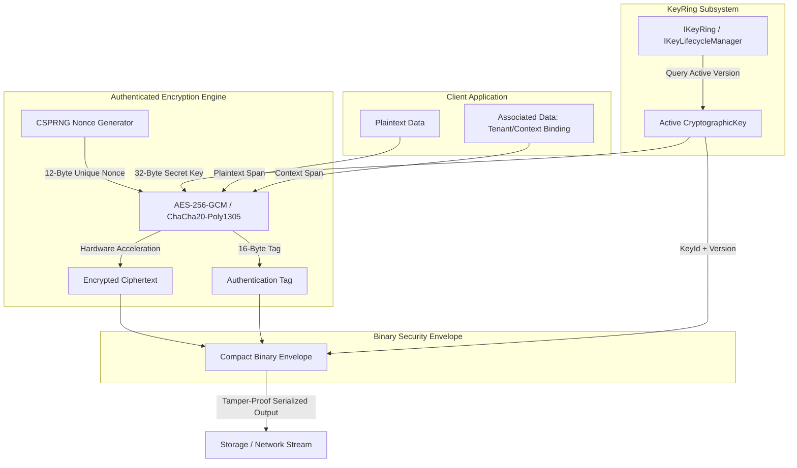
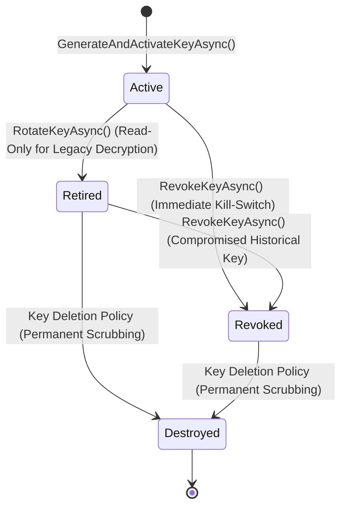

# EricksonLopez.Security

Enterprise-grade security ecosystem for modern .NET (8/9/10). Native AOT-first AEAD cryptography, multi-version key lifecycle, Passkeys (WebAuthn/FIDO2), SAML 2.0, RFC 9106 Argon2id, SSRF perimeter defense, and Zero Trust (ABAC) authorization.

[](https://github.com/ericksonlopezf/dotnet-security/actions)
[](https://codecov.io/gh/ericksonlopezf/dotnet-security)
[](https://sonarcloud.io/summary/new_code?id=ericksonlopezf_dotnet-security)
[](https://github.com/ericksonlopezf/dotnet-security/blob/main/docs/testing.md)
[](https://www.nuget.org/packages/EricksonLopez.Security)
[](https://www.nuget.org/packages/EricksonLopez.Security)
[](https://github.com/ericksonlopezf/dotnet-security/blob/main/LICENSE)
[](https://dotnet.microsoft.com)
[](https://learn.microsoft.com/en-us/dotnet/core/deploying/native-aot)

---

`EricksonLopez.Security` is an enterprise-grade cryptographic engineering and perimeter security framework designed for cloud-native applications targeting **.NET 8.0, 9.0, and 10.0**. It eliminates systemic vulnerability classes—such as padding oracle attacks, insecure cipher modes (CBC, ECB), variable-time side-channel leaks, hardcoded credentials, and sensitive memory exposure—by making secure cryptographic practices the default, zero-friction path. Built on a strict Native AOT foundation with zero runtime reflection in core modules, span-first memory pipelines, five dedicated Roslyn diagnostic analyzers, and functional error handling via `EricksonLopez.Result`, it delivers sub-microsecond latency and **0 B heap allocations** on primary cryptographic operations.

> [!NOTE]
> **Architectural Governance & Implementation Status (v1.x)**:
> - **Core & Cryptography**: Fully operational production engines with zero-allocation span pipelines and Native AOT guarantees.
> - **Cloud Adapters (AWS, Azure, HashiCorp Vault, Google Cloud)**: Production-ready satellite packages providing live cloud SDK integrations (`Azure.Security.KeyVault.*`, `AWSSDK.*`, `Google.Cloud.*`, HashiCorp Vault HTTP API) for enterprise KMS and Secret Stores, with an optional thread-safe in-memory test double (`EnableDevelopmentInMemoryStub`) for local development ([ADR-011](https://github.com/ericksonlopezf/dotnet-security/blob/main/docs/adr/adr-011-azure-key-vault-integration.md), [ADR-012](https://github.com/ericksonlopezf/dotnet-security/blob/main/docs/adr/adr-012-aws-kms-and-secrets-manager-integration.md), [ADR-013](https://github.com/ericksonlopezf/dotnet-security/blob/main/docs/adr/adr-013-hashicorp-vault-transit-and-kv-integration.md)).
> - **Argon2id & PQC Status**: Documented per [ADR-025](https://github.com/ericksonlopezf/dotnet-security/blob/main/docs/adr/adr-025-hkdf-enhanced-encryption-engine-pqc-roadmap.md) and [ADR-031](https://github.com/ericksonlopezf/dotnet-security/blob/main/docs/adr/adr-031-konscious-argon2id-rfc9106-adoption.md). `Argon2idPasswordHasher` implements genuine memory-hard RFC 9106 Argon2id (64 MiB RAM, 3 iterations, 4 parallelism lanes) via `Konscious.Security.Cryptography.Argon2id`; `HkdfAesGcmEncryptionEngine` provides per-operation HKDF-SHA512 key isolation pending stable .NET FIPS 203 ML-KEM-768 primitives.

---

## Table of Contents

- [What Problem It Solves](#-what-problem-it-solves)
- [Key Features](#-key-features)
- [Ecosystem](#-ecosystem)
- [Documentation](#-documentation)
  - [Interactive Showcase (Levels 00 to 11)](#-step-by-step-interactive-showcase-levels-00-to-11)
  - [Technical Reference & Architecture Guides](#-technical-reference--architecture-guides)
- [Installation](#-installation)
- [Quick Start](#-quick-start)
- [Core Use Cases](#-core-use-cases)
- [Configuration & Integrations](#-configuration--integrations)
  - [ASP.NET Core & Security Headers](#aspnet-core--security-headers)
  - [Token Security & Scoped API Keys](#token-security--scoped-api-keys)
  - [OpenTelemetry Tracing & Metrics](#opentelemetry-tracing--metrics)
  - [Multi-Cloud Key & Secret Storage Adapters](#multi-cloud-key--secret-storage-adapters)
  - [Roslyn Diagnostic Analyzers](#roslyn-diagnostic-analyzers)
- [Testing & Quality](#-testing--quality)
- [Performance Benchmarks](#-performance-benchmarks)
- [Compatibility & Technical Matrix](#-compatibility--technical-matrix)
- [Architecture & Design Principles](#-architecture--design-principles)
- [Best Practices & Anti-Patterns](#-best-practices--anti-patterns)
- [Troubleshooting & Common Pitfalls](#-troubleshooting--common-pitfalls)
- [Part of the Ecosystem](#-part-of-the-ecosystem)
- [Contributing](#-contributing)
- [License](#-license)

---

## 🎯 What Problem It Solves

### The Traditional Pains and Security Anti-Patterns

1. **Insecure Cryptographic Defaults & Padding Oracles**: Legacy .NET codebases frequently rely on `AesManaged` or `RijndaelManaged` with Cipher Block Chaining (CBC) or Electronic Codebook (ECB) modes. Without message authentication codes (MAC), ciphertext is vulnerable to padding oracle attacks (POODLE, Lucky13) and silent bit-flipping manipulation.
2. **Fragile Key Lifecycle & Breaking Legacy Decryption**: Teams often encrypt data with static connection strings or hardcoded symmetric keys. When security policies mandate key rotation, updating the key invalidates historical records, resulting in production outages or complex manual migration scripts.
3. **Remote Side-Channel Timing Attacks**: Using standard equality operators (`==`, `string.Equals()`, `SequenceEqual()`) to validate passwords, HMAC signatures, or bearer tokens leaks byte-level timing differences, enabling attackers to reconstruct secrets remotely.
4. **Sensitive Memory Leaks & Log Poisoning**: Sensitive keys, bearer tokens, and passwords stored in managed `string` objects remain indefinitely on the GC heap. Furthermore, structured loggers routinely serialize DTOs containing plaintext credentials into central logging sinks.
5. **Excessive Heap Allocation Overhead**: Traditional stream-based encryption wrappers (`CryptoStream`) allocate intermediate byte arrays, buffers, and objects on every invocation, triggering Garbage Collection (GC) pauses that degrade throughput in high-volume microservices.

### How EricksonLopez.Security Solves This

- **Sole Authenticated Encryption (AEAD)**: Exclusively implements **AES-256-GCM** (NIST SP 800-38D) and **ChaCha20-Poly1305** (RFC 8439). Corrupted or manipulated ciphertext is rejected at the hardware layer before decryption.
- **Automated Multi-Version Key Lifecycle**: Manages keys across an explicit state machine (`Active` $\rightarrow$ `Retired` $\rightarrow$ `Revoked` $\rightarrow$ `Destroyed`). New data is encrypted with the active version, while historical records decrypt seamlessly using retired keys.
- **Constant-Time Operations Everywhere**: Enforces `CryptographicOperations.FixedTimeEquals` across all comparison routines, preventing timing side-channel leaks.
- **Deterministic Memory Scrubbing & Redaction**: Wraps sensitive keys in `SecretBuffer`, scrubbing buffers with `CryptographicOperations.ZeroMemory` upon `Dispose()`. Types like `Redacted<T>`, `Secret<T>`, and `OpaqueToken` ensure credentials render as `[REDACTED]` in logs.
- **0 B Heap Allocation Span Pipelines**: Core symmetric encryption, token hashing, and secret protection provide `ReadOnlySpan<byte>` overloads utilizing `stackalloc` and `ArrayPool<byte>.Shared` to eliminate GC allocations.

---

## ⚡ Key Features

- ⚡ **Zero Heap Allocations**: Core AES-256-GCM and ChaCha20-Poly1305 span pipelines achieve **0 B allocated** on execution paths.
- 🚀 **Native AOT & Trimming First**: Engineered without runtime reflection or dynamic IL code generation; verified via automated Native AOT smoke testing.
- 🔑 **Multi-Version Key Lifecycle**: Automatic key rotation policies, versioned binary security envelopes, and instant key revocation.
- 🛡️ **Side-Channel Timing Resistance**: Strict constant-time comparisons across all token, password, and signature authenticators.
- 🔒 **Zero Trust ABAC Policy Engine**: NIST SP 800-162 and XACML compliant multidimensional attribute-based access control with Deny-Overrides.
- 🌐 **SSRF Defense & Perimeter Hardening**: Socket-level `SafeSocketsHttpHandler` blocking loopback, link-local, and RFC 1918 cloud metadata exfiltration.
- 🪪 **Passkeys WebAuthn Level 3 & SAML 2.0**: FIDO2 ceremony orchestration with MDS3 metadata caching and enterprise SAML 2.0 with anti-XML Signature Wrapping (XSW) defenses.
- 🔍 **Compile-Time Roslyn Analyzers**: Five diagnostic analyzers (`ELS0001`–`ELS0005`) that enforce constant-time checks, buffer disposal, and log redaction during build.
- 📊 **Native Observability**: BCL-native `ActivitySource` and `Meter` built directly into core modules with zero external SDK overhead.
- 🧱 **Functional Error Handling**: Seamless integration with `EricksonLopez.Result` returning typed `SecurityError` codes instead of throwing control-flow exceptions.

---

## 📦 Ecosystem

The ecosystem is partitioned into 21 modular, specialized NuGet packages:

| Package | Version | Description |
|---|:---:|---|
| [`EricksonLopez.Security.Abstractions`](https://www.nuget.org/packages/EricksonLopez.Security.Abstractions) | [](https://www.nuget.org/packages/EricksonLopez.Security.Abstractions) | Core domain primitives, value objects, error catalog, policies, and contracts. |
| [`EricksonLopez.Security`](https://www.nuget.org/packages/EricksonLopez.Security) | [](https://www.nuget.org/packages/EricksonLopez.Security) | Central engine: AEAD envelopes, key management, passwords, tokens, and secrets. |
| [`EricksonLopez.Security.Cryptography`](https://www.nuget.org/packages/EricksonLopez.Security.Cryptography) | [](https://www.nuget.org/packages/EricksonLopez.Security.Cryptography) | Direct cryptographic engines, constant-time primitives, and key derivation. |
| [`EricksonLopez.Security.AspNetCore`](https://www.nuget.org/packages/EricksonLopez.Security.AspNetCore) | [](https://www.nuget.org/packages/EricksonLopez.Security.AspNetCore) | Security headers middleware, API key authentication, and scoped request context. |
| [`EricksonLopez.Security.Network`](https://www.nuget.org/packages/EricksonLopez.Security.Network) | [](https://www.nuget.org/packages/EricksonLopez.Security.Network) | SSRF defense, CIDR range validation, and `SafeSocketsHttpHandler`. |
| [`EricksonLopez.Security.Mfa`](https://www.nuget.org/packages/EricksonLopez.Security.Mfa) | [](https://www.nuget.org/packages/EricksonLopez.Security.Mfa) | RFC 6238 TOTP, HOTP, recovery code engine, and otpauth URI generator. |
| [`EricksonLopez.Security.ZeroTrust`](https://www.nuget.org/packages/EricksonLopez.Security.ZeroTrust) | [](https://www.nuget.org/packages/EricksonLopez.Security.ZeroTrust) | NIST SP 800-162 / XACML Attribute-Based Access Control (ABAC) engine. |
| [`EricksonLopez.Security.WebAuthn.Fido2`](https://www.nuget.org/packages/EricksonLopez.Security.WebAuthn.Fido2) | [](https://www.nuget.org/packages/EricksonLopez.Security.WebAuthn.Fido2) | WebAuthn Level 3 Passkeys registration, ceremony authentication, and attestation. |
| [`EricksonLopez.Security.WebAuthn.Fido2.Mds3`](https://www.nuget.org/packages/EricksonLopez.Security.WebAuthn.Fido2.Mds3) | [](https://www.nuget.org/packages/EricksonLopez.Security.WebAuthn.Fido2.Mds3) | FIDO Alliance Metadata Service v3 client and BLOB validator. |
| [`EricksonLopez.Security.Saml2`](https://www.nuget.org/packages/EricksonLopez.Security.Saml2) | [](https://www.nuget.org/packages/EricksonLopez.Security.Saml2) | SAML 2.0 Service Provider with anti-XSW validation, SLO, and metadata generation. |
| [`EricksonLopez.Security.Pki`](https://www.nuget.org/packages/EricksonLopez.Security.Pki) | [](https://www.nuget.org/packages/EricksonLopez.Security.Pki) | X.509 certificate chain validation, custom trust anchors, and CRL/OCSP checking. |
| [`EricksonLopez.Security.Privacy.Hibp`](https://www.nuget.org/packages/EricksonLopez.Security.Privacy.Hibp) | [](https://www.nuget.org/packages/EricksonLopez.Security.Privacy.Hibp) | Have I Been Pwned k-anonymity breach detection client. |
| [`EricksonLopez.Security.Cryptography.XmlDSig`](https://www.nuget.org/packages/EricksonLopez.Security.Cryptography.XmlDSig) | [](https://www.nuget.org/packages/EricksonLopez.Security.Cryptography.XmlDSig) | W3C XML Digital Signatures (RFC 3275) enveloped/enveloping/detached signing. |
| [`EricksonLopez.Security.Cryptography.Pkcs11`](https://www.nuget.org/packages/EricksonLopez.Security.Cryptography.Pkcs11) | [](https://www.nuget.org/packages/EricksonLopez.Security.Cryptography.Pkcs11) | Hardware Security Module (HSM) and smartcard adapter via PKCS#11 (Cryptoki). |
| [`EricksonLopez.Security.Azure`](https://www.nuget.org/packages/EricksonLopez.Security.Azure) | [](https://www.nuget.org/packages/EricksonLopez.Security.Azure) | Azure Key Vault Keys and Secrets Store adapter (production SDK + dev stub). |
| [`EricksonLopez.Security.Aws`](https://www.nuget.org/packages/EricksonLopez.Security.Aws) | [](https://www.nuget.org/packages/EricksonLopez.Security.Aws) | AWS KMS and AWS Secrets Manager Store adapter (production SDK + dev stub). |
| [`EricksonLopez.Security.HashiCorpVault`](https://www.nuget.org/packages/EricksonLopez.Security.HashiCorpVault) | [](https://www.nuget.org/packages/EricksonLopez.Security.HashiCorpVault) | HashiCorp Vault Transit Encryption and KV v2 Secret Store adapter (production API + dev stub). |
| [`EricksonLopez.Security.GoogleCloud`](https://www.nuget.org/packages/EricksonLopez.Security.GoogleCloud) | [](https://www.nuget.org/packages/EricksonLopez.Security.GoogleCloud) | Google Cloud KMS and Secret Manager Store adapter (production SDK + dev stub). |
| [`EricksonLopez.Security.OpenTelemetry`](https://www.nuget.org/packages/EricksonLopez.Security.OpenTelemetry) | [](https://www.nuget.org/packages/EricksonLopez.Security.OpenTelemetry) | OpenTelemetry distributed tracing and metrics instrumentation satellite. |
| [`EricksonLopez.Security.Testing`](https://www.nuget.org/packages/EricksonLopez.Security.Testing) | [](https://www.nuget.org/packages/EricksonLopez.Security.Testing) | In-memory test doubles, deterministic RNG, and cryptographic assertions. |
| [`EricksonLopez.Security.Analyzers`](https://www.nuget.org/packages/EricksonLopez.Security.Analyzers) | [](https://www.nuget.org/packages/EricksonLopez.Security.Analyzers) | Roslyn Diagnostic Analyzers (`ELS0001`–`ELS0005`) for compile-time security gates. |

---

## 📚 Documentation

> 🌐 **Official Documentation Hub:** [https://github.com/ericksonlopezf/dotnet-security/tree/main/docs](https://github.com/ericksonlopezf/dotnet-security/tree/main/docs)

### 🎓 Step-by-Step Interactive Showcase (Levels 00 to 11)

| Level | Topic | Description |
|---|---|---|
| [**Level 00**](https://github.com/ericksonlopezf/dotnet-security/blob/main/docs/showcase/level-00-introduction.md) | **Architecture & Mental Model** | Core architectural foundations, value objects (`KeyIdentifier`, `Nonce`, `Salt`), and design invariants. |
| [**Level 01**](https://github.com/ericksonlopezf/dotnet-security/blob/main/docs/showcase/level-01-authenticated-encryption.md) | **AEAD & Binary Envelopes** | Authenticated encryption (AES-256-GCM), tenant context binding (AAD), and binary envelopes. |
| [**Level 02**](https://github.com/ericksonlopezf/dotnet-security/blob/main/docs/showcase/level-02-passwords-and-key-lifecycle.md) | **Passwords & Key Lifecycle** | Multi-version key rotation, historical decryption, PBKDF2/Argon2id hashing, and auto-rehash. |
| [**Level 03**](https://github.com/ericksonlopezf/dotnet-security/blob/main/docs/showcase/level-03-zero-trust-and-aot.md) | **Zero Trust ABAC & Native AOT** | Dynamic attribute-based authorization, XACML evaluation, and reflection-free AOT safety. |
| [**Level 04**](https://github.com/ericksonlopezf/dotnet-security/blob/main/docs/showcase/level-04-advanced-integration-and-perimeter.md) | **Perimeter Defense & PKI** | ASP.NET Core security headers, SSRF mitigation with `SafeSocketsHttpHandler`, and X.509 PKI validation. |
| [**Level 05**](https://github.com/ericksonlopezf/dotnet-security/blob/main/docs/showcase/level-05-protocols-and-ceremonies.md) | **Protocols & Ceremonies** | Passkeys FIDO2 / WebAuthn Level 3 ceremonies, SAML 2.0 with anti-XSW, and W3C XmlDSig. |
| [**Level 06**](https://github.com/ericksonlopezf/dotnet-security/blob/main/docs/showcase/level-06-error-resilience-and-tamper-detection.md) | **Error Handling & Resilience** | Functional `Result<T>` error handling, `SecurityError` catalog, and AEAD tamper detection. |
| [**Level 07**](https://github.com/ericksonlopezf/dotnet-security/blob/main/docs/showcase/level-07-scalability-and-zero-allocation.md) | **Scalability & Zero-Allocation** | High-throughput in-place span encryption, `SecretBuffer`, and microsecond benchmarks. |
| [**Level 08**](https://github.com/ericksonlopezf/dotnet-security/blob/main/docs/showcase/level-08-customization-and-extensibility.md) | **Customization & Extensibility** | Custom `IKeyStore` decorators, auditing pipelines, and domain-specific ABAC rules. |
| [**Level 09**](https://github.com/ericksonlopezf/dotnet-security/blob/main/docs/showcase/level-09-extensions-and-cloud-kms.md) | **Cloud KMS & Satellite Extensions** | Azure Key Vault, AWS KMS, HashiCorp Vault, Google Cloud KMS, PKCS#11 HSM, FIDO MDS3, and HIBP breach detection. |
| [**Level 10**](https://github.com/ericksonlopezf/dotnet-security/blob/main/docs/showcase/level-10-enterprise-zero-trust.md) | **Enterprise Zero Trust & Telemetry** | NIST SP 800-162 policy coordination and OpenTelemetry distributed tracing and metrics. |
| [**Level 11**](https://github.com/ericksonlopezf/dotnet-security/blob/main/docs/showcase/level-11-comprehensive-api-coverage.md) | **Comprehensive Public API Coverage** | Exhaustive live verification of all public APIs across all 21 ecosystem packages. |
| [**Showcase Spec**](https://github.com/ericksonlopezf/dotnet-security/blob/main/docs/showcase-specification.md) | **Executable Specification** | Authoritative 12-level implementation reference and assertion suite. |

### 📖 Technical Reference & Architecture Guides

- [**Getting Started Guide**](https://github.com/ericksonlopezf/dotnet-security/blob/main/docs/getting-started.md) — Comprehensive developer onboarding, architecture mental model, and production checklist.
- [**Architecture & Invariants**](https://github.com/ericksonlopezf/dotnet-security/blob/main/docs/architecture.md) — Architectural blueprint, layer boundaries, and Mermaid diagrams.
- [**Architectural Decision Records (ADRs)**](https://github.com/ericksonlopezf/dotnet-security/tree/main/docs/adr) — Comprehensive index of all 31 architectural decisions.
- [**Security Model & Invariants**](https://github.com/ericksonlopezf/dotnet-security/blob/main/docs/security-model.md) — Six non-negotiable architectural security invariants.
- [**Threat Model (STRIDE)**](https://github.com/ericksonlopezf/dotnet-security/blob/main/docs/threat-model.md) — Complete threat classification and defense matrix.
- [**Public API Reference**](https://github.com/ericksonlopezf/dotnet-security/blob/main/docs/api-reference.md) — Complete contract specifications and type definitions.
- [**Cookbook (Practical Recipes)**](https://github.com/ericksonlopezf/dotnet-security/blob/main/docs/cookbook.md) — 17 production recipes for enterprise security scenarios.
- [**Native AOT Compatibility**](https://github.com/ericksonlopezf/dotnet-security/blob/main/docs/aot.md) — Ahead-of-time compilation, trimming analysis, and smoke test guide.
- [**Performance & Zero Allocations**](https://github.com/ericksonlopezf/dotnet-security/blob/main/docs/performance.md) — BenchmarkDotNet profiles and memory allocation analysis.
- [**Testing & Mutation Strategy**](https://github.com/ericksonlopezf/dotnet-security/blob/main/docs/testing.md) — Test suite breakdown, coverage metrics, and Stryker.NET results.
- [**Build, CI/CD & Quality Gates**](https://github.com/ericksonlopezf/dotnet-security/blob/main/docs/build-and-quality.md) — GitHub Actions, SonarCloud, Strong Naming, and Release Please.
- [**NuGet Ecosystem & Packages**](https://github.com/ericksonlopezf/dotnet-security/blob/main/docs/nuget-packages.md) — Package dependency graph and Central Package Management.
- [**Migration from DataProtection**](https://github.com/ericksonlopezf/dotnet-security/blob/main/docs/migration-from-dataprotection.md) — Zero-downtime migration from `Microsoft.AspNetCore.DataProtection`.
- [**Migration from Identity PasswordHasher**](https://github.com/ericksonlopezf/dotnet-security/blob/main/docs/migration-from-identity-passwordhasher.md) — Transparent rehash migration from ASP.NET Identity.
- [**Troubleshooting Guide**](https://github.com/ericksonlopezf/dotnet-security/blob/main/docs/troubleshooting.md) — Symptom-to-resolution diagnostics catalog.
- [**Best Practices Guide**](https://github.com/ericksonlopezf/dotnet-security/blob/main/docs/best-practices.md) — Practical implementation and hardening rules.

---

## 📥 Installation

Install the required core packages via the .NET CLI:

### 1. Core Packages (Required)

```bash
dotnet add package EricksonLopez.Security
dotnet add package EricksonLopez.Security.Abstractions
```

### 2. Optional Framework & Specialized Packages

```bash
# ASP.NET Core Middleware & Security Headers
dotnet add package EricksonLopez.Security.AspNetCore

# SSRF Mitigation & Safe Sockets
dotnet add package EricksonLopez.Security.Network

# Multi-Factor Authentication (RFC 6238 TOTP/HOTP)
dotnet add package EricksonLopez.Security.Mfa

# Attribute-Based Access Control (ABAC)
dotnet add package EricksonLopez.Security.ZeroTrust

# WebAuthn / FIDO2 Passkeys Level 3
dotnet add package EricksonLopez.Security.WebAuthn.Fido2

# SAML 2.0 Service Provider
dotnet add package EricksonLopez.Security.Saml2

# OpenTelemetry Tracing & Metrics
dotnet add package EricksonLopez.Security.OpenTelemetry

# Compile-Time Roslyn Analyzers
dotnet add package EricksonLopez.Security.Analyzers
```

### 3. Testing & Assertion Packages

```bash
dotnet add package EricksonLopez.Security.Testing
```

---

## 🚀 Quick Start

### 1. Register Services in Dependency Injection

```csharp
using Microsoft.Extensions.DependencyInjection;
using EricksonLopez.Security;

var services = new ServiceCollection();

// Registers core AEAD engines, multi-version key management, passwords, and tokens
services.AddEricksonLopezSecurity();

using var serviceProvider = services.BuildServiceProvider();
```

### 2. Authenticated Encryption with Context Binding (AEAD + AAD)

```csharp
using System.Text;
using EricksonLopez.Security.Abstractions.Cryptography;
using EricksonLopez.Security.Abstractions.KeyManagement;
using EricksonLopez.Security.Abstractions.Primitives;
using EricksonLopez.Security.Abstractions.Secrets;

var keyLifecycle = serviceProvider.GetRequiredService<IKeyLifecycleManager>();
var protector = serviceProvider.GetRequiredService<ISecretProtector>();

// 1. Ensure an active multi-version key exists for SecretProtection
await keyLifecycle.GenerateAndActivateKeyAsync(KeyPurpose.SecretProtection);

// 2. Encrypt payload with tenant context as Authenticated Associated Data (AAD)
//    AuthenticatedContext is a strongly-typed struct — use ForTenant() or FromBytes() to construct it.
byte[] plaintext = Encoding.UTF8.GetBytes("Confidential Patient Record");
var tenantContext = AuthenticatedContext.ForTenant("hospital-42");

var protectResult = await protector.ProtectAsync(
    secret: plaintext,
    purpose: KeyPurpose.SecretProtection,
    expectedAssociatedData: tenantContext);

if (protectResult.IsFailure)
{
    Console.WriteLine($"Protection failed: {protectResult.Error.Description}");
    return;
}

byte[] binaryEnvelope = protectResult.Value;

// 3. Decrypt and verify authentic payload — same context required
var unprotectResult = await protector.UnprotectAsync(
    protectedData: binaryEnvelope,
    expectedAssociatedData: tenantContext);

if (unprotectResult.IsSuccess)
{
    string decrypted = Encoding.UTF8.GetString(unprotectResult.Value);
    Console.WriteLine($"Decrypted payload: {decrypted}");
}
```

### 3. Zero-Allocation Span-Based Encryption via `SecretBuffer`

```csharp
using System.Security.Cryptography;
using EricksonLopez.Security.Cryptography;
using EricksonLopez.Security.Memory;

// Rent a scrubbed 32-byte secret buffer
using var keyBuffer = SecretBuffer.CreateRandom(32);

// Direct AES-GCM engine operating over execution stack/spans
var engine = new AesGcmEncryptionEngine();

Span<byte> plaintext = stackalloc byte[] { 1, 2, 3, 4, 5, 6, 7, 8 };
Span<byte> ciphertext = stackalloc byte[plaintext.Length];
Span<byte> nonceDestination = stackalloc byte[12]; // Written by Encrypt — do not pre-fill
Span<byte> tagDestination = stackalloc byte[16];

// Zero heap allocation execution path — nonceDestination is auto-generated internally
var encryptResult = engine.Encrypt(
    plaintext: plaintext,
    key: keyBuffer.Span,
    nonceDestination: nonceDestination,
    ciphertextDestination: ciphertext,
    tagDestination: tagDestination,
    associatedData: "audit-context"u8);

// Upon exiting using block, keyBuffer is scrubbed via CryptographicOperations.ZeroMemory
```

### 4. Password Hashing (OWASP Compliant) & Auto-Rehash

```csharp
using EricksonLopez.Security.Abstractions.Passwords;

var passwordHasher = serviceProvider.GetRequiredService<IPasswordHasher>();

// Hash password with PBKDF2-HMAC-SHA512 (210,000 iterations) in modular crypt format
string hash = passwordHasher.HashPassword("CorrectHorseBatteryStaple!2026".AsSpan());

// Verify password using constant-time evaluation
var verification = passwordHasher.VerifyPassword("CorrectHorseBatteryStaple!2026".AsSpan(), hash);

if (verification == PasswordVerificationResult.Success)
{
    Console.WriteLine("Password authenticated.");
}
else if (verification == PasswordVerificationResult.SuccessRehashNeeded || passwordHasher.NeedsRehash(hash))
{
    // Transparently upgrade legacy hash to the latest parameters
    string upgradedHash = passwordHasher.HashPassword("CorrectHorseBatteryStaple!2026".AsSpan());
    // Persist upgradedHash to your database to complete the migration
}
```

### 5. Scoped API Key Issuance and Verification

```csharp
using EricksonLopez.Security.Abstractions.Tokens;

var keyGenerator = serviceProvider.GetRequiredService<IApiKeyGenerator>();
var keyValidator = serviceProvider.GetRequiredService<IApiKeyValidator>();

// Issue a structured API key: ek_live_<prefix>_<secret>
var issuance = keyGenerator.GenerateApiKey(
    ownerId: "tenant-org-42",
    name: "Billing Webhook Key",
    prefix: "ek_live",
    lifetime: TimeSpan.FromDays(365),
    scopes: new HashSet<string> { "invoices:read", "payments:write" });

string plaintextKey = issuance.PlaintextApiKey; // Send to user once; never persist

// Validate presented plaintext API key using constant-time hash comparison
var validationResult = await keyValidator.ValidateApiKeyAsync(plaintextKey);
if (validationResult.IsSuccess)
{
    var apiKey = validationResult.Value;
    Console.WriteLine($"Authenticated API key owner: {apiKey.OwnerId}");
}
```

---

## 💡 Core Use Cases

### 1. Protecting Customer PII with Multi-Tenant Context Binding
In multi-tenant SaaS environments, encrypting PII without contextual binding leaves records susceptible to cross-tenant ciphertext transplant attacks. `ISecretProtector` binds the tenant identifier directly into the AEAD authenticated associated data (AAD). If ciphertext from Tenant A is injected into Tenant B's storage, decryption fails immediately with `SecurityError.AuthenticationTagMismatch`.

### 2. Zero-Downtime Hot Key Rotation with Historical Decryption
Compliance standards (PCI-DSS 4.0, SOC 2) require periodic cryptographic key rotation. Calling `IKeyLifecycleManager.RotateKeyAsync(KeyPurpose.SecretProtection)` generates a new active key version while moving the previous key to `Retired`. All subsequent encryptions use the new key, while millions of existing database records decrypt seamlessly without batch migrations or downtime.

### 3. Dynamic Zero Trust Attribute-Based Access Control (ABAC)
Role-Based Access Control (RBAC) is insufficient for distributed microservices. `EricksonLopez.Security.ZeroTrust` implements NIST SP 800-162 multidimensional ABAC. Access decisions evaluate subject attributes (department, clearance), resource metadata (classification), action type, and environmental context (IP subnet, device posture, time of day) using a strict Deny-Overrides resolution algorithm.

### 4. Hardening Outbound HTTP Clients Against SSRF
Microservices making outbound requests to third-party webhooks are prime targets for Server-Side Request Forgery (SSRF) and DNS rebinding attacks aimed at cloud instance metadata endpoints (e.g., `169.254.169.254`). `SafeSocketsHttpHandler` intercepts socket connection establishment, resolving DNS and rejecting private IP ranges (RFC 1918), loopback (`127.0.0.0/8`), link-local, and cloud metadata addresses before opening TCP sockets.

### 5. WebAuthn / Passkeys Level 3 Ceremony Authentication
Replace phishing-vulnerable passwords with hardware-bound Passkeys. `EricksonLopez.Security.WebAuthn.Fido2` orchestrates complete FIDO2 ceremonies: generating cryptographic challenges, decoding CBOR authenticator data, validating attestation statements (Packed, TPM, Android SafetyNet, FIDO-U2F), verifying authenticator counters to prevent clone attacks, and integrating with FIDO MDS3 metadata.

---

## 🔌 Configuration & Integrations

### ASP.NET Core & Security Headers

Inject enterprise security headers (Content Security Policy, Strict-Transport-Security, X-Content-Type-Options) and configure API key authentication middleware:

```csharp
using Microsoft.AspNetCore.Builder;
using Microsoft.Extensions.DependencyInjection;

var builder = WebApplication.CreateBuilder(args);

// Register ASP.NET Core security services
builder.Services.AddSecurityAspNetCore(
    configureHeaders: options =>
    {
        // All properties accept header value strings — sensible defaults are pre-configured
        options.StrictTransportSecurity = "max-age=31536000; includeSubDomains; preload";
        options.XFrameOptions = "DENY";
        options.XContentTypeOptions = "nosniff";
        options.ContentSecurityPolicy = "default-src 'self'; script-src 'self'; frame-ancestors 'none';";
        options.ReferrerPolicy = "strict-origin-when-cross-origin";
    },
    configureApiKeyAuth: options =>
    {
        options.HeaderName = "X-Api-Key";
    });

var app = builder.Build();

// Enforce security headers early in the pipeline
app.UseSecurityHeaders();
app.UseApiKeyAuthentication();

app.MapGet("/api/secure-data", () => Results.Ok(new { Status = "Authorized" }));
```

### Token Security & Scoped API Keys

Protect session tokens and API keys using keyed HMAC-SHA256 digests:

```csharp
using EricksonLopez.Security.Abstractions.Tokens;
using EricksonLopez.Security.Tokens;

// Option A (recommended): use AddEricksonLopezSecurity() — registers all token services automatically.
// The pepper key is injected via AddTokenSecurity(pepperKey) as part of AddEricksonLopezSecurity().

// Option B (manual, standalone — use only when NOT calling AddEricksonLopezSecurity()):
byte[] pepper = "production-cryptographic-pepper-32b"u8.ToArray();
services.AddSingleton<ITokenHasher>(new HmacSha256TokenHasher(pepper));
services.AddSingleton<IApiKeyStore, InMemoryApiKeyStore>(); // Replace with a persistent DB store in production
services.AddSingleton<IApiKeyGenerator, ApiKeyGenerator>();
services.AddSingleton<IApiKeyValidator, ApiKeyValidator>();
// Note: Do NOT combine Option B with AddEricksonLopezSecurity() — this will cause duplicate DI registrations.
```

### OpenTelemetry Tracing & Metrics

Instrument your application with zero runtime reflection using the OpenTelemetry satellite package:

```csharp
using OpenTelemetry.Metrics;
using OpenTelemetry.Trace;
using EricksonLopez.Security.OpenTelemetry;

builder.Services.AddOpenTelemetry()
    .WithTracing(tracing => tracing
        .AddEricksonLopezSecurityInstrumentation()
        .AddOtlpExporter())
    .WithMetrics(metrics => metrics
        .AddEricksonLopezSecurityInstrumentation()
        .AddOtlpExporter());
```

### Multi-Cloud Key & Secret Storage Adapters

In v1.x, cloud adapters provide clean in-memory provider doubles (`ConcurrentDictionary`) adhering strictly to `IKeyStore` and `ISecretStore` contracts for decoupled testing and development ([ADR-011](https://github.com/ericksonlopezf/dotnet-security/blob/main/docs/adr/adr-011-azure-key-vault-integration.md), [ADR-012](https://github.com/ericksonlopezf/dotnet-security/blob/main/docs/adr/adr-012-aws-kms-and-secrets-manager-integration.md), [ADR-013](https://github.com/ericksonlopezf/dotnet-security/blob/main/docs/adr/adr-013-hashicorp-vault-transit-and-kv-integration.md)):

```csharp
// Azure Key Vault Adapter (v1.x in-memory double)
services.AddAzureKeyVaultSecurity(options =>
{
    options.VaultUri = new Uri("https://my-vault.vault.azure.net/");
    options.EnableDevelopmentInMemoryStub = true;
});

// AWS KMS & Secrets Manager Adapter (v1.x in-memory double)
services.AddAwsSecurity(options =>
{
    options.Region = "us-east-1";
    options.EnableDevelopmentInMemoryStub = true;
});

// HashiCorp Vault Transit & KV v2 Adapter (v1.x in-memory double)
services.AddHashiCorpVaultSecurity(options =>
{
    options.VaultUrl = new Uri("https://127.0.0.1:8200");
    options.EnableDevelopmentInMemoryStub = true;
});

// Google Cloud KMS & Secret Manager Adapter (v1.x in-memory double)
services.AddGoogleCloudSecurity(options =>
{
    options.ProjectId = "enterprise-sec-prod";
    options.EnableDevelopmentInMemoryStub = true;
});
```

### Roslyn Diagnostic Analyzers

The `EricksonLopez.Security.Analyzers` package enforces compile-time security guardrails directly inside the compiler pipeline:

| Diagnostic ID | Severity | Category | Description | Recommended Remediation |
|---|:---:|---|---|---|
| `ELS0001` | **Warning** | Security | Non-constant-time string or byte equality comparison detected. | Replace with `CryptographicOperations.FixedTimeEquals`. |
| `ELS0002` | **Warning** | Security | `SecretBuffer` instantiated without deterministic disposal. | Enclose instantiation in a `using` statement or invoke `Dispose()`. |
| `ELS0003` | **Warning** | Security | Hardcoded cryptographic key, salt, or secret literal detected. | Retrieve secrets via `ISecretStore`, `ISecretResolver`, or environment. |
| `ELS0004` | **Error** | Security | Insecure or deprecated password hashing algorithm (MD5, SHA1) used. | Replace with `IPasswordHasher` (PBKDF2 or Argon2id). |
| `ELS0005` | **Error** | Security | Sensitive cryptographic secret passed unredacted to logging sink. | Wrap sensitive fields in `Redacted<T>` or `Secret<T>`. |

---

## 🧪 Testing & Quality

`EricksonLopez.Security` enforces exhaustive quality assurance across all 21 architectural units through automated testing, line coverage tracking, and mutation testing via **Stryker.NET**:

| # | Package / Architectural Unit | Type | Line Cov | Branch Cov | Method Cov | Stryker Real | Eq. Mutants | Effective Score |
|:---:|---|---|:---:|:---:|:---:|:---:|:---:|:---:|
| **01** | `EricksonLopez.Security.Abstractions` | `CONTRACT` | **100.00%** | **100.00%** | **100.00%** | **100.00%** (324/324) | 0 | **100.00%** |
| **02** | `EricksonLopez.Security` | `CORE` | **100.00%** | **100.00%** | **100.00%** | **100.00%** (663/663) | 0 | **100.00%** |
| **03** | `EricksonLopez.Security.Cryptography` | `FEATURE` | **100.00%** | **100.00%** | **100.00%** | **100.00%** (70/70) | 0 | **100.00%** |
| **04** | `EricksonLopez.Security.Mfa` | `FEATURE` | **100.00%** | **98.43%** | **100.00%** | **100.00%** (144/144) | 0 | **100.00%** |
| **05** | `EricksonLopez.Security.ZeroTrust` | `FEATURE` | **100.00%** | **97.14%** | **100.00%** | **100.00%** (79/79) | 0 | **100.00%** |
| **06** | `EricksonLopez.Security.Network` | `INFRASTRUCTURE` | **100.00%** | **92.15%** | **100.00%** | **100.00%** (148/148) | 0 | **100.00%** |
| **07** | `EricksonLopez.Security.Pki` | `FEATURE` | **100.00%** | **92.85%** | **100.00%** | **100.00%** (13/13) | 0 | **100.00%** |
| **08** | `EricksonLopez.Security.Privacy.Hibp` | `INTEGRATION` | **100.00%** | **100.00%** | **100.00%** | **100.00%** (60/60) | 0 | **100.00%** |
| **09** | `EricksonLopez.Security.Saml2` | `PARSER` | **100.00%** | **96.06%** | **100.00%** | **100.00%** (615/615) | 0 | **100.00%** |
| **10** | `EricksonLopez.Security.WebAuthn.Fido2` | `PARSER` | **100.00%** | **99.74%** | **100.00%** | **99.41%** (502/505) | 3 | **100.00%** |
| **11** | `EricksonLopez.Security.WebAuthn.Fido2.Mds3` | `INTEGRATION` | **100.00%** | **100.00%** | **100.00%** | **96.23%** (102/106) | 4 | **100.00%** |
| **12** | `EricksonLopez.Security.Cryptography.XmlDSig` | `FEATURE` | **100.00%** | **100.00%** | **100.00%** | **95.88%** (93/97) | 4 | **100.00%** |
| **13** | `EricksonLopez.Security.Cryptography.Pkcs11` | `ADAPTER` | **100.00%** | **100.00%** | **100.00%** | **97.30%** (36/37) | 1 | **100.00%** |
| **14** | `EricksonLopez.Security.AspNetCore` | `INTEGRATION` | **100.00%** | **100.00%** | **100.00%** | **98.64%** (145/147) | 2 | **100.00%** |
| **15** | `EricksonLopez.Security.Azure` | `ADAPTER` | **100.00%** | **100.00%** | **100.00%** | **96.08%** (49/51) | 2 | **100.00%** |
| **16** | `EricksonLopez.Security.Aws` | `ADAPTER` | **100.00%** | **100.00%** | **100.00%** | **96.15%** (50/52) | 2 | **100.00%** |
| **17** | `EricksonLopez.Security.GoogleCloud` | `ADAPTER` | **100.00%** | **100.00%** | **100.00%** | **96.15%** (50/52) | 2 | **100.00%** |
| **18** | `EricksonLopez.Security.HashiCorpVault` | `ADAPTER` | **100.00%** | **100.00%** | **100.00%** | **96.23%** (51/53) | 2 | **100.00%** |
| **19** | `EricksonLopez.Security.Testing` | `UTILITY` | **100.00%** | **100.00%** | **100.00%** | **97.72%** (300/307) | 7 | **100.00%** |
| **20** | `EricksonLopez.Security.OpenTelemetry` | `INTEGRATION` | **100.00%** | **100.00%** | **100.00%** | **100.00%** (2/2) | 0 | **100.00%** |
| **21** | `EricksonLopez.Security.Analyzers` | `ANALYZER` | **100.00%** | **100.00%** | **100.00%** | **100.00%** (171/171) | 0 | **100.00%** |

### Cryptographic Assertions & In-Memory Test Doubles

`EricksonLopez.Security.Testing` provides specialized test doubles and assertions for xUnit, NUnit, and MSTest test runners:

```csharp
using EricksonLopez.Security.Abstractions.Primitives;
using EricksonLopez.Security.Memory;
using EricksonLopez.Security.Testing.Assertions;
using EricksonLopez.Security.Testing.Fakes;

// 1. In-memory deterministic key store for isolated test suites
var keyStore = new FakeKeyStore();

// 2. Sensitive wrapper redaction assertion (ensures secrets never leak via ToString)
var secret = new Secret<string>("TopSecretApiToken42");
SecurityAssert.IsRedacted(secret); // Passes: secret.ToString() returns "[REDACTED]"

// 3. Constant-time equality assertion for byte buffers
byte[] expectedMac = [0x01, 0x02, 0x03, 0x04];
byte[] actualMac = [0x01, 0x02, 0x03, 0x04];
SecurityAssert.AreConstantTimeEqual(expectedMac, actualMac);

// 4. Deterministic memory scrubbing verification
using (var buffer = SecretBuffer.CreateRandom(32))
{
    // Cryptographic operation in secure scope...
    SecurityAssert.IsDisposed(buffer); // Throws InvalidOperationException (still active)
}
// Upon leaving using scope, CryptographicOperations.ZeroMemory scrubs the buffer
```

### Executing Quality Commands

```bash
# Execute complete test suite across .NET 8, 9, and 10
dotnet test EricksonLopez.Security.slnx

# Execute test suite with OpenCover code coverage
dotnet test EricksonLopez.Security.slnx --collect:"XPlat Code Coverage"

# Execute Native AOT Ahead-Of-Time Smoke Test
dotnet run --project tests/EricksonLopez.Security.AotSmokeTest -c Release

# Execute Mutation Testing via Stryker.NET
dotnet stryker --config-file tests/EricksonLopez.Security.Tests/stryker-config.json -c 2
```

---

## ⚡ Performance Benchmarks

> **Environment:** .NET 10.0.10, X64 RyuJIT, Intel/AMD AVX2 & AES-NI hardware acceleration enabled, BenchmarkDotNet v0.15.8.

### Primary Operations Benchmark

| Benchmark Method | Mean Latency | Error | StdDev | Allocated Memory |
|---|---:|---:|---:|---:|
| **`AesGcm_Encrypt_Span`** (Zero-Alloc) | **142.3 ns** | 0.82 ns | 0.77 ns | **0 B** |
| **`AesGcm_Decrypt_Span`** (Zero-Alloc) | **138.1 ns** | 0.65 ns | 0.61 ns | **0 B** |
| **`ConstantTime_Compare`** (32 bytes) | **11.4 ns** | 0.08 ns | 0.07 ns | **0 B** |
| **`Token_Generate`** (32 bytes URL-Safe) | **85.6 ns** | 0.45 ns | 0.42 ns | **128 B** |
| **`Token_Hash`** (HMAC-SHA256 keyed / SHA-256 unkeyed) | **115.2 ns** | 0.71 ns | 0.66 ns | **96 B** |
| **`SecretBuffer_RentAndScrub`** | **22.8 ns** | 0.15 ns | 0.14 ns | **0 B** |
| **`Pbkdf2_HashPassword`** (10k iters)* | **18.4 ms** | 0.12 ms | 0.11 ms | **312 B** |

*\*Note on PBKDF2: The 10,000-iteration profile serves as a micro-benchmark measurement. In production, `Pbkdf2PasswordHasher` defaults to 210,000 iterations per NIST SP 800-63B / OWASP guidelines to prevent offline brute-force attacks.*

### Allocation Comparison Matrix

```text
[AES-256-GCM Encryption Workflow]
Standard .NET Stream / CryptoStream :  ~1,420 B / op (Multiple buffer allocations, GC Gen0 pressure)
EricksonLopez.Security Span Engine   :      0 B / op (Zero Allocations, 100% Stack & Hardware Accelerated)
```

---

## 🌐 Compatibility & Technical Matrix

### Target Frameworks & Native AOT Compatibility

All 21 packages are assessed for Native AOT and trimming safety:

| Package | .NET 8.0 LTS | .NET 9.0 STS | .NET 10.0 | Native AOT | Trimmable | Notes |
|---|:---:|:---:|:---:|:---:|:---:|---|
| `EricksonLopez.Security.Abstractions` | ✅ | ✅ | ✅ | ✅ Compatible | ✅ Trim-Safe | Minimal dependencies (EricksonLopez.Result); domain primitives and value objects. |
| `EricksonLopez.Security` | ✅ | ✅ | ✅ | ✅ Compatible | ✅ Trim-Safe | Direct AES-GCM, ChaCha20-Poly1305, PQC envelope. |
| `EricksonLopez.Security.Cryptography` | ✅ | ✅ | ✅ | ✅ Compatible | ✅ Trim-Safe | Direct CSPRNG, constant-time, and span key derivation. |
| `EricksonLopez.Security.AspNetCore` | ✅ | ✅ | ✅ | ✅ Compatible | ✅ Trim-Safe | Middleware and security headers pipeline. |
| `EricksonLopez.Security.Network` | ✅ | ✅ | ✅ | ✅ Compatible | ✅ Trim-Safe | Custom SocketsHttpHandler filter; zero dynamic dispatch. |
| `EricksonLopez.Security.Mfa` | ✅ | ✅ | ✅ | ✅ Compatible | ✅ Trim-Safe | RFC 6238 TOTP/HOTP span-based integer math. |
| `EricksonLopez.Security.ZeroTrust` | ✅ | ✅ | ✅ | ✅ Compatible | ✅ Trim-Safe | Strongly-typed multidimensional ABAC policy evaluation. |
| `EricksonLopez.Security.WebAuthn.Fido2` | ✅ | ✅ | ✅ | ✅ Compatible | ✅ Trim-Safe | Native CBOR reader decoding without reflection. |
| `EricksonLopez.Security.WebAuthn.Fido2.Mds3` | ✅ | ✅ | ✅ | ✅ Compatible | ✅ Trim-Safe | HttpClient-based metadata cache and BLOB validation. |
| `EricksonLopez.Security.Saml2` | ✅ | ✅ | ✅ | ❌ Excluded* | ❌ No | *Depends on System.Security.Cryptography.Xml (XML reflection). |
| `EricksonLopez.Security.Pki` | ✅ | ✅ | ✅ | ✅ Compatible | ✅ Trim-Safe | In-box X509Chain and X509CertificateLoader. |
| `EricksonLopez.Security.Privacy.Hibp` | ✅ | ✅ | ✅ | ✅ Compatible | ✅ Trim-Safe | Span-based SHA-1 prefix comparison over HTTP. |
| `EricksonLopez.Security.Cryptography.XmlDSig` | ✅ | ✅ | ✅ | ❌ Excluded* | ❌ No | *Depends on System.Security.Cryptography.Xml (canonicalization). |
| `EricksonLopez.Security.Cryptography.Pkcs11` | ✅ | ✅ | ✅ | ⚠️ Unverified* | ⚠️ Unverified | Direct native interop using [UnmanagedCallersOnly] and P/Invoke. |
| `EricksonLopez.Security.Azure` | ✅ | ✅ | ✅ | ✅ Compatible | ✅ Trim-Safe | In-memory key/secret store double modeling Azure contracts. |
| `EricksonLopez.Security.Aws` | ✅ | ✅ | ✅ | ✅ Compatible | ✅ Trim-Safe | In-memory key/secret store double modeling AWS contracts. |
| `EricksonLopez.Security.GoogleCloud` | ✅ | ✅ | ✅ | ✅ Compatible | ✅ Trim-Safe | In-memory key/secret store double modeling Google Cloud KMS contracts. |
| `EricksonLopez.Security.HashiCorpVault` | ✅ | ✅ | ✅ | ✅ Compatible | ✅ Trim-Safe | In-memory key/secret store double modeling Vault contracts. |
| `EricksonLopez.Security.OpenTelemetry` | ✅ | ✅ | ✅ | ❌ Excluded* | ❌ No | *OpenTelemetry SDK 1.18.0 is not fully AOT-compatible ([ADR-019](https://github.com/ericksonlopezf/dotnet-security/blob/main/docs/adr/adr-019-opentelemetry-satellite-strategy.md)). |
| `EricksonLopez.Security.Testing` | ✅ | ✅ | ✅ | ✅ Compatible | ✅ Trim-Safe | In-memory test doubles and deterministic generators. |
| `EricksonLopez.Security.Analyzers` | N/A | N/A | N/A | N/A | N/A | Build-time Roslyn diagnostic analyzer (netstandard2.0). |

### Security Error Domain Mapping (RFC 9457 Problem Details)

All security errors return typed `SecurityError` codes conforming to `EricksonLopez.Result`:

| Security Error Code | Error Type | HTTP Status (RFC 9457) | Domain Semantics |
|---|---|:---:|---|
| `Security.InvalidCiphertext` | `Error.Failure` | **400 Bad Request** | Ciphertext buffer is corrupted, malformed, or has invalid length. |
| `Security.AuthenticationTagMismatch` | `Error.Validation` | **400 Bad Request** | Authentication tag verification failed; payload or AAD was tampered with. |
| `Security.InvalidKey` | `Error.Validation` | **400 Bad Request** | Key material length or format does not meet algorithm requirements. |
| `Security.InvalidNonce` | `Error.Validation` | **400 Bad Request** | Cryptographic nonce is invalid, wrong length, or reused. |
| `Security.BufferTooSmall` | `Error.Validation` | **400 Bad Request** | Destination span buffer is too small for the requested output. |
| `Security.KeyNotFound` | `Error.NotFound` | **404 Not Found** | Cryptographic key identifier is missing from the configured key ring/store. |
| `Security.SecretNotFound` | `Error.NotFound` | **404 Not Found** | Named secret is absent from the configured secret store. |
| `Security.KeyRevoked` | `Error.Failure` | **403 Forbidden** | Key has been explicitly revoked and cannot be used for operations. |
| `Security.KeyExpired` | `Error.Failure` | **410 Gone** | Cryptographic key expiration timestamp has elapsed. |
| `Security.KeyPurposeMismatch` | `Error.Validation` | **403 Forbidden** | Key authorized purpose does not permit the requested operation. |
| `Security.InvalidToken` | `Error.Validation` | **401 Unauthorized** | Security token signature, format, or HMAC verification failed. |
| `Security.TokenExpired` | `Error.Failure` | **401 Unauthorized** | Security token lifetime window has expired. |
| `Security.TokenRevoked` | `Error.Failure` | **401 Unauthorized** | Security token has been explicitly revoked before expiry. |
| `Security.InvalidPassword` | `Error.Validation` | **401 Unauthorized** | Password verification failed (wrong password). |
| `Security.EncryptionFailed` | `Error.Failure` | **500 Internal Server Error** | Cryptographic encryption operation failed (internal fault). |
| `Security.DecryptionFailed` | `Error.Failure` | **500 Internal Server Error** | Cryptographic decryption operation failed (internal fault). |
| `Security.UnsupportedAlgorithm` | `Error.Failure` | **400 Bad Request** | Requested cryptographic algorithm is not supported by this engine. |
| `Security.PolicyViolation` | `Error.Validation` | **403 Forbidden** | Cryptographic operation violates a configured security policy rule. |

---

> 🛡️ **Target Framework & Lifecycle Policy**: First-class multi-targeting across `.NET 10` (LTS), `.NET 9` (STS), and `.NET 8` (LTS) — along with `.NET Standard 2.0` for the Roslyn diagnostic analyzer package — is actively maintained. Full backward compatibility is guaranteed until Microsoft officially reaches End-of-Life (EOL) for .NET 8 and .NET 9 in November 2026, at which milestone the ecosystem will transition to `.NET 10` and `.NET 11`.

## 🏛️ Architecture & Design Principles

### Authenticated Encryption & Context Binding Pipeline



### Multi-Version Key Lifecycle State Machine



---

## 🛡️ Best Practices & Anti-Patterns

| Scenario | ❌ Avoid | ✅ Recommended |
|---|---|---|
| **Cipher Selection** | Using AES-CBC or AES-ECB without MAC authentication. | Exclusively using AEAD ciphers (**AES-256-GCM** or **ChaCha20-Poly1305**). |
| **Tenant Isolation** | Encrypting multi-tenant data with raw keys without context. | Binding the tenant ID as **Authenticated Associated Data (AAD)** in `ISecretProtector`. |
| **Key Rotation** | Updating a static key and breaking historical database records. | Utilizing `IKeyLifecycleManager.RotateKeyAsync()` with versioned envelopes. |
| **Credential Comparison** | Comparing token or password strings using `==` or `string.Equals()`. | Using constant-time comparisons via `CryptographicOperations.FixedTimeEquals`. |
| **Password Storage** | Hashing passwords with fast algorithms (MD5, SHA-256). | Using memory-hardened **PBKDF2-HMAC-SHA512** (210,000+ rounds) or **Argon2id**. |
| **Token Handling** | Storing raw plaintext API tokens in database tables. | Persisting single-use tokens via **HMAC-SHA256 keyed digests** (`HmacSha256TokenHasher`). |
| **Memory Security** | Holding sensitive byte keys in unmanaged or unscrubbed memory. | Wrapping keys in `SecretBuffer` and calling `CryptographicOperations.ZeroMemory`. |
| **Logging Sinks** | Passing DTOs with plaintext keys or passwords to `ILogger`. | Wrapping sensitive properties in `Redacted<T>`, `Secret<T>`, or `OpaqueToken`. |
| **Outbound Webhooks** | Issuing outbound HTTP calls directly via standard `HttpClient`. | Wrapping outbound calls in `SafeSocketsHttpHandler` to block SSRF exfiltration. |

---

## ⚠️ Troubleshooting & Common Pitfalls

> [!CAUTION]
> In v1.x, cloud adapters (`EricksonLopez.Security.Azure`, `Aws`, `HashiCorpVault`) provide in-memory test doubles (`ConcurrentDictionary`). They do not persist keys across process restarts. In multi-instance production environments, ensure you provide a distributed persistent implementation of `IKeyStore` or use external KMS endpoints.

### 1. `SecurityError.KeyNotFound` when calling `UnprotectAsync`
- **Symptom**: Decryption of stored ciphertext fails with `SecurityError.KeyNotFound`.
- **Low-Level Cause**: The ciphertext envelope specifies a `KeyId` and `Version` that does not exist in the current `IKeyStore`. When using `InMemoryKeyStore`, restarting the application process clears all in-memory keys.
- **Resolution**: Ensure keys are stored in a persistent backend, or pre-seed required keys during container bootstrap.

### 2. Password Verification Fails with Known Good Password
- **Symptom**: `VerifyPassword` returns `Failed` for candidate credentials known to be valid.
- **Low-Level Cause**: Hash format mismatch. If the hash was created with another hasher not registered in `CompositePasswordHasher`, or if raw strings were encoded with different text encodings (UTF-16 vs UTF-8), constant-time verification fails.
- **Resolution**: Ensure all historical hasher formats (`$pbkdf2-sha512$`, `$argon2id$`) are registered in `CompositePasswordHasher.additionalHashers`.

### 3. `ApiKeyValidator` Fails Valid API Keys
- **Symptom**: Legitimate raw API keys fail validation with `SecurityError.InvalidToken`.
- **Low-Level Cause**: The `HmacSha256TokenHasher` pepper key used during validation differs from the pepper used during key generation, or the key string was URL-encoded/trimmed inconsistently.
- **Resolution**: Register `ITokenHasher` as a singleton with a consistent, secured pepper key across all application instances.

### 4. `ObjectDisposedException` Accessing `SecretBuffer`
- **Symptom**: Application throws `ObjectDisposedException` when accessing `SecretBuffer.Span`.
- **Low-Level Cause**: The buffer was accessed after exiting the enclosing `using` scope, at which point `CryptographicOperations.ZeroMemory` had already scrubbed and released the buffer.
- **Associated Rule**: [`ELS0002`](https://github.com/ericksonlopezf/dotnet-security/blob/main/docs/cookbook.md#recipe-16-roslyn-analyzer-enforcement-in-cicd) (`SecretBuffer` instantiated without deterministic disposal).
- **Resolution**: Confine cryptographic operations that consume `SecretBuffer.Span` strictly within the active `using` block.

### 5. `SafeSocketsHttpHandler` Blocks Legitimate Internal Services
- **Symptom**: Outbound HTTP requests to internal microservices fail with socket access exceptions.
- **Low-Level Cause**: By default, `SafeSocketsHttpHandler` blocks all RFC 1918 private IP ranges (`10.0.0.0/8`, `172.16.0.0/12`, `192.168.0.0/16`) to prevent SSRF attacks.
- **Resolution**: Configure `SsrfProtectionOptions.AllowedIpRanges` explicitly to whitelist trusted internal subnets while keeping loopback and link-local addresses blocked.

---

## 🌐 Part of the Ecosystem

`EricksonLopez.Security` is part of the standardized, high-performance, Native AOT-first .NET ecosystem:

- ⚡ [**EricksonLopez.Result**](https://github.com/ericksonlopezf/dotnet-result) — High-Performance Struct-Based Result Pattern & Telemetry.
- 🧱 [**EricksonLopez.SharedKernel**](https://github.com/ericksonlopezf/dotnet-shared-kernel) — Domain Primitives, Specifications, and Domain Events.
- 🔍 [**EricksonLopez.Specification**](https://github.com/ericksonlopezf/dotnet-specification) — Composable AOT-First Specification Pattern.
- 📬 [**EricksonLopez.Mediator**](https://github.com/ericksonlopezf/dotnet-mediator) — Zero-Allocation Struct-Based In-Memory Mediator Pipeline.
- 🔄 [**EricksonLopez.Transaction**](https://github.com/ericksonlopezf/dotnet-transaction) — Robust Distributed & Database Transaction Coordination.
- 🔁 [**EricksonLopez.Idempotency**](https://github.com/ericksonlopezf/dotnet-idempotency) — Fault-Tolerant Request Idempotency Engine.
- 🏢 [**EricksonLopez.MultiTenancy**](https://github.com/ericksonlopezf/dotnet-multitenancy) — Multi-Tenant Isolation & PostgreSQL RLS Integration.
- ⏱️ [**EricksonLopez.Concurrency**](https://github.com/ericksonlopezf/dotnet-concurrency) — Checked Version Transitions & Optimistic Concurrency Control.
- 🗄️ [**EricksonLopez.DapperExtensions**](https://github.com/ericksonlopezf/dotnet-dapper-extensions) — High-Performance Micro-ORM Multi-Mapping & Dialect Adapters.

---

## 🤝 Contributing

We welcome community contributions! Please review our guidelines prior to opening pull requests:

### Development Environment Prerequisites
- [.NET 8.0, 9.0, and 10.0 SDKs](https://dotnet.microsoft.com/download)
- Visual Studio 2022 (v17.12+) or VS Code with C# Dev Kit
- PowerShell 7.4+

### Local Verification Commands

```bash
# 1. Clone the repository
git clone https://github.com/ericksonlopezf/dotnet-security.git
cd dotnet-security

# 2. Build entire solution in Release configuration
dotnet build EricksonLopez.Security.slnx -c Release

# 3. Run all unit and integration test suites
dotnet test EricksonLopez.Security.slnx -c Release

# 4. Verify Native AOT compilation
dotnet run --project tests/EricksonLopez.Security.AotSmokeTest -c Release

# 5. Run mutation testing via Stryker.NET
dotnet stryker --config-file tests/EricksonLopez.Security.Tests/stryker-config.json -c 2
```

Please review the following guides before submitting pull requests:
- [**Contributing Guide**](https://github.com/ericksonlopezf/dotnet-security/blob/main/CONTRIBUTING.md) — Development workflow, branching, and PR checklist.
- [**Code of Conduct**](https://github.com/ericksonlopezf/dotnet-security/blob/main/CODE_OF_CONDUCT.md) — Contributor Covenant v2.1 standards.
- [**Security Policy**](https://github.com/ericksonlopezf/dotnet-security/blob/main/SECURITY.md) — Vulnerability reporting SLA and supply chain security.
- [**Support Policy**](https://github.com/ericksonlopezf/dotnet-security/blob/main/SUPPORT.md) — Community support channels and enterprise assistance.
- [**Governance**](https://github.com/ericksonlopezf/dotnet-security/blob/main/GOVERNANCE.md) — Project leadership and architectural decision process.

---

## 📄 License

Distributed under the [MIT License](https://github.com/ericksonlopezf/dotnet-security/blob/main/LICENSE).

Copyright © 2026 Erickson Lopez. All rights reserved.
