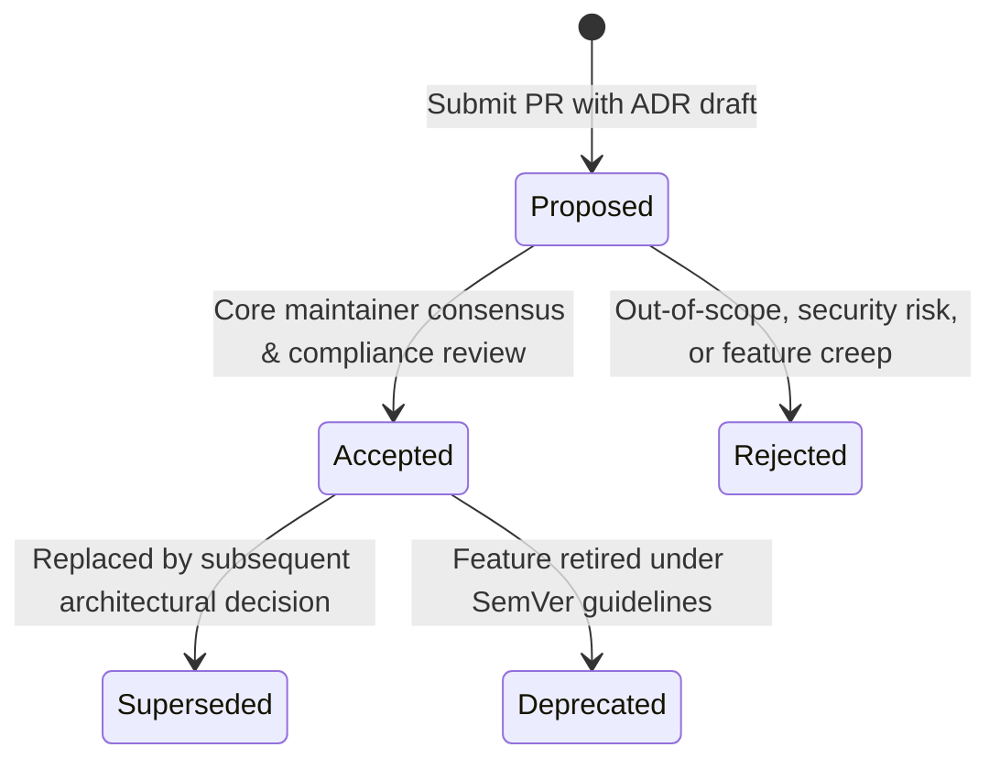

# Architecture Decision Records (ADRs)

This directory contains the authoritative Architecture Decision Records for the `EricksonLopez.Security` ecosystem.

---

## ADR Index

| ADR | Title | Status | Date | Summary |
|---|---|---|---|---|
| [**ADR-001**](./adr-001-bounded-context-and-package-strategy.md) | Bounded Context, Responsibilities, and Package Strategy | Accepted | 2026-08-30 | Establishes the 4 core tiers (`Abstractions`, `Core`, `AspNetCore`, `Testing`) and external satellite boundaries. |
| [**ADR-002**](./adr-002-authenticated-encryption-aead-default.md) | Authenticated Encryption (AEAD) as Sole Encryption Paradigm | Accepted | 2026-08-30 | Strictly enforces AES-256-GCM and ChaCha20-Poly1305. Formally rejects AES-CBC and ECB. |
| [**ADR-003**](./adr-003-binary-security-envelope-format.md) | Compact Binary Security Envelope Format | Accepted | 2026-08-30 | Defines the deterministic binary layout for encrypted payloads with AAD context binding. |
| [**ADR-004**](./adr-004-multi-version-key-lifecycle-management.md) | Multi-Version Key Lifecycle Management and Rotation | Accepted | 2026-08-30 | Automated state machine (`Active` $\rightarrow$ `Retired` $\rightarrow$ `Revoked` $\rightarrow$ `Destroyed`) with seamless legacy decryption. |
| [**ADR-005**](./adr-005-password-hashing-pbkdf2-argon2-and-auto-rehash.md) | Password Hashing with In-Box PBKDF2, Argon2id, and Auto-Rehash | Accepted | 2026-08-30 | Multi-algorithm composite password hasher with transparent rehash on successful authentication. |
| [**ADR-006**](./adr-006-side-channel-resistant-constant-time-comparisons.md) | Side-Channel Resistant Constant-Time Comparisons | Accepted | 2026-08-30 | Enforces `CryptographicOperations.FixedTimeEquals` across all secret, token, and hash verifications. |
| [**ADR-007**](./adr-007-memory-scrubbing-and-zero-allocation-primitives.md) | Cryptographic Memory Scrubbing and Zero-Allocation Primitives | Accepted | 2026-08-30 | Mandates `CryptographicOperations.ZeroMemory` upon `Dispose()` and span-first zero-allocation pipelines. |
| [**ADR-008**](./adr-008-redacted-sensitive-wrapper-types.md) | Type-Safe Redacted Sensitive Wrapper Types | Accepted | 2026-08-30 | Introduces `Redacted<T>` and `Secret<T>` to prevent accidental credential leakage in logs and traces. |
| [**ADR-009**](./adr-009-hashed-token-and-api-key-storage-pattern.md) | Non-Reversible Hashed Token and Structured API Key Storage | Accepted | 2026-08-30 | Establishes single-use plaintext issuance, SHA-256 persistence, and fast prefix indexing. |
| [**ADR-010**](./adr-010-clean-architecture-and-result-pattern-error-handling.md) | Result Pattern and Functional Error Handling via `EricksonLopez.Result` | Accepted | 2026-08-30 | Replaces control-flow exceptions with typed `SecurityError` discriminated union returns. |
| [**ADR-011**](./adr-011-azure-key-vault-integration.md) | Azure Key Vault Key and Secret Store Satellite Integration | Accepted | 2026-08-30 | Establishes satellite adapter for Azure Key Vault Keys and Secrets via `Azure.Security.KeyVault.*`. |
| [**ADR-012**](./adr-012-aws-kms-and-secrets-manager-integration.md) | AWS KMS and Secrets Manager Satellite Integration | Accepted | 2026-08-30 | Establishes satellite adapter for AWS KMS and Secrets Manager via `AWSSDK.*`. |
| [**ADR-013**](./adr-013-hashicorp-vault-transit-and-kv-integration.md) | HashiCorp Vault Transit and KV v2 Satellite Integration | Accepted | 2026-08-30 | Establishes satellite adapter for HashiCorp Vault Transit Engine and KV v2 engine. |
| [**ADR-014**](./adr-014-hybrid-post-quantum-cryptography-pqc.md) | Hybrid Post-Quantum Cryptography (PQC) Key Encapsulation | **Superseded by ADR-025** | 2026-08-30 | Original intent: ML-KEM-768 + AES-256-GCM. Actual implementation uses HKDF-SHA512 only. See ADR-025. |
| [**ADR-015**](./adr-015-reject-jwt-issuance-and-oauth-server.md) | Reject JWT Issuance, OAuth2 / OIDC Server, and ASP.NET Identity Replacement | Accepted (Scope Rejected) | 2026-09-01 | Formally excludes OAuth2/OIDC servers and JWT issuance to prevent feature creep. |
| [**ADR-016**](./adr-016-saml2-profile-coverage-audit.md) | SAML 2.0 Profile Coverage Audit | Accepted | 2026-09-01 | Implements IdP-initiated SSO and Single Logout (SLO) to achieve full enterprise federation parity. |
| [**ADR-017**](./adr-017-satellite-repository-strategy.md) | Satellite Repository Strategy | Accepted | 2026-09-01 | Monorepo retention policy governing all 21 packages until standalone thresholds warrant extraction. |
| [**ADR-018**](./adr-018-ssrf-prevention-architecture.md) | SSRF Prevention Architecture | Accepted | 2026-09-01 | Socket-level protection (`SafeSocketsHttpHandler`) mitigating DNS rebinding and loopback attacks. |
| [**ADR-019**](./adr-019-opentelemetry-satellite-strategy.md) | OpenTelemetry Observability Satellite Strategy | Accepted | 2026-09-01 | Zero OTel SDK dependency in core; BCL `ActivitySource`/`Meter` in core; optional satellite adapter. |
| [**ADR-020**](./adr-020-reject-rate-limiting-captcha-full-ca-proprietary-crypto.md) | Reject Rate Limiting, CAPTCHA / Bot Detection, Full CA, and Proprietary Crypto | Accepted (Scope Rejected) | 2026-09-01 | Formal rejection of edge rate limiting, CAPTCHA, full PKI CA, and non-standard ciphers. |
| [**ADR-021**](./adr-021-defer-fido-mds3-u2f-roslyn-analyzer.md) | Full Implementation — FIDO MDS3, FIDO-U2F, Roslyn Analyzers, SAML SP Metadata | Accepted | 2026-09-01 | Completes implementation of FIDO MDS3, FIDO-U2F attestation, Roslyn analyzers, and SP metadata. |
| [**ADR-022**](./adr-022-automated-devsecops-supply-chain-attestation.md) | Automated DevSecOps, Supply Chain Provenance Attestation, and Multi-Tier Quality Gates | Accepted | 2026-09-02 | Formalizes Sigstore provenance attestation, NuGet OIDC publishing, Strong Naming, and Stryker 95% mutation threshold. |
| [**ADR-023**](./adr-023-dual-pbkdf2-hasher-architecture.md) | Dual PBKDF2 Password Hasher Archetypes and Format Segregation | Accepted | 2026-09-02 | Formalizes architectural tier segregation between standalone crypto PBKDF2 (600k) and composite modular crypt PBKDF2 (210k). |
| [**ADR-024**](./adr-024-argon2id-hasher-implementation-strategy.md) | Argon2idPasswordHasher Cryptographic Substrate and Upgrade Strategy | **Superseded by ADR-031** | 2026-09-02 | Documents former interim status; superseded by genuine RFC 9106 Argon2id adoption via `Konscious.Security.Cryptography.Argon2`. |
| [**ADR-025**](./adr-025-hkdf-enhanced-encryption-engine-pqc-roadmap.md) | HKDF-Enhanced Encryption Engine — PQC Implementation Status and ML-KEM-768 Roadmap | Accepted | 2026-09-02 | Supersedes ADR-014. Corrects the ML-KEM-768 claim: current implementation is HKDF-SHA512 key derivation + AES-256-GCM. Defines ML-KEM-768 upgrade path for .NET 10+. |
| [**ADR-026**](./adr-026-recovery-code-generator-static-utility-design.md) | RecoveryCodeGenerator Static Utility Architecture and API Design | Superseded by ADR-029 | 2026-09-02 | Resolves API parity by retaining RecoveryCodeGenerator as a high-performance static utility, separating code generation from stateful credential verification. |
| [**ADR-027**](./adr-027-sonarcloud-and-ci-cd-standardization.md) | SonarCloud Static Analysis Integration and CI/CD Release Standardization | Accepted | 2026-09-03 | Incorporates SonarCloud scanning into CI build pipelines, standardizes OIDC trusted publishing, and enhances quality gate enforcement. |
| [**ADR-028**](./adr-028-xml-signature-wrapping-defense-and-certificate-validation.md) | XML Signature Wrapping (XSW) Defense and Trust Anchor Validation in SAML 2.0 | Accepted | 2026-09-08 | Implements anti-XSW signed element binding and strict X.509 trust anchor validation in `XmlSignatureVerifier`. |
| [**ADR-029**](./adr-029-recovery-code-generator-dependency-injection-abstraction.md) | Recovery Code Generator Dependency Injection Abstraction (`IRecoveryCodeGenerator`) | Accepted | 2026-09-08 | Introduces `IRecoveryCodeGenerator` interface and DI registration while retaining high-performance static utility methods. |
| [**ADR-030**](./adr-030-explicit-legacy-pbkdf2-password-hasher-format-segregation.md) | Explicit Legacy PBKDF2 Password Hasher Format Segregation | Accepted | 2026-09-08 | Introduces `LegacyPbkdf2PasswordHasher` with `$legacy-pbkdf2$` prefix for truthful algorithm reporting and ASP.NET Core Identity v3 compatibility. |
| [**ADR-031**](./adr-031-konscious-argon2id-rfc9106-adoption.md) | Genuine RFC 9106 Argon2id Cryptographic Substrate Adoption via Konscious.Security.Cryptography | Accepted | 2026-09-19 | Adopts `Konscious.Security.Cryptography.Argon2` as the RFC 9106 memory-hard substrate, superseding ADR-024. |

---

## Decision Lifecycle

Architecture decisions evolve through the following lifecycle states:

- **Proposed**: Under community and architectural review.
- **Accepted**: Officially adopted and implemented in production code.
- **Rejected**: Formally evaluated and excluded with documented rationale (e.g. ADR-015, ADR-020).
- **Superseded**: Superseded by a newer ADR with updated constraints.
