# ADR-022: Automated DevSecOps, Supply Chain Provenance Attestation, and Multi-Tier Quality Gates

## Status
Accepted

## Date
2026-09-02

**Date**: 2026-09-02  
**Status**: Accepted  
**Deciders**: EricksonLopez.Security Core Team

---

## Context

`EricksonLopez.Security` serves as the foundational security and cryptographic primitives tier for enterprise .NET applications. Downstream systems and high-compliance environments (PCI-DSS, HIPAA, FedRAMP, GDPR) rely directly upon the integrity, provenance, and operational correctness of these packages.

Distributing cryptographic libraries introduces unique supply chain and quality risks:
1. **Supply Chain Tampering**: Binary packages published to public feeds without cryptographic provenance can be tampered with or substituted in transit.
2. **Credential Exfiltration**: Static, long-lived NuGet API keys stored in CI secrets risk accidental disclosure or exfiltration.
3. **Silent Trimming / AOT Regressions**: Code modifications that introduce unsupported reflection or ambient dynamic behaviors break Native AOT publishing silently unless tested under real AOT compilation.
4. **False Confidence from Line Coverage**: Standard code coverage metrics do not evaluate whether assertions actually verify cryptographic invariants, boundary protections, or timing-safety guarantees.
5. **Architectural Drift**: Concrete references slipping into domain abstraction layers compromise Clean Architecture and loose coupling.

---

## Decision

We establish an automated DevSecOps and supply chain security framework across all 21 packages, enforced through GitHub Actions pipelines and repository configuration artifacts:

### 1. Cryptographic Build Provenance via Sigstore Attestation
- In `.github/workflows/publish.yml`, all package artifacts (`.nupkg`) are attested using GitHub Artifact Attestations powered by Sigstore (`actions/attest-build-provenance@v1`).
- Generates a signed, verifiable cryptographic manifest binding the build commit, workflow identity, and binary hash without requiring external key management.

### 2. NuGet Trusted Publishing via OIDC
- Automated releases utilize GitHub Actions OpenID Connect (OIDC) federated credentials with NuGet.org (`id-token: write`).
- Eliminates static `NUGET_API_KEY` secrets, granting short-lived, repository-scoped authorization exclusively during approved release job runs.

### 3. Strong Name Signing
- All assemblies are cryptographically signed with the official project key (`EricksonLopez.snk`) during compilation (`<SignAssembly>true</SignAssembly>`).
- Public key:
  ```text
  0024000004800000940000000602000000240000525341310004000001000100655c867cb6d2e3a8d53e10d858994a49ea6b428de6e1e2eec19c71f0409345a7bf1649e9208282982347d90153f237f1aef003468e4a913598faa0b96815de53ede401790587fef88c7869884cdbf4372e74a44facf7dd6995e9b832285f8c548f531e1886d6712632139b617cd4f13988021b7cc32b5c3af18f52e19ae2a6cc
  ```

### 4. Multi-Tier Quality Gates

```mermaid
flowchart LR
    Commit([Code Push / PR]) --> Restore[Restore CPM]
    Restore --> Build[Build TreatWarningsAsErrors]
    Build --> Tests[551 Automated Tests\nCoverlet >= 95%]
    Tests --> Arch[NetArchTest Rules]
    Arch --> AOT[Native AOT Smoke Test]
    AOT --> Stryker[Stryker Mutation Gate\nBreak Threshold: 95%]
    Stryker --> Attest[Sigstore Attestation]
    Attest --> Publish[OIDC Trusted Publish]
```



1. **Compilation Guardrails**: `<TreatWarningsAsErrors>true</TreatWarningsAsErrors>`, `<WarningLevel>5</WarningLevel>`, and `<EnableTrimAnalyzer>true</EnableTrimAnalyzer>`.
2. **Automated Test Matrix**: 551 test methods covering unit, integration, and security invariants across multi-targeting runtimes (`net8.0`, `net9.0`, `net10.0`) on Ubuntu and Windows.
3. **Architecture Governance (NetArchTest)**: Automated validation ensuring `EricksonLopez.Security.Abstractions` maintains zero internal or external implementation dependencies.
4. **Native AOT Smoke Test**: Dedicated executable (`tests/EricksonLopez.Security.AotSmokeTest`) compiled self-contained in CI to ensure zero runtime reflection or trimming regressions.
5. **Mutation Testing Gate (Stryker.NET)**: Configured across all functional packages via dedicated configuration files (`stryker-*.json`) executing as a 19-job parallel matrix with a mandatory **break threshold of 95%** and consolidated quality gate reporting.
6. **Automated Dependency Maintenance**: Weekly Dependabot scans (`.github/dependabot.yml`) for NuGet packages and GitHub Actions.

---

## Consequences

### Positive
- **Tamper-Proof Supply Chain**: Downstream consumers can verify build provenance back to the exact commit in `ericksonlopezf/dotnet-security`.
- **Zero Static Secrets**: Eliminates credential theft risk via OIDC federation.
- **Enforced Cryptographic Verification**: The 95% mutation testing threshold ensures tests actually assert security logic rather than merely traversing code branches.
- **Deterministic Native AOT Guarantees**: AOT regressions are caught before PR merge.

### Tradeoffs
- **Mutation Testing Execution Time**: Running full mutation testing on cryptographic algorithms (PBKDF2 210,000 iterations, Argon2id) is computationally expensive; isolated in CI on main pushes and filtered via exclusion configs.

---

## References
- [NIST SP 800-218 (Secure Software Development Framework)](https://csrc.nist.gov/pubs/sp/800/218/final)
- [Sigstore Software Supply Chain Security](https://www.sigstore.dev/)
- [NuGet Trusted Publishing with GitHub Actions](https://learn.microsoft.com/en-us/nuget/nuget-org/trusted-signers)
- [Stryker.NET Mutation Testing Documentation](https://stryker-mutator.io/docs/stryker-net/introduction/)
