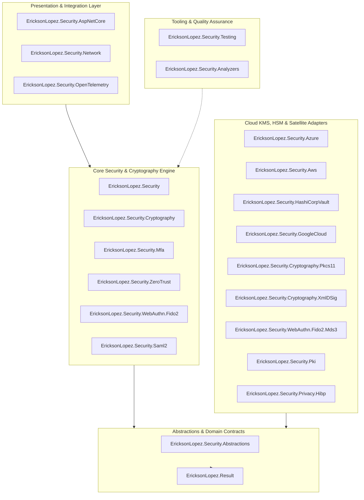
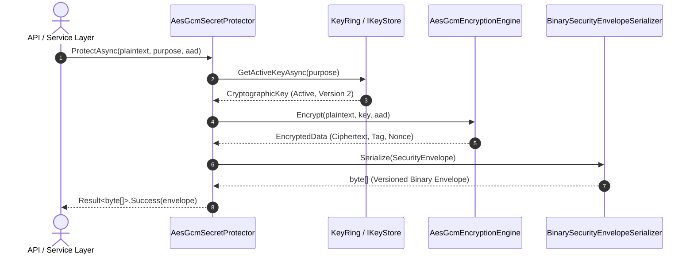
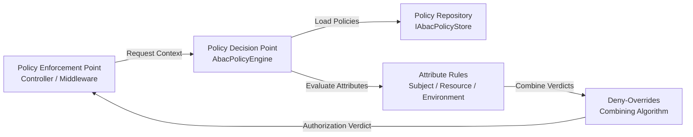
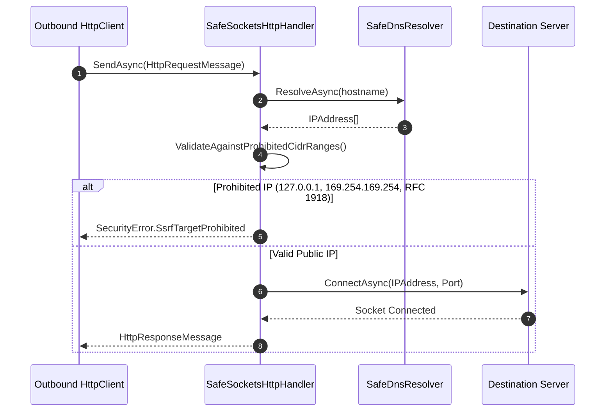
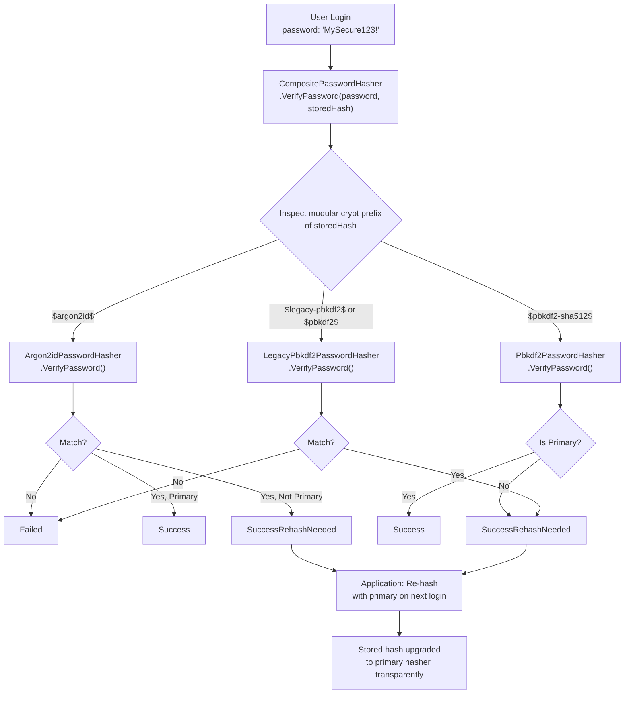
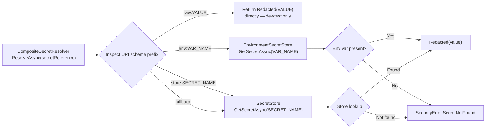
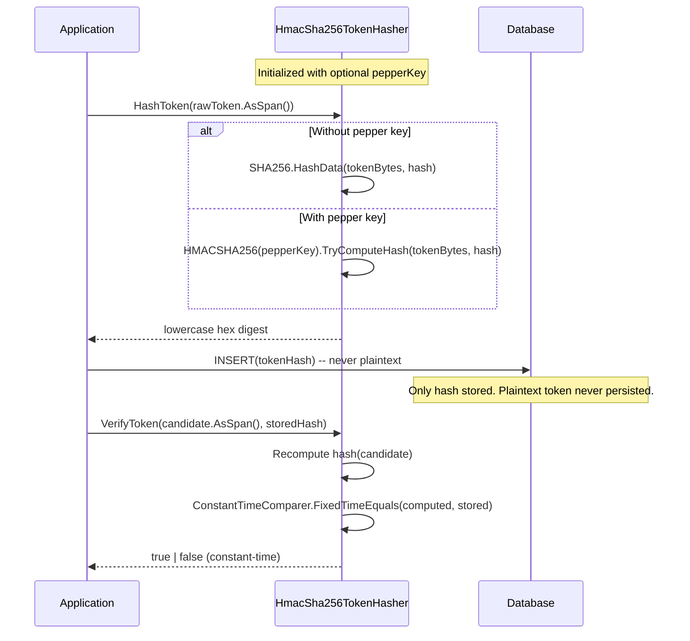

# Architecture Guide — EricksonLopez.Security

> **Version**: v1.0.0  
> **Target Frameworks**: .NET 8.0 \| .NET 9.0 \| .NET 10.0  
> **Core Architectural Patterns**: Clean Architecture, Ports & Adapters (Hexagonal), Zero Trust (ABAC NIST SP 800-162), Memory Scrubbing, Native AOT.

---

## 1. System Overview

`EricksonLopez.Security` is the foundational enterprise security and cryptography ecosystem for modern .NET applications. It provides high-performance, allocation-conscious cryptographic primitives, guaranteed Native AOT compatibility, misuse-resistant APIs, versioned binary security envelopes, zero-downtime multi-version key lifecycle management, WebAuthn/Passkeys Level 3 authentication, SAML 2.0 Service Provider federation with anti-XSW defense, and dynamic Attribute-Based Access Control (ABAC).

The architecture is designed around a fundamental tenet: **make secure software the path of least resistance**. Insecure ciphers (AES-CBC, ECB) are excluded by design; secrets are automatically redacted in logs and scrubbed from RAM upon disposal; and core crypto pipelines execute in constant time with zero heap allocations.

> [!NOTE]
> **Architectural Governance & Implementation Status (v1.x)**:
> - **Core & Cryptography**: Fully operational production engines with zero-allocation span pipelines and Native AOT guarantees.
> - **Cloud Adapters (AWS KMS, Azure Key Vault, HashiCorp Vault, Google Cloud KMS)**: Production-ready satellite adapters providing live cloud SDK integrations (`Azure.Security.KeyVault.*`, `AWSSDK.*`, `Google.Cloud.*`, HashiCorp Vault HTTP API) for enterprise KMS and Secret Stores, with an optional thread-safe in-memory test double (`EnableDevelopmentInMemoryStub`) for local development without cloud dependencies (ADR-011, ADR-012, ADR-013).
> - **Argon2id, PQC & Legacy Status**: Documented per ADR-025, ADR-030, and ADR-031. `Argon2idPasswordHasher` implements genuine memory-hard RFC 9106 Argon2id (64 MiB RAM, 3 iterations, 4 parallelism lanes) via `Konscious.Security.Cryptography.Argon2id`; HKDF-enhanced engine uses HKDF-SHA512 key isolation pending .NET FIPS 203 ML-KEM-768 stabilization (`HkdfAesGcmEncryptionEngine`, with `HybridAes256GcmMlKem` preserved as an obsolete alias); legacy ASP.NET Identity hashes are handled via dedicated `LegacyPbkdf2PasswordHasher` (`$legacy-pbkdf2$`).

---

## 2. Package Decomposition & Layer Architecture

The ecosystem comprises 21 specialized packages organized into distinct architectural layers:



### Layer Responsibilities

| Layer / Package | Classification | Primary Architectural Responsibility |
|---|---|---|
| `EricksonLopez.Security.Abstractions` | Domain / Ports | Immutable domain primitives (`KeyIdentifier`, `KeyVersion`, `Redacted<T>`, `Nonce`, `Salt`), contracts, policies, domain events, `ISimplePasswordHasher`, `IKeyRevocationNotifier`, and `SecurityError` catalog. Zero third-party dependencies. |
| `EricksonLopez.Security` | Core Engine | Central cryptographic orchestration: AES-256-GCM, ChaCha20-Poly1305, HKDF-Enhanced AES-256-GCM (`HkdfAesGcmEncryptionEngine`, see [ADR-025](./adr/adr-025-hkdf-enhanced-encryption-engine-pqc-roadmap.md)), `BinarySecurityEnvelopeSerializer`, `KeyLifecycleManager`, `InProcessKeyRevocationNotifier`, `DelegateKeyRevocationNotifier` for distributed key revocation broadcasting, `KeyRing` with automated cache eviction, `CompositePasswordHasher` with PBKDF2, Argon2id, and `LegacyPbkdf2PasswordHasher` (see [ADR-030](./adr/adr-030-explicit-legacy-pbkdf2-password-hasher-format-segregation.md)), `ApiKeyGenerator`. |
| `EricksonLopez.Security.Cryptography` | Core Engine | Direct cryptographic engines, constant-time primitives (`ConstantTimeComparer`, `TimingSafeString`), and CSPRNG provider. |
| `EricksonLopez.Security.Mfa` | Core Protocols | Multi-factor authentication: RFC 6238 TOTP, HOTP, `DelegateTotpReplayStore` for distributed replay prevention, `IRecoveryCodeGenerator` DI abstraction & `RecoveryCodeGenerator` static utility (see [ADR-026](./adr/adr-026-recovery-code-generator-static-utility-design.md), [ADR-029](./adr/adr-029-recovery-code-generator-dependency-injection-abstraction.md)), and `otpauth://` QR URI generation. |
| `EricksonLopez.Security.ZeroTrust` | Core Engine | Dynamic Attribute-Based Access Control (ABAC) evaluation engine compliant with NIST SP 800-162 and XACML Deny-Overrides. |
| `EricksonLopez.Security.WebAuthn.Fido2` | Core Protocols | WebAuthn Level 3 Passkeys ceremony orchestration, CBOR parsing, attestation validation (Packed, TPM 2.0, SafetyNet, FIDO-U2F). |
| `EricksonLopez.Security.Saml2` | Core Protocols | Enterprise SAML 2.0 Service Provider (SP), SP/IdP-initiated SSO, Single Logout (SLO), anti-XSW signature validation, and SP metadata generation. |
| `EricksonLopez.Security.AspNetCore` | Integration | Web security headers middleware (`SecurityHeadersMiddleware`), API key authentication middleware, scoped `IRequestSecurityContext`, and `IdentityPasswordHasherBridge<TUser>` for ASP.NET Core Identity. |
| `EricksonLopez.Security.Network` | Perimeter Defense | Socket-level Server-Side Request Forgery (SSRF) defense (`SafeSocketsHttpHandler`) and CIDR prohibited IP filtering. |
| `EricksonLopez.Security.Pki` | Infrastructure | X.509 certificate chain validation, custom trust anchors, and CRL/OCSP revocation checking. |
| `EricksonLopez.Security.Privacy.Hibp` | Integration | Have I Been Pwned k-anonymity password breach verification client. |
| `EricksonLopez.Security.Cryptography.XmlDSig` | Infrastructure | W3C XML Digital Signatures (RFC 3275) enveloped, enveloping, and detached signing with canonicalization, strict anti-XSW element binding, and X.509 trust anchor validation via `XmlVerificationOptions` and `XmlVerificationResult` (see [ADR-028](./adr/adr-028-xml-signature-wrapping-defense-and-certificate-validation.md)). |
| `EricksonLopez.Security.Cryptography.Pkcs11` | Infrastructure | Hardware Security Module (HSM) and smartcard interop via standard PKCS#11 (Cryptoki) C-API. |
| `EricksonLopez.Security.WebAuthn.Fido2.Mds3` | Infrastructure | FIDO Alliance Metadata Service v3 HTTP client, BLOB parser, and status verification. |
| `EricksonLopez.Security.Azure` | Cloud Adapter | Azure Key Vault Key Store (`IKeyStore`) and Secret Store (`ISecretStore`) adapters (v1.x in-memory stub). |
| `EricksonLopez.Security.Aws` | Cloud Adapter | AWS KMS Key Store and AWS Secrets Manager Secret Store adapters (v1.x in-memory stub). |
| `EricksonLopez.Security.HashiCorpVault` | Cloud Adapter | HashiCorp Vault Transit Encryption Engine and KV v2 Secret Store adapters (v1.x in-memory stub). |
| `EricksonLopez.Security.GoogleCloud` | Cloud Adapter | Google Cloud KMS Key Store (`IKeyStore`) and Secret Manager Secret Store (`ISecretStore`) adapters (v1.x in-memory stub). |
| `EricksonLopez.Security.OpenTelemetry` | Observability | Registration of `SecurityActivitySource` and `SecurityMeter` into the OpenTelemetry telemetry pipeline. |
| `EricksonLopez.Security.Testing` | Testing / Fakes | In-memory test doubles (`FakeKeyStore`, `FakePasswordHasher`), deterministic RNG, and `SecurityAssert`. |
| `EricksonLopez.Security.Analyzers` | Static Analysis | Roslyn Diagnostic Analyzers (`ELS0001`–`ELS0005`) targeting `netstandard2.0` for compile-time security guardrails. |

---

## 3. Cryptographic Key Lifecycle State Machine

Keys transition through a deterministic state machine managed by `IKeyLifecycleManager`:

```mermaid
stateDiagram-v2
    [*] --> Active: GenerateAndActivateKeyAsync()
    Active --> Retired: RotateKeyAsync()
    Active --> Revoked: RevokeKeyAsync(Compromise)
    Retired --> Revoked: RevokeKeyAsync(Compromise)
    Retired --> Destroyed: ZeroMemory() & Delete
    Revoked --> Destroyed: ZeroMemory() & Delete
    
    note right of Active: Encrypts new payloads & decrypts existing
    note right of Retired: Strictly allowed for historical decryption only
    note right of Revoked: Emergency kill-switch: rejected immediately for all operations
```

### State Semantics
- **`Active`**: Allowed to encrypt new payloads and decrypt existing payloads. Only one key version is active per purpose at any time.
- **`Retired`**: Prohibited for new encryption passes; retained strictly for decrypting legacy historical records.
- **`Revoked`**: Immediate emergency kill-switch. All cryptographic operations fail fast with `SecurityError.KeyRevoked`.
- **`Destroyed`**: Key material is wiped from memory via `CryptographicOperations.ZeroMemory` and permanently deleted from persistence.

---

## 4. Protection & Envelope Serialization Pipeline



### Binary Security Envelope Layout
Envelopes are serialized with an immutable, versioned binary structure:
```text
+--------+--------+----------------+----------------+----------------+----------------+----------------+----------------+----------------+----------------+
| Ver(1) | Alg(1) | KeyIdLen(2 LE) | KeyId (UTF-8)  | KeyVer(4 LE)   | Nonce (12)     | Tag (16)       | AADLen(4 LE)   | AAD (Bytes)    | Ciphertext (N) |
+--------+--------+----------------+----------------+----------------+----------------+----------------+----------------+----------------+----------------+
```
- **AAD Context Binding**: Ensures that ciphertexts encrypted for tenant A cannot be decrypted in the context of tenant B, even if keys are shared.

---

## 5. Zero Trust Attribute-Based Access Control (ABAC) Architecture

`EricksonLopez.Security.ZeroTrust` implements dynamic authorization compliant with NIST SP 800-162 and XACML:



- **Subject Attributes**: Actor ID, Roles, Clearances, Tenant.
- **Resource Attributes**: Resource Type, Owner, Classification, Sensitivity Level.
- **Environment Attributes**: Client IP, Time of Day, Network Security Zone.
- **Resolution Strategy**: Strict **Deny-Overrides** — any matching `Deny` rule unconditionally vetoes the authorization request.

---

## 6. Network SSRF Prevention Architecture

`EricksonLopez.Security.Network` provides defense-in-depth against Server-Side Request Forgery via `SafeSocketsHttpHandler`:



- **DNS Rebinding Defense**: Pinning occurs at socket connect time using resolved and verified IP addresses, neutralizing TTL manipulation attacks.

---

## 7. Security Invariants & Performance Engineering

1. **Native AOT & Reflection-Free Core**: Core cryptographic pipelines completely eliminate `System.Reflection` and runtime code generation. All projects build cleanly with `TreatWarningsAsErrors=true` and `EnableTrimAnalyzer=true`.
2. **Side-Channel Timing Attack Resistance**: All credential, token, API key, and signature comparisons use `CryptographicOperations.FixedTimeEquals` via `ConstantTimeComparer`.
3. **Deterministic Memory Scrubbing**: Sensitive buffers implement `ISecretBuffer` or `SecretBuffer`, calling `CryptographicOperations.ZeroMemory` immediately upon `Dispose()`.
4. **Misuse Resistance**: Unauthenticated cipher modes (CBC, ECB) are completely omitted from the API surface. Envelopes strictly require authenticated encryption with authentication tags.
5. **Zero Heap Allocations**: Cryptographic hotpaths provide `ReadOnlySpan<byte>` overloads, stack allocation for short buffers, and memory pooling via `ArrayPool<byte>.Shared`.

---

## 8. Supplemental Architectural Flows

### 8.1 CompositePasswordHasher — Transparent Algorithm Migration



---

### 8.2 CompositeSecretResolver — Multi-Scheme URI Resolution



---

### 8.3 HmacSha256TokenHasher — Token Hashing for Database Lookup


