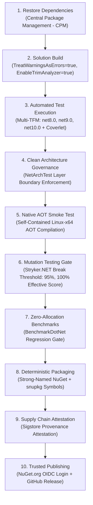
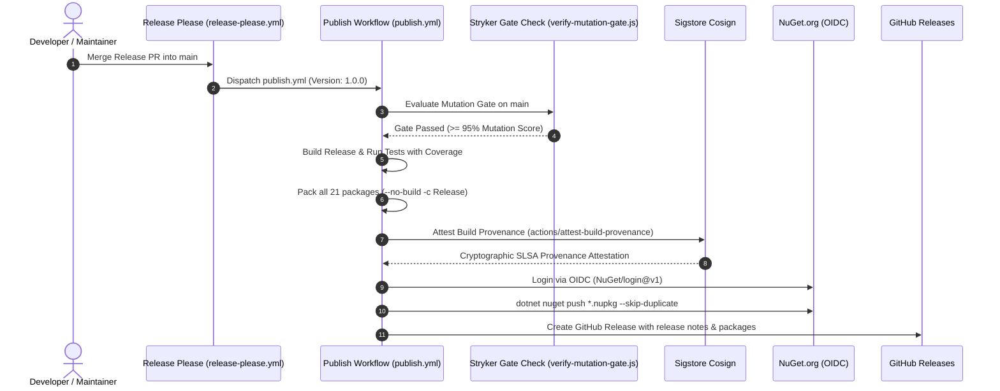

# Build, CI/CD & Quality Gates — EricksonLopez.Security

> **Documentation Scope**: Build pipeline, MSBuild configuration, Quality Gates, Strong Name Signing, all 10 GitHub Actions workflows, DevSecOps supply chain security, and Release Engineering.

---

## 1. Build Lifecycle Overview

The build, verification, and packaging lifecycle for `EricksonLopez.Security` enforces strict compilation and multi-tier quality gates across all 21 packable library projects (49 total projects in the solution):



---

## 2. Solution Configuration & MSBuild Properties

Centralized build settings are defined in [`Directory.Build.props`](../Directory.Build.props):

### Core Compilation Settings
- **Target Frameworks**: Multi-targeting `net8.0;net9.0;net10.0` (inherited across 20 runtime packages; `EricksonLopez.Security.Analyzers` targets `netstandard2.0`).
- **Language Version**: `<LangVersion>latest</LangVersion>` (C# 13 features enabled).
- **Nullability**: `<Nullable>enable</Nullable>` enforced across all projects.
- **Implicit Usings**: `<ImplicitUsings>enable</ImplicitUsings>` enabled globally.
- **Warning Level & Strictness**:
  - `<WarningLevel>5</WarningLevel>`
  - `<TreatWarningsAsErrors>true</TreatWarningsAsErrors>` (all warnings treated as fatal errors)
  - `<AnalysisLevel>latest-recommended</AnalysisLevel>`
- **Suppressed Compiler Diagnostics (`<NoWarn>`)**:
  - `CA1848`: Logging message template performance recommendation.
  - `CA1873`: String interpolation in logging calls (handled with explicit `IsEnabled` guards).
  - Note: `NU1901`-`NU1904` are actively enforced (not suppressed) to prevent vulnerable dependencies in supply-chain audits.

### Native AOT & Trimming Settings
- `<IsAotCompatible>true</IsAotCompatible>`: Declares that the library assemblies are trim-compatible and safe for Native AOT (set on 17 of 21 packages; 3 runtime packages explicitly set `<IsAotCompatible>false</IsAotCompatible>` due to XML/dynamic dependencies: `Saml2`, `Cryptography.XmlDSig`, and `OpenTelemetry`. `EricksonLopez.Security.Analyzers` targets `netstandard2.0` and runs inside the compiler process — it is a build-time tool, not a runtime package, and is not subject to the AOT runtime check).
- `<EnableTrimAnalyzer>true</EnableTrimAnalyzer>`: Activates Roslyn trimming analyzers during build, catching unsupported reflection or dynamic code generation at compile time.

---

## 3. Strong Name Signing & Supply Chain Security

All assemblies shipped by `EricksonLopez.Security` are cryptographically signed with a project key:

- **Key File**: `EricksonLopez.snk` (RSA strong name key located in the repository root).
- **Public Key**:
  ```text
  0024000004800000940000000602000000240000525341310004000001000100655c867cb6d2e3a8d53e10d858994a49ea6b428de6e1e2eec19c71f0409345a7bf1649e9208282982347d90153f237f1aef003468e4a913598faa0b96815de53ede401790587fef88c7869884cdbf4372e74a44facf7dd6995e9b832285f8c548f531e1886d6712632139b617cd4f13988021b7cc32b5c3af18f52e19ae2a6cc
  ```
- **Conditional Compilation**: `<DefineConstants>SIGN_ASSEMBLY</DefineConstants>` is defined when assembly signing is active.
- **SourceLink & Symbol Packages**:
  - `<PublishRepositoryUrl>true</PublishRepositoryUrl>`
  - `<EmbedUntrackedSources>true</EmbedUntrackedSources>`
  - `<IncludeSymbols>true</IncludeSymbols>`
  - `<SymbolPackageFormat>snupkg</SymbolPackageFormat>`
- **Supply Chain Provenance**: Evaluated and attested via Sigstore (`actions/attest-build-provenance@v2.2.3`) during packaging.
- **Governing Architecture Decision**: Defined and governed under [**ADR-022: Automated DevSecOps, Supply Chain Provenance Attestation, and Multi-Tier Quality Gates**](./adr/adr-022-automated-devsecops-supply-chain-attestation.md).

---

## 4. Central Package Management (CPM)

Dependencies and versions are managed strictly centrally in [`Directory.Packages.props`](../Directory.Packages.props):

- `<ManagePackageVersionsCentrally>true</ManagePackageVersionsCentrally>` ensures no individual `.csproj` specifies a package version directly.

### Complete Dependency Matrix

| Category | Dependency | Pinned Version | Consumed By / Purpose |
|---|---|---|---|
| **Ecosystem** | `EricksonLopez.Result` | `2.0.0` | `Abstractions`, `Core`, `Testing`, etc. (Monadic functional error handling) |
| **Microsoft Extensions** | `Microsoft.Extensions.DependencyInjection.Abstractions` | `10.0.11` | DI contract abstractions |
| | `Microsoft.Extensions.DependencyInjection` | `10.0.11` | Concrete DI container runtime |
| | `Microsoft.Extensions.Logging.Abstractions` | `10.0.11` | Zero-allocation structured logging contracts |
| | `Microsoft.Extensions.Options` | `10.0.11` | Strongly-typed options configuration pattern |
| | `Microsoft.Extensions.Http` | `10.0.11` | HTTP client factory and resilient handlers |
| | `Microsoft.Extensions.TimeProvider.Testing` | `10.1.0` | Deterministic time simulation in tests |
| | `Microsoft.SourceLink.GitHub` | `10.0.400` | SourceLink debugging metadata |
| | `System.Formats.Cbor` | `10.0.11` | WebAuthn/FIDO2 CBOR attestation parsing |
| | `System.Security.Cryptography.Xml` | `10.0.10` | SAML 2.0 and W3C XMLDSig canonicalization |
| **Observability** | `OpenTelemetry.Api` | `1.18.0` | OTel ActivitySource & Meter bridge |
| | `OpenTelemetry` | `1.18.0` | Telemetry SDK |
| **Roslyn Tooling** | `Microsoft.CodeAnalysis.CSharp` | `4.13.0` | Roslyn analyzer syntax tree inspection |
| | `Microsoft.CodeAnalysis.CSharp.Workspaces` | `5.9.0` | Roslyn workspace and diagnostic testing |
| | `Microsoft.CodeAnalysis.Analyzers` | `3.11.0` | Roslyn analyzer SDK meta-analyzers |
| **Cloud Security SDKs** | `Azure.Identity` | `1.21.0` | Azure Key Vault token credential provider |
| | `Azure.Security.KeyVault.Keys` | `4.10.1` | Azure Key Vault cryptographic keys client |
| | `Azure.Security.KeyVault.Secrets` | `4.11.1` | Azure Key Vault secrets client |
| | `AWSSDK.KeyManagementService` | `4.0.100.12` | AWS KMS envelope encryption & key operations |
| | `AWSSDK.SecretsManager` | `4.0.100.12` | AWS Secrets Manager secret store client |
| | `Google.Cloud.Kms.V1` | `3.26.0` | Google Cloud KMS & Cloud HSM key operations client |
| | `Google.Cloud.SecretManager.V1` | `2.8.0` | Google Cloud Secret Manager client |
| **Testing & Quality** | `Microsoft.NET.Test.Sdk` | `18.9.0` | Test runner SDK |
| | `xunit` | `2.9.3` | Test framework core |
| | `xunit.runner.visualstudio` | `4.0.0` | Visual Studio and `dotnet test` test adapter |
| | `AwesomeAssertions` | `9.6.0` | Fluent assertions library |
| | `NSubstitute` | `5.3.0` | Test double mocking engine |
| | `FsCheck.Xunit` | `3.4.0` | Property-based and fuzzing test harness |
| | `NetArchTest.Rules` | `1.3.2` | Clean architecture and boundary enforcement rules |
| | `coverlet.collector` | `10.0.1` | Cross-platform coverage data collector |
| | `coverlet.msbuild` | `10.0.1` | MSBuild coverage integration |
| | `BenchmarkDotNet` | `0.15.8` | Microbenchmark harness and zero-allocation validator |

---

## 5. Quality Gates & Verification Gates

### 1. Repository Compliance Gate (`scripts/verify-compliance.ps1`)
Automated zero-tolerance repository compliance & governance verifier executing 8 automated checks:
1. **Documentation Naming**: Asserts that all files under `docs/` and `.github/` use strictly `kebab-case.md` naming (with canonical root exceptions).
2. **Canonical MIT Copyright Header**: Asserts that all `.cs`, `.csproj`, `.props`, `.targets`, `.slnx`, `.ps1`, `.js`, `.editorconfig`, `.codecov.yml`, and `.github/**/*.yml` files start with `Copyright © Erickson Lopez. MIT License.`.
3. **One Type Per File Governance**: Enforces that every source file under `src/` contains at most one top-level type (`class`, `interface`, `struct`, `record`, `enum`, `delegate`).
4. **Zero [Obsolete] Usage**: Scans all solution `.cs` files to prohibit deprecated or obsolete API calls.
5. **Contact & Security Email Normalization**: Verifies that `SECURITY.md`, `CODE_OF_CONDUCT.md`, `SUPPORT.md`, and `CONTRIBUTING.md` use the normalized contact email (`ericksonlopezf@gmail.com`).
6. **Directory.Build.props Standards**: Validates that `ImplicitUsings=enable`, `PackageProjectUrl`, and `icon.png` are properly declared.
7. **Zero Prohibited NoWarn Suppressions**: Scans all projects and props files to prevent unauthorized compiler warning bypasses.
8. **Markdown Internal Link Integrity**: Validates that every relative internal Markdown link in `README.md`, `docs/`, `samples/`, and `.github/` resolves to an existing file.

### 2. Code Coverage Gate (Coverlet & Codecov)
Test execution runs with cross-platform coverage collection:
```bash
dotnet test EricksonLopez.Security.slnx -c Release --no-build \
  --logger "trx;LogFileName=test-results.trx" \
  --results-directory ./test-results \
  --collect:"XPlat Code Coverage" \
  -- DataCollectionRunSettings.DataCollectors.DataCollector.Configuration.Format=opencover,cobertura
```
- Line coverage target: $\ge$ 95.00% across the solution (100.00% across all 21 units certified in [`testing.md`](./testing.md)).
- Uploaded to Codecov using `codecov/codecov-action@v5.3.1`.

### 3. Mutation Testing Gate (Stryker.NET)
Configured via [`stryker-config.json`](../stryker-config.json) and individual unit configurations:
- **Thresholds**:
  - `High`: 100%
  - `Low`: 98%
  - `Warn`: 95%
  - `Break`: 95% (any score below 95% fails the CI build with non-zero exit code).
- **Certified Score**: All 21 architectural units achieve **100.00% Effective Mutation Score** (raw Stryker score 95.88%–100.00% with all surviving mutants classified under Categories A–E in [`docs/testing.md §4`](./testing.md#4-mutation-testing--equivalent-mutant-precedent)).

### 4. Static Code Analysis (SonarCloud & Roslyn Analyzers)
- **SonarCloud**: Integrated into `.github/workflows/dotnet-build-test.yml` using `dotnet-sonarscanner` and OpenCover reports:
  - Project Key: `ericksonlopezf_dotnet-security`
  - Organization: `ericksonlopezf`
  - Host URL: `https://sonarcloud.io`
- **Internal Security Analyzers** (`EricksonLopez.Security.Analyzers`):
  - `ELS0001`: Flags non-constant-time equality comparisons (`==`) on security-sensitive buffers.
  - `ELS0002`: Flags `SecretBuffer` instances not wrapped in `using` declarations.
  - `ELS0003`: Flags hardcoded string literals assigned to secret variables.
  - `ELS0004`: Flags insecure hash algorithms (MD5/SHA1/SHA256) in password contexts.
  - `ELS0005`: Flags sensitive parameters logged without `Redacted<T>` wrappers.

### 5. Architecture Governance (NetArchTest)
Located in `tests/EricksonLopez.Security.ArchitectureTests`:
- Validates that `EricksonLopez.Security.Abstractions` has zero dependencies on concrete packages.
- Asserts that domain contracts never depend on cloud KMS or external web frameworks.
- Enforces interface naming conventions (`I*`), sealed concrete implementations, and immutability rules.

### 6. Native AOT Smoke Test Gate
Located in `tests/EricksonLopez.Security.AotSmokeTest`:
```bash
dotnet publish tests/EricksonLopez.Security.AotSmokeTest/EricksonLopez.Security.AotSmokeTest.csproj \
  --configuration Release --runtime linux-x64 --self-contained \
  -p:TreatWarningsAsErrors=true -p:WarningLevel=5 --output ./aot-output
```
- Exercises DI registration, AEAD encryption/decryption, binary envelope serialization, and token hashing under full ahead-of-time compilation on Linux x64 with `DOTNET_EnableAotCompilationWarningsAsErrors=true`.
- Runs the resulting native binary to assert zero runtime trimming regressions or missing metadata exceptions.

### 7. Performance & Zero-Allocation Regression Gate
Located in `.github/workflows/benchmark-regression-gate.yml`:
- Triggered on PRs affecting `src/**` or `benchmarks/**`.
- Compares PR branch BenchmarkDotNet runs against baselines stored in `benchmarks/results/`.
- Fails if any cryptographic primitive regresses by more than **5%**.

---

## 6. GitHub Actions Workflows Catalog

The repository defines **10 specialized GitHub Actions workflows** under `.github/workflows/`:

| Workflow File | Name | Trigger | Key Function / Scope | Secrets Required |
|---|---|---|---|---|
| [`ci.yml`](../.github/workflows/ci.yml) | `CI` | `push`, `pull_request` (`main`, `develop`) | Master CI pipeline: runs compliance audit, then invokes `dotnet-build-test.yml` and `aot-smoke-test.yml` in parallel | `SNK_KEY`, `CODECOV_TOKEN`, `SONAR_TOKEN` |
| [`dotnet-build-test.yml`](../.github/workflows/dotnet-build-test.yml) | `Reusable — .NET Build & Test` | `workflow_call` | Reusable workflow: Multi-SDK setup (8, 9, 10), SNK restoration, SonarScanner, `dotnet build -c Release`, test suite with Coverlet coverage, Codecov upload | `SNK_KEY`, `CODECOV_TOKEN`, `SONAR_TOKEN` |
| [`aot-smoke-test.yml`](../.github/workflows/aot-smoke-test.yml) | `NativeAOT Smoke Test` | `workflow_call`, `push`, `pull_request`, `workflow_dispatch` | Installs clang/lld, publishes `AotSmokeTest` as self-contained Linux-x64 native binary, and executes it | `SNK_KEY` |
| [`publish.yml`](../.github/workflows/publish.yml) | `Publish NuGet Packages` | `push` (tags `v*.*.*`), `workflow_dispatch` | Packs all 21 packages, runs Sigstore provenance attestation, pushes to NuGet.org via OIDC trusted publishing, and creates GitHub Release | `SNK_KEY`, `CODECOV_TOKEN`, `GITHUB_TOKEN` |
| [`release-please.yml`](../.github/workflows/release-please.yml) | `Release Please` | `push` (`main`) | Automates semantic versioning, changelog generation, and triggers `publish.yml` via workflow dispatch upon release merge | `GITHUB_TOKEN` |
| [`repo-compliance.yml`](../.github/workflows/repo-compliance.yml) | `Repository Compliance & Quality Gate` | `push`, `pull_request` (`main`), `workflow_dispatch` | Runs `./scripts/verify-compliance.ps1`, restores, builds with strict diagnostics, tests, and packs packages | None |
| [`mutation-testing.yml`](../.github/workflows/mutation-testing.yml) | `Mutation Testing (Stryker)` | `schedule` (Mon 04:00 UTC), `workflow_dispatch`, `workflow_call` | Runs Stryker.NET across all 20 functional packages with configurable mutation level (Basic, Standard, Advanced) and 95% break threshold | None |
| [`benchmark-regression-gate.yml`](../.github/workflows/benchmark-regression-gate.yml) | `Benchmark Regression Gate` | `pull_request` (`main`, `develop`), `workflow_dispatch` | Runs BenchmarkDotNet against PR changes and compares with baseline in `benchmarks/results/`; fails if regression > 5% | `SNK_KEY` |
| [`benchmarks.yml`](../.github/workflows/benchmarks.yml) | `Benchmarks` | `workflow_call`, `workflow_dispatch` | On-demand BenchmarkDotNet suite execution with configurable filter expression | `SNK_KEY` |
| [`weekly-benchmarks.yml`](../.github/workflows/weekly-benchmarks.yml) | `Weekly Benchmarks (Deep Review)` | `schedule` (Sun 02:00 UTC), `workflow_dispatch` | Deep multi-TFM benchmark review across .NET 8, 9, and 10 to establish statistically rigorous performance baselines | `SNK_KEY` |

---

## 7. Reusable Workflow Inputs & Parameters

### `dotnet-build-test.yml` (Reusable Workflow)
- **Inputs**:
  - `dotnet-version` (`string`, default: `"10.0.x"`): Primary SDK version for tooling.
  - `test-filter` (`string`, default: `""`): Optional test filter expression.
  - `test-project` (`string`, default: `""`): Specific test project path (or empty for solution).
  - `upload-coverage` (`boolean`, default: `true`): Toggles Codecov upload.
  - `artifact-name` (`string`, default: `"test-results"`): Name of the uploaded TRX artifact.
- **Secrets**: `SNK_KEY`, `CODECOV_TOKEN`, `SONAR_TOKEN`.

### `aot-smoke-test.yml` (Reusable Workflow)
- **Secrets**: `SNK_KEY`.

### `mutation-testing.yml` (Reusable & Scheduled Workflow)
- **Inputs**:
  - `mutation-level` (`string`/`choice`, default: `"Standard"`): Stryker mutation level (`Basic`, `Standard`, `Advanced`).

### `benchmarks.yml` (Reusable & On-Demand Workflow)
- **Inputs**:
  - `benchmark-filter` (`string`, default: `"*"`): BenchmarkDotNet filter glob.

---

## 8. Secrets & Identity Catalog

| Secret Name | Storage / Scope | Purpose & Usage in Workflows |
|---|---|---|
| `SNK_KEY` | GitHub Repository Secrets | Base64-encoded RSA strong name key (`EricksonLopez.snk`) restored in CI to cryptographically sign assemblies. |
| `CODECOV_TOKEN` | GitHub Repository Secrets | Authentication token for uploading OpenCover / Cobertura coverage reports to Codecov. |
| `SONAR_TOKEN` | GitHub Repository Secrets | SonarCloud token used by `dotnet-sonarscanner` to authenticate code quality scans. |
| `GITHUB_TOKEN` | GitHub Actions Built-in | Used by Release Please, workflow dispatch triggers, artifact uploads, and GitHub Releases. |
| `OIDC NuGet Token` | GitHub OIDC Identity Provider | Passwordless token exchange via `NuGet/login@v1` (username: `ericksonlopezf`, permission: `id-token: write`). No static API keys stored. |

---

## 9. Branching Strategy & CI Triggers

Based on CI workflow triggers, the repository operates on a two-tier branch strategy:

- **`main`**: Production trunk. Pushes trigger `CI`, `Release Please`, and `Repository Compliance`. Tags (`v*.*.*`) trigger the `publish.yml` release pipeline.
- **`develop`**: Active integration branch. Pushes trigger `CI` (compliance, build, multi-TFM test, AOT smoke test).
- **Pull Requests targeting `main` or `develop`**: Trigger `CI` and conditional `Benchmark Regression Gate`.

---

## 10. Release & Supply Chain Security Pipeline

The end-to-end publishing pipeline enforces automated governance before any package is uploaded:



---

## 11. Local Build & Quality Commands

```bash
# 1. Run Repository Compliance & Governance check
pwsh ./scripts/verify-compliance.ps1

# 2. Restore solution via Central Package Management (CPM)
dotnet restore EricksonLopez.Security.slnx

# 3. Build solution with strict diagnostics (warnings as errors)
dotnet build EricksonLopez.Security.slnx --no-restore -c Release

# 4. Run all unit and integration tests with coverage
dotnet test EricksonLopez.Security.slnx --no-build -c Release --collect:"XPlat Code Coverage"

# 5. Run Native AOT smoke test
dotnet publish tests/EricksonLopez.Security.AotSmokeTest/EricksonLopez.Security.AotSmokeTest.csproj -c Release --runtime linux-x64 --self-contained

# 6. Run mutation testing on a specific unit (config files live in the repository root)
dotnet stryker --config-file stryker-config.json

# 7. Run performance benchmarks
dotnet run -c Release --project benchmarks/EricksonLopez.Security.Benchmarks
```
