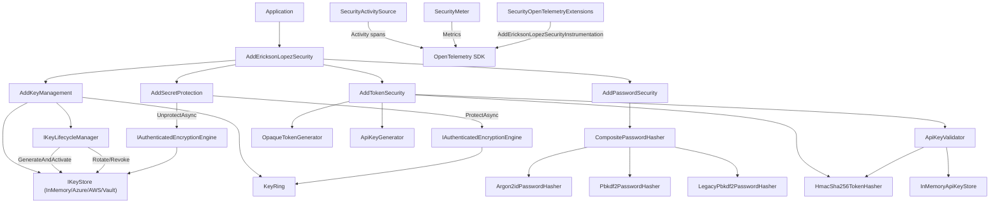
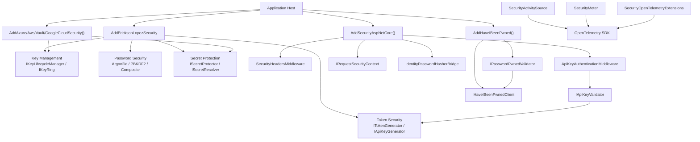
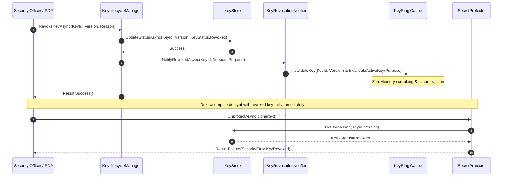

# Functional Map — EricksonLopez.Security

> **Phase**: PHASE 2 — FUNCTIONAL MAP  
> Describes how all components discovered in Phase 1 interact with each other.

---

## 1. Entry Point: DI Configuration

```
Application Host
    └─> AddEricksonLopezSecurity()
           ├─> AddSecurityCore()         [CSPRNG, ConstantTimeComparer, AES-GCM, BinarySerializer]
           ├─> AddKeyManagement()        [InMemoryKeyStore, KeyRing, IKeyLifecycleManager, IKeyRevocationNotifier]
           ├─> AddPasswordSecurity()     [Pbkdf2, Argon2id, LegacyPbkdf2, CompositePasswordHasher, ISimplePasswordHasher]
           ├─> AddTokenSecurity()        [OpaqueTokenGenerator, HmacSha256TokenHasher, ApiKeyGenerator, ApiKeyValidator, InMemoryApiKeyStore]
           └─> AddSecretProtection()     [AesGcmSecretProtector, EnvironmentSecretStore, CompositeSecretResolver]
```

---

## 2. Key Management Flow

```
IKeyLifecycleManager.GenerateAndActivateKeyAsync(KeyPurpose)
    ├─> CryptographicRandom.Shared.Fill(keyMaterial[32])
    ├─> CryptographicKey { Metadata, KeyMaterial: Secret<byte[]> }
    ├─> IKeyStore.SaveAsync(CryptographicKey)
    └─> KeyRing.InvalidateActiveKey(purpose) / InvalidateCache()

IKeyLifecycleManager.RotateKeyAsync(KeyPurpose)
    ├─> Retire active key (KeyStatus.Retired)
    ├─> Generate new key material
    └─> Emit KeyRotatedEvent

IKeyLifecycleManager.RevokeKeyAsync(KeyIdentifier, KeyVersion, reason)
    ├─> Update KeyStatus to Revoked in IKeyStore
    ├─> IKeyRevocationNotifier.NotifyRevokedAsync(keyId, version, purpose)
    │       └─> InProcessKeyRevocationNotifier / Distributed Broadcaster
    │               ├─> KeyRing.InvalidateKey(keyId, version) [ZeroMemory & cache eviction]
    │               └─> KeyRing.InvalidateActiveKey(purpose) [ZeroMemory & cache eviction]
    ├─> Emit KeyRevokedEvent
    └─> Metric: security.key.revocations counter
```

---

## 3. Encryption Flow (AEAD)

```
ISecretProtector.ProtectAsync(plaintext, KeyPurpose, AAD)
    ├─> IEncryptionKeyProvider.GetActiveKeyAsync(purpose)
    ├─> IAuthenticatedEncryptionEngine.Encrypt(plaintext, key, aad)
    │       ├─> CryptographicRandom.Fill(nonce[12])
    │       ├─> AES-256-GCM / ChaCha20-Poly1305 / HkdfAesGcm
    │       └─> EncryptedData { Ciphertext, Nonce, Tag }
    ├─> SecurityEnvelope { KeyId, Version, Algorithm, Ciphertext, Nonce, Tag, AAD }
    └─> BinarySecurityEnvelopeSerializer.Serialize(envelope) → byte[]

ISecretProtector.UnprotectAsync(protectedData, expectedAAD)
    ├─> BinarySecurityEnvelopeSerializer.Deserialize(bytes)
    ├─> IKeyStore.GetByIdAsync(keyId, version)
    ├─> Guard: KeyStatus == Revoked → SecurityError.KeyRevoked
    ├─> IAuthenticatedEncryptionEngine.Decrypt(...) [authentication tag verification]
    └─> plaintext
```

---

## 4. Password Flow

```
IPasswordHasher.HashPassword(ReadOnlySpan<char> password)
    └─> CompositePasswordHasher (primary: Pbkdf2 or Argon2id)
            ├─> Argon2idPasswordHasher.HashPassword(password)
            │       ├─> CryptographicRandom.Fill(salt[16])
            │       └─> MCF: "$argon2id$v=19$m=65536,t=3,p=4$..."
            └─> Pbkdf2PasswordHasher.HashPassword(password)
                    ├─> CryptographicRandom.Fill(salt[16])
                    └─> MCF: "$pbkdf2-sha512$i=210000$..."

IPasswordHasher.VerifyPassword(password, storedHash)
    └─> CompositePasswordHasher
            ├─> Inspect MCF prefix → route to matching hasher:
            │       ├─> "$argon2id$"                  → Argon2idPasswordHasher
            │       ├─> "$pbkdf2-sha512$"             → Pbkdf2PasswordHasher
            │       └─> "$legacy-pbkdf2$" / "$pbkdf2$" → LegacyPbkdf2PasswordHasher
            ├─> VerifyPassword constant-time
            └─> Failed | Success | SuccessRehashNeeded
```

---

## 5. Token and API Key Flow

```
ITokenGenerator.GenerateToken(byteLength)
    ├─> CryptographicRandom.GetBytes(byteLength)
    └─> OpaqueToken { Value, ToString()="[REDACTED]" }

IApiKeyGenerator.GenerateApiKey(ApiKeyPolicy)
    ├─> CryptographicRandom.GetHexString(byteLength) → rawKey
    ├─> ITokenHasher.HashToken(rawKey)               → hashedKey
    └─> (rawKey, hashedKey) pair

IApiKeyValidator.ValidateApiKeyAsync(plaintextApiKey)
    ├─> IApiKeyStore.FindByPrefixAsync(displayPrefix)
    ├─> ITokenHasher.HashToken(plaintextApiKey)
    ├─> ConstantTimeComparer.FixedTimeEquals(computed, stored)
    ├─> Guard: ApiKey.IsActive() == false → SecurityError.TokenInvalid
    └─> Result<ApiKey>
```

---

## 6. Secret Resolution Flow

```
ISecretResolver.ResolveAsync(secretReference)
    └─> CompositeSecretResolver
            ├─> "raw:VALUE"         → Redacted<string>(VALUE)
            ├─> "env:VAR_NAME"      → EnvironmentSecretStore.GetSecretAsync(VAR_NAME)
            └─> "store:SECRET_NAME" → ISecretStore.GetSecretAsync(SECRET_NAME)
                                          [Azure KV / AWS SM / HashiCorp Vault / Google Cloud SM / EnvironmentSecretStore]
```

---

## 7. Zero Trust ABAC Flow

```
AbacPolicyEngine.Evaluate(AbacContext, AbacPolicy[])
    ├─> For each AbacPolicy → For each AbacRule:
    │       ├─> Evaluate SubjectConditions
    │       ├─> Evaluate ResourceConditions
    │       ├─> Evaluate ActionConditions
    │       └─> Effect: Permit | Deny
    ├─> CombiningAlgorithm:
    │       ├─> DenyOverrides: ANY Deny → Deny
    │       ├─> PermitOverrides: ANY Permit → Permit
    │       └─> FirstApplicable: First matching rule wins
    └─> AbacDecision { Status, IsPermitted, Reason }
```

---

## 8. Observability Flow

```
SecurityActivitySource.Instance.StartActivity(EncryptOperation)
    ├─> Tag: security.algorithm, security.key.version, security.result
    └─> Exported via: ActivityListener (BCL) | OTel SDK

SecurityMeter.EncryptTotal.Add(1, tags)
SecurityMeter.Argon2HashingDurationMs.Record(ms)
    └─> Exported via: MeterListener (BCL) | OTel SDK
```

---

## 9. Error States

```
All operations return: Result<T> (from EricksonLopez.Result)

SecurityError.KeyNotFound                → Key not found in IKeyStore
SecurityError.KeyRevoked                 → Key revoked (KeyStatus.Revoked)
SecurityError.KeyExpired                 → Key expired (ExpiresAtUtc < UtcNow)
SecurityError.KeyPurposeMismatch         → Attempted operation purpose mismatch
SecurityError.EncryptionFailed           → Error in AEAD encryption
SecurityError.DecryptionFailed           → Error in AEAD decryption
SecurityError.AuthenticationTagMismatch  → Authentication tag verification failed (tampered payload/AAD)
SecurityError.InvalidCiphertext          → Invalid or malformed ciphertext
SecurityError.InvalidNonce               → Nonce size mismatch (expected 12 bytes for standard AEAD)
SecurityError.BufferTooSmall             → Destination buffer capacity insufficient for cryptographic output
SecurityError.InvalidKey                 → Invalid cryptographic key material
SecurityError.SecretNotFound             → Env var / store secret not found
SecurityError.SecurityPolicyViolation    → Password/token policy violation
SecurityError.TokenExpired               → Token TTL exceeded
```

---

## 10. Mermaid Diagram — Layer Dependency Graph



---

## 11. ASP.NET Core Integration Flow

```
AddSecurityAspNetCore(configureHeaders, configureApiKeyAuth)
    ├── Registers: SecurityHeadersOptions (IOptions)
    ├── Registers: ApiKeyAuthenticationOptions (IOptions)
    ├── Registers: IRequestSecurityContext → RequestSecurityContext (scoped)
    └── Registers: IHttpContextAccessor (singleton)

Middleware Pipeline:
app.UseSecurityHeaders()
    └── SecurityHeadersMiddleware → Sets CSP, HSTS, X-Frame-Options, Permissions-Policy, Referrer-Policy

app.UseApiKeyAuthentication()
    └── ApiKeyAuthenticationMiddleware
            ├── Extract key from HeaderName (default: "X-Api-Key") or QueryParameterName
            ├── IApiKeyValidator.ValidateApiKeyAsync(plaintextKey)
            │       ├── IApiKeyStore.GetByIdAsync(ApiKeyId)
            │       ├── Guard: IsActive() == false → SecurityError.TokenInvalid
            │       └── ConstantTimeComparer.FixedTimeEquals(candidateHash, storedHash)
            └── On success: IRequestSecurityContext.ApiKey = resolved ApiKey

IRequestSecurityContext properties:
    .IsAuthenticated    → HttpContext.User.Identity.IsAuthenticated
    .ActorId            → ClaimTypes.NameIdentifier claim value
    .HasScope(scope)    → Checks "scope" claim
    .ApiKey             → ApiKey entity resolved by middleware (null if no API key auth)
    .Principal          → HttpContext.User (ClaimsPrincipal)
```

---

## 12. Identity Bridge Flow (ASP.NET Core Identity)

```
AddEricksonLopezIdentityPasswordHasher<TUser>()
    └── Replaces Identity's IPasswordHasher<TUser> with IdentityPasswordHasherBridge<TUser>

IdentityPasswordHasherBridge<TUser>.HashPassword(user, password)
    └── IPasswordHasher.HashPassword(password.AsSpan())
            └── CompositePasswordHasher (routes to primary: Argon2id or PBKDF2)

IdentityPasswordHasherBridge<TUser>.VerifyHashedPassword(user, hashedPassword, providedPassword)
    └── IPasswordHasher.VerifyPassword(providedPassword.AsSpan(), hashedPassword)
            └── Returns: Microsoft.AspNetCore.Identity.PasswordVerificationResult
                         (Success, SuccessRehashNeeded, Failed)
```

---

## 13. HIBP k-Anonymity Flow

```
AddHaveIBeenPwned(configureOptions)
    ├── Registers: IHaveIBeenPwnedClient (HttpClient-backed, singleton)
    └── Registers: IPasswordPwnedValidator (scoped)

IHaveIBeenPwnedClient.CheckPasswordAsync(password)
    ├── SHA-1 hash of password
    ├── Extract first 5 chars as hashPrefix (k-anonymity)
    ├── GET https://api.pwnedpasswords.com/range/{hashPrefix}
    ├── Parse response entries
    └── PwnedPasswordCheckResult { HashPrefix, BreachCount, IsPwned: BreachCount > 0 }

IPasswordPwnedValidator.ValidateNotPwnedAsync(password)
    └── CheckPasswordAsync() → if BreachCount > HibpOptions.MaxAllowedBreachCount
            └── Result.Failure(SecurityError.SecurityPolicyViolation("HIBP", ...))
```

---

## 14. Mermaid Diagram — Full System (Including Extensions)



---

## 15. Mermaid Diagram — Real-Time Key Revocation & Cache Eviction Sequence



---

## 16. DNS-Level SSRF Prevention Flow (`ISafeDnsResolver` / `SafeDnsResolver`)

```
ISafeDnsResolver.ResolveAndValidateAsync(host, ct)
    ├─> Parse host:
    │       ├─> Raw IP literal → validate directly against blocked ranges
    │       └─> Hostname → Dns.GetHostAddressesAsync(host) [or injected dnsLookup delegate]
    ├─> For each resolved IPAddress:
    │       ├─> Check: hostname in cloud metadata blocklist
    │       │       (169.254.169.254, metadata.google.internal, metadata.azure.com, ...)
    │       ├─> Check: ambiguous octal format (e.g. 010.0.0.1 → blocked)
    │       ├─> Check: IpAddressRange.Contains(ip)
    │       │       ├─> Loopback (127.0.0.0/8, ::1)
    │       │       ├─> Link-local (169.254.0.0/16)
    │       │       ├─> RFC 1918 (10.0.0.0/8, 172.16.0.0/12, 192.168.0.0/16)
    │       │       └─> Custom ranges in SsrfProtectionOptions.BlockedRanges
    │       └─> Any blocked → Result.Failure(SecurityError.SecurityPolicyViolation)
    └─> All safe → Result.Success(IPAddress[])

SafeDnsResolver injection:
    SafeDnsResolver(
        options: SsrfProtectionOptions?,  // blocked/allowed ranges
        dnsLookup: Func<string, CancellationToken, Task<IPAddress[]>>?  // injectable for testing
    )
```

**Integration with `SafeSocketsHttpHandler`**:
```
SafeSocketsHttpHandler(options, dnsResolver)
    ├─> On ConnectCallback → validate IPAddress at TCP connect time
    └─> Optionally call ISafeDnsResolver for pre-validation at hostname stage
```

---

## 17. Cryptographic Context Binding (`AuthenticatedContext`)

```
AuthenticatedContext — Strongly-typed AAD for AEAD
    ├─> AuthenticatedContext.Empty                   → no AAD (backward compat)
    ├─> AuthenticatedContext.ForTenant(tenantId)     → UTF-8("tenant:<tenantId>")
    └─> AuthenticatedContext.FromBytes(span)         → raw byte binding

Integration with ISecretProtector:
    protector.ProtectAsync(plaintext, purpose, expectedAssociatedData: ctx)
        └─> AES-256-GCM(plaintext, key, nonce, aad=ctx.Span)
                └─> SecurityEnvelope { AssociatedData = ctx.Span }

    protector.UnprotectAsync(envelope, expectedAssociatedData: wrongCtx)
        └─> AES-256-GCM.Decrypt(tag mismatch if ctx differs)
                └─> SecurityError.AuthenticationTagMismatch
```

---

## 18. Cache TTL & `KeyRingOptions` Lifecycle Note

```
KeyRing(store, options: KeyRingOptions, notifier)
    ├─> options.CacheTtl = TimeSpan.FromSeconds(30) [default]
    │       ├─> Key material cached for 30s after first IKeyStore.GetByIdAsync()
    │       ├─> Reduce to 0 for air-gapped / HSM-only environments (no caching)
    │       └─> Increase to 300s for high-throughput services (fewer store reads)
    └─> On KeyRevocationNotifier signal:
            └─> InvalidateKey(id, version) — ZeroMemory + remove from cache
                regardless of CacheTtl
```

> **Synchronization stamp v1.1.1**: Added §16 SafeDnsResolver flow, §17 AuthenticatedContext binding, §18 KeyRingOptions lifecycle. Functional map now covers all v1.1.1 API inventory entries.
