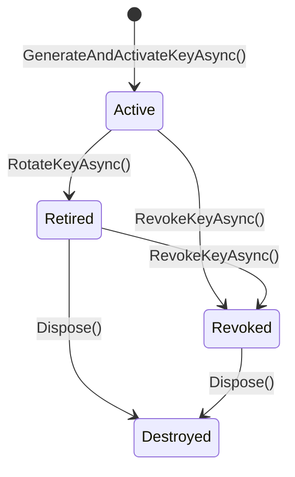
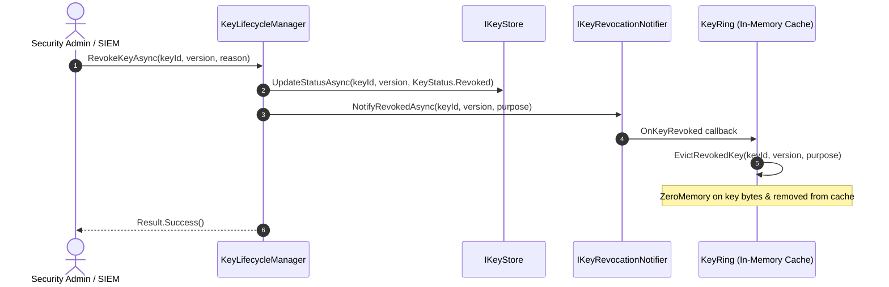

# Key Management & Multi-Version Keyrings

## 1. Multi-Version Key Management Model

Cryptographic keys have distinct operational phases throughout their lifecycle:



### Key States

1. **`Active`**: Key is fully enabled for new encryption operations and decryption.
2. **`Retired`**: Key is disabled for new encryption operations, but remains usable for decrypting legacy historical records.
3. **`Revoked`**: Immediate emergency kill-switch. All encryption and decryption requests are rejected with `SecurityError.KeyRevoked`.
4. **`Destroyed`**: Key material is wiped from RAM using `CryptographicOperations.ZeroMemory` and removed from storage.

---

## 2. Key Ring Resolution & Real-Time Cache Eviction (`IKeyRing`)

The `KeyRing` provides thread-safe access to keys for active encryption and legacy historical decryption operations:

- **`GetActiveKeyAsync(KeyPurpose)`**: Resolves the highest-version `Active` key for the requested purpose (e.g. `Encryption`, `SecretProtection`, `Signing`).
- **`GetKeyAsync(KeyIdentifier, KeyVersion)`**: Looks up a specific historical key version to decrypt legacy envelopes.
- **`TryGetKey(KeyIdentifier, KeyVersion, out CryptographicKey?)`**: Synchronous non-blocking cache lookup.
- **`EvictRevokedKey(KeyIdentifier, KeyVersion, KeyPurpose)`**: Directly evicts a revoked key from internal active and historical caches, scrubbing sensitive key buffers from memory.

---

## 3. Real-Time Key Revocation Notification (`IKeyRevocationNotifier`)

When a key compromise occurs, invalidation must propagate instantaneously to prevent subsequent decryption:



- **`IKeyRevocationNotifier`**: Core abstraction in `EricksonLopez.Security.Abstractions.KeyManagement` for broadcasting and subscribing to revocation signals.
- **`InProcessKeyRevocationNotifier`**: High-performance thread-safe in-process broadcaster providing defensive subscriber isolation.
- **`DelegateKeyRevocationNotifier`**: High-performance delegation adapter in `EricksonLopez.Security.KeyManagement` that connects local key rings to external distributed message brokers (Redis Pub/Sub, RabbitMQ, Kafka, Azure Service Bus).
- **Cluster Registration**:
  ```csharp
  // Register distributed revocation notifier with Redis Pub/Sub, RabbitMQ, or custom broker:
  builder.Services.AddKeyManagement();
  builder.Services.AddDistributedKeyRevocationNotifier(async (keyId, version, purpose, ct) =>
  {
      await redisSubscriber.PublishAsync("security:keys:revocation", $"{keyId}:{version}:{purpose}");
  });

  // When a message arrives from the cluster subscriber on a worker node:
  var notifier = serviceProvider.GetRequiredService<DelegateKeyRevocationNotifier>();
  await notifier.ReceiveRemoteRevocationAsync(keyId, version, purpose);
  // -> Immediately evicts the key from in-process key rings without republishing
  ```

---

## 4. Automatic Rotation & Emergency Revocation Workflow

```csharp
using EricksonLopez.Security.Abstractions.KeyManagement;
using EricksonLopez.Security.Abstractions.Primitives;

// 1. Initial Generation
var keyV1 = (await keyLifecycleManager.GenerateAndActivateKeyAsync(KeyPurpose.SecretProtection)).Value;
// Result: Key Id 'secretprotection-abc', Version 1, Status: Active

// 2. Automated Rotation
var keyV2 = (await keyLifecycleManager.RotateKeyAsync(KeyPurpose.SecretProtection)).Value;
// Result: Key Id 'secretprotection-abc', Version 2, Status: Active
// Previous Key v1 transitioned to Status: Retired

// 3. Emergency Revocation (Triggers instant cache eviction via IKeyRevocationNotifier)
await keyLifecycleManager.RevokeKeyAsync(
    keyV1.Metadata.KeyId, 
    keyV1.Metadata.Version, 
    "Key compromise detected");
```
