# NuGet Packages & Ecosystem Guide — EricksonLopez.Security

> **Version**: v1.0.0  
> **Total Published Packages**: 21  
> **Central Package Management**: Enabled via `Directory.Packages.props`

---

## 1. Package Inventory & Target Frameworks

| # | Package Name | Target Frameworks | Native AOT | Primary Classification |
|---|---|---|:---:|---|
| **01** | [`EricksonLopez.Security.Abstractions`](../src/EricksonLopez.Security.Abstractions) | `net8.0;net9.0;net10.0` | ✅ Yes | Core Contracts & Value Objects |
| **02** | [`EricksonLopez.Security`](../src/EricksonLopez.Security) | `net8.0;net9.0;net10.0` | ✅ Yes | Central Cryptographic Engine |
| **03** | [`EricksonLopez.Security.Cryptography`](../src/EricksonLopez.Security.Cryptography) | `net8.0;net9.0;net10.0` | ✅ Yes | Direct Primitives & Constant-Time |
| **04** | [`EricksonLopez.Security.AspNetCore`](../src/EricksonLopez.Security.AspNetCore) | `net8.0;net9.0;net10.0` | ✅ Yes | Web Security Headers & API Key Auth |
| **05** | [`EricksonLopez.Security.Network`](../src/EricksonLopez.Security.Network) | `net8.0;net9.0;net10.0` | ✅ Yes | SSRF Defense & Socket Filter |
| **06** | [`EricksonLopez.Security.Mfa`](../src/EricksonLopez.Security.Mfa) | `net8.0;net9.0;net10.0` | ✅ Yes | RFC 6238 TOTP, HOTP & Recovery |
| **07** | [`EricksonLopez.Security.ZeroTrust`](../src/EricksonLopez.Security.ZeroTrust) | `net8.0;net9.0;net10.0` | ✅ Yes | NIST SP 800-162 Dynamic ABAC |
| **08** | [`EricksonLopez.Security.WebAuthn.Fido2`](../src/EricksonLopez.Security.WebAuthn.Fido2) | `net8.0;net9.0;net10.0` | ✅ Yes | WebAuthn Level 3 Passkeys Ceremonies |
| **09** | [`EricksonLopez.Security.WebAuthn.Fido2.Mds3`](../src/EricksonLopez.Security.WebAuthn.Fido2.Mds3) | `net8.0;net9.0;net10.0` | ✅ Yes | FIDO Alliance MDS3 Metadata Cache |
| **10** | [`EricksonLopez.Security.Saml2`](../src/EricksonLopez.Security.Saml2) | `net8.0;net9.0;net10.0` | ❌ No | SAML 2.0 SP & Anti-XSW Engine |
| **11** | [`EricksonLopez.Security.Pki`](../src/EricksonLopez.Security.Pki) | `net8.0;net9.0;net10.0` | ✅ Yes | X.509 Certificate Chain Validator |
| **12** | [`EricksonLopez.Security.Privacy.Hibp`](../src/EricksonLopez.Security.Privacy.Hibp) | `net8.0;net9.0;net10.0` | ✅ Yes | Have I Been Pwned Breach Client |
| **13** | [`EricksonLopez.Security.Cryptography.XmlDSig`](../src/EricksonLopez.Security.Cryptography.XmlDSig) | `net8.0;net9.0;net10.0` | ❌ No | W3C XML Digital Signatures |
| **14** | [`EricksonLopez.Security.Cryptography.Pkcs11`](../src/EricksonLopez.Security.Cryptography.Pkcs11) | `net8.0;net9.0;net10.0` | ✅ Yes | Hardware Security Module (HSM) |
| **15** | [`EricksonLopez.Security.Azure`](../src/EricksonLopez.Security.Azure) | `net8.0;net9.0;net10.0` | ✅ Yes | Azure Key Vault Adapter |
| **16** | [`EricksonLopez.Security.Aws`](../src/EricksonLopez.Security.Aws) | `net8.0;net9.0;net10.0` | ✅ Yes | AWS KMS & Secrets Manager Adapter |
| **17** | [`EricksonLopez.Security.HashiCorpVault`](../src/EricksonLopez.Security.HashiCorpVault) | `net8.0;net9.0;net10.0` | ✅ Yes | HashiCorp Vault Transit / KV v2 |
| **18** | [`EricksonLopez.Security.GoogleCloud`](../src/EricksonLopez.Security.GoogleCloud) | `net8.0;net9.0;net10.0` | ✅ Yes | Google Cloud KMS & Secret Manager |
| **19** | [`EricksonLopez.Security.OpenTelemetry`](../src/EricksonLopez.Security.OpenTelemetry) | `net8.0;net9.0;net10.0` | ❌ No | Tracing & Metrics Satellite |
| **20** | [`EricksonLopez.Security.Testing`](../src/EricksonLopez.Security.Testing) | `net8.0;net9.0;net10.0` | ✅ Yes | Test Doubles & Assertions |
| **21** | [`EricksonLopez.Security.Analyzers`](../src/EricksonLopez.Security.Analyzers) | `netstandard2.0` | N/A (Build tool) | Roslyn Security Analyzers |

---

## 2. Inter-Package Dependency Graph

The dependency hierarchy strictly enforces Clean Architecture and prevents circular or unneeded dependencies:

```mermaid
graph TD
    %% Base Abstractions
    Abstractions["EricksonLopez.Security.Abstractions\n(Zero internal dependencies)"]

    %% Core Layer
    Core["EricksonLopez.Security"] --> Abstractions
    Crypto["EricksonLopez.Security.Cryptography"] --> Abstractions
    Saml2["EricksonLopez.Security.Saml2"] --> Abstractions
    Saml2 --> Crypto
    WebAuthn["EricksonLopez.Security.WebAuthn.Fido2"] --> Abstractions
    Mds3["EricksonLopez.Security.WebAuthn.Fido2.Mds3"] --> WebAuthn
    Hibp["EricksonLopez.Security.Privacy.Hibp"] --> Abstractions
    Pkcs11["EricksonLopez.Security.Cryptography.Pkcs11"] --> Abstractions

    %% Cloud & Web Integrations
    AspNetCore["EricksonLopez.Security.AspNetCore"] --> Core
    Azure["EricksonLopez.Security.Azure"] --> Core
    Azure --> Abstractions
    Aws["EricksonLopez.Security.Aws"] --> Core
    Aws --> Abstractions
    Vault["EricksonLopez.Security.HashiCorpVault"] --> Core
    Vault --> Abstractions
    Gcp["EricksonLopez.Security.GoogleCloud"] --> Core
    Gcp --> Abstractions
    OTel["EricksonLopez.Security.OpenTelemetry"] --> Core
    Testing["EricksonLopez.Security.Testing"] --> Core
    Testing --> Abstractions
    Testing --> WebAuthn

    %% Standalone / Zero Internal Dependency Libraries
    ZeroTrust["EricksonLopez.Security.ZeroTrust\n(Self-Contained ABAC)"]
    Network["EricksonLopez.Security.Network\n(Self-Contained SSRF Handler)"]
    Pki["EricksonLopez.Security.Pki\n(Depends on EricksonLopez.Result)"]
    Mfa["EricksonLopez.Security.Mfa\n(Depends on EricksonLopez.Result)"]
    XmlDSig["EricksonLopez.Security.Cryptography.XmlDSig\n(Self-Contained W3C XMLDSig)"]
    Analyzers["EricksonLopez.Security.Analyzers\n(Roslyn Diagnostic Analyzer)"]
```



> **Standalone Packages**: Exactly 7 packages have zero internal references to other `EricksonLopez.Security.*` packages: `Abstractions`, `ZeroTrust`, `Network`, `Pki`, `Mfa`, `Cryptography.XmlDSig`, and `Analyzers`.

---

## 3. Central Package Management (CPM) Versions

All third-party and ecosystem dependency versions are centralized in [`Directory.Packages.props`](../Directory.Packages.props):

### Internal Ecosystem Packages
| Dependency | Pinned Version | Consumed By |
|---|---|---|
| `EricksonLopez.Result` | `2.0.0` | `Abstractions`, `Core`, `Testing`, etc. (Functional error handling) |

> [!NOTE]
> `EricksonLopez.Security.Abstractions` depends only on `EricksonLopez.Result` (ecosystem sibling package for functional error handling). It has **no** dependencies on web frameworks, ORMs, cloud SDKs, or other third-party libraries per ADR-001. All domain primitives (`KeyIdentifier`, `KeyVersion`, `Nonce`, `Salt`) and auditable events (`ISecurityEvent`) are implemented natively within the package.

### Microsoft Extensions & Runtime
| Dependency | Pinned Version | Purpose |
|---|---|---|
| `Microsoft.Extensions.DependencyInjection.Abstractions` | `10.0.11` | Inversion of Control & DI contracts |
| `Microsoft.Extensions.DependencyInjection` | `10.0.11` | DI container runtime |
| `Microsoft.Extensions.Logging.Abstractions` | `10.0.11` | Logging abstraction |
| `Microsoft.Extensions.Options` | `10.0.11` | Options pattern configuration |
| `Microsoft.Extensions.Http` | `10.0.11` | HTTP client factory and resilient handlers |
| `Microsoft.Extensions.TimeProvider.Testing` | `10.1.0` | Deterministic time testing |
| `Microsoft.SourceLink.GitHub` | `10.0.400` | SourceLink debugging metadata |
| `System.Formats.Cbor` | `10.0.11` | WebAuthn CBOR attestation parsing |
| `System.Security.Cryptography.Xml` | `10.0.10` | SAML 2.0 & XmlDSig canonicalization |

### Observability & Tooling
| Dependency | Pinned Version | Purpose |
|---|---|---|
| `OpenTelemetry.Api` | `1.18.0` | OTel ActivitySource & Meter bridge |
| `OpenTelemetry` | `1.18.0` | Telemetry SDK |
| `Microsoft.CodeAnalysis.CSharp` | `4.13.0` | Roslyn analyzer syntax trees |
| `Microsoft.CodeAnalysis.CSharp.Workspaces` | `5.9.0` | Roslyn analyzer workspaces and testing |
| `Microsoft.CodeAnalysis.Analyzers` | `3.11.0` | Roslyn analyzer verification |

### Testing & Quality Frameworks
| Dependency | Pinned Version | Purpose |
|---|---|---|
| `Microsoft.NET.Test.Sdk` | `18.9.0` | Test host runner SDK |
| `xunit` | `2.9.3` | Test framework core engine |
| `xunit.runner.visualstudio` | `4.0.0` | Visual Studio and `dotnet test` adapter |
| `AwesomeAssertions` | `9.6.0` | Fluent assertion library |
| `NSubstitute` | `5.3.0` | Test double mocking engine |
| `FsCheck.Xunit` | `3.4.0` | Property-based and fuzzing test harness |
| `NetArchTest.Rules` | `1.3.2` | Clean architecture rule enforcement |
| `coverlet.collector` | `10.0.1` | Cross-platform coverage data collector |
| `coverlet.msbuild` | `10.0.1` | MSBuild coverage integration |
| `BenchmarkDotNet` | `0.15.8` | Microbenchmarking and zero-allocation validation |

---

## 4. Package Capabilities & Primary Public Types

### 1. `EricksonLopez.Security.Abstractions`
- **Purpose**: Foundational contracts, value objects, error catalog, policies, and domain events.
- **Exported Types**: `KeyIdentifier`, `KeyVersion`, `KeyPurpose`, `KeyStatus`, `CryptographicKey`, `Redacted<T>`, `Secret<T>`, `ProtectedSecret`, `ISecretBuffer`, `SecurityStamp`, `ApiKeyId`, `ApiKey`, `OpaqueToken`, `Nonce`, `Salt`, `Fingerprint`, `SecurityEnvelope`, `SecurityError`, `ISimplePasswordHasher`, `IKeyRevocationNotifier`.

### 2. `EricksonLopez.Security` (Core Engine)
- **Purpose**: Authenticated encryption envelopes, multi-version key lifecycle manager, password hashing, and API key generation.
- **Exported Types**: `AesGcmEncryptionEngine`, `ChaCha20Poly1305EncryptionEngine`, `HkdfAesGcmEncryptionEngine`, `AesGcmSecretProtector`, `BinarySecurityEnvelopeSerializer`, `KeyLifecycleManager`, `KeyRing`, `InMemoryKeyStore`, `InProcessKeyRevocationNotifier`, `DelegateKeyRevocationNotifier`, `Pbkdf2PasswordHasher` (modular crypt `$pbkdf2-sha512$`, 210k iterations), `Argon2idPasswordHasher` (RFC 9106, 64 MB), `LegacyPbkdf2PasswordHasher` (modular crypt `$legacy-pbkdf2$`), `CompositePasswordHasher`, `ConstantTimeComparer`, `TimingSafeString`, `CryptographicRandom`, `ApiKeyGenerator`, `ApiKeyValidator`.

### 3. `EricksonLopez.Security.Cryptography`
- **Purpose**: Low-level cryptographic algorithms, standalone PBKDF2 hashing (ADR-023), and side-channel timing attack defense.
- **Exported Types**: `AesGcmAuthenticatedEncryptionEngine`, `ConstantTimeComparer`, `CryptographicRandomNumberGenerator`, `Pbkdf2PasswordHasher` (`PBKDF2.V1`, 600k iterations), `CryptographyServiceCollectionExtensions`.

### 4. `EricksonLopez.Security.AspNetCore`
- **Purpose**: ASP.NET Core integration, response security headers, and API key middleware.
- **Exported Types**: `SecurityHeadersMiddleware`, `ApiKeyAuthenticationMiddleware`, `RequestSecurityContext`, `IdentityPasswordHasherBridge<TUser>`, `AspNetCoreSecurityExtensions`.

### 5. `EricksonLopez.Security.Network`
- **Purpose**: SSRF mitigation and socket-level IP connection authorization.
- **Exported Types**: `SafeSocketsHttpHandler`, `SafeDnsResolver`, `IpAddressRange`, `SsrfProtectionOptions`.

### 6. `EricksonLopez.Security.Mfa`
- **Purpose**: Two-factor and multi-factor authentication.
- **Exported Types**: `TotpService`, `IRecoveryCodeGenerator`, `RecoveryCodeGenerator`, `DelegateTotpReplayStore`, `InMemoryTotpReplayStore`, `Base32Encoding`, `TotpOptions`.

### 7. `EricksonLopez.Security.ZeroTrust`
- **Purpose**: Attribute-Based Access Control dynamic policy evaluation.
- **Exported Types**: `AbacPolicyEngine`, `AbacPolicy`, `AbacRule`, `AbacContext`, `AbacDecision`.

### 8. `EricksonLopez.Security.WebAuthn.Fido2`
- **Purpose**: Passkeys FIDO2 ceremonies and attestation verification.
- **Exported Types**: `WebAuthnCeremonyService`, `PackedAttestationVerifier`, `TpmAttestationVerifier`, `AndroidSafetyNetAttestationVerifier`, `FidoU2FAttestationVerifier`.

### 9. `EricksonLopez.Security.WebAuthn.Fido2.Mds3`
- **Purpose**: FIDO Alliance Metadata Service v3 integration.
- **Exported Types**: `IMds3MetadataService`, `HttpMds3MetadataService`, `Mds3Options`, `AuthenticatorMetadata`.

### 10. `EricksonLopez.Security.Saml2`
- **Purpose**: SAML 2.0 Service Provider and anti-XSW signature validation.
- **Exported Types**: `Saml2Service`, `Saml2XswValidator`, `Saml2AssertionDecryptor`, `Saml2Options`, `SamlValidationOptions`.

### 11. `EricksonLopez.Security.Pki`
- **Purpose**: X.509 certificate chain validation and trust anchor enforcement.
- **Exported Types**: `CertificateChainValidator`, `PkiValidationOptions`.

### 12. `EricksonLopez.Security.Privacy.Hibp`
- **Purpose**: Have I Been Pwned password breach checking.
- **Exported Types**: `HaveIBeenPwnedClient`, `PasswordPwnedValidator`, `HibpOptions`.

### 13. `EricksonLopez.Security.Cryptography.XmlDSig`
- **Purpose**: W3C XML Digital Signatures (RFC 3275).
- **Exported Types**: `XmlDigitalSignatureService`, `IXmlDigitalSignatureVerifier`, `IXmlDigitalSigner`, `XmlSigningOptions`, `XmlVerificationOptions`, `XmlVerificationResult`.

### 14. `EricksonLopez.Security.Cryptography.Pkcs11`
- **Purpose**: Hardware Security Modules (HSM) via standard PKCS#11 C-API.
- **Exported Types**: `Pkcs11DigitalSignatureEngine`, `Pkcs11SessionManager`, `Pkcs11NativeLibrary`, `Pkcs11Options`, `Pkcs11ServiceCollectionExtensions`.

### 15. `EricksonLopez.Security.Azure`
- **Purpose**: Azure Key Vault Keys and Secrets Store adapter.
- **Exported Types**: `AzureKeyVaultKeyStore`, `AzureKeyVaultSecretStore`, `AzureKeyVaultOptions`, `AzureSecurityServiceCollectionExtensions`.

### 16. `EricksonLopez.Security.Aws`
- **Purpose**: AWS KMS and AWS Secrets Manager adapter.
- **Exported Types**: `AwsKmsKeyStore`, `AwsSecretsManagerSecretStore`, `AwsKmsOptions`, `AwsSecurityServiceCollectionExtensions`.

### 17. `EricksonLopez.Security.HashiCorpVault`
- **Purpose**: HashiCorp Vault Transit Engine and KV v2 Secret Store adapter.
- **Exported Types**: `HashiCorpVaultKeyStore`, `HashiCorpVaultSecretStore`, `HashiCorpVaultOptions`, `HashiCorpVaultSecurityExtensions`.

### 18. `EricksonLopez.Security.GoogleCloud`
- **Purpose**: Google Cloud KMS and Secret Manager Store adapter.
- **Exported Types**: `GoogleCloudKmsKeyStore`, `GoogleCloudSecretManagerStore`, `GoogleCloudKmsOptions`, `GoogleCloudSecurityExtensions`.

### 19. `EricksonLopez.Security.OpenTelemetry`
- **Purpose**: Distributed tracing and metrics telemetry integration.
- **Exported Types**: `SecurityOpenTelemetryExtensions`.

### 20. `EricksonLopez.Security.Testing`
- **Purpose**: Testing fakes and cryptographic assertion helpers.
- **Exported Types**: `FakeKeyStore`, `FakePasswordHasher`, `FakeSecretProtector`, `DeterministicRandomNumberGenerator`, `SecurityAssert`.

### 21. `EricksonLopez.Security.Analyzers`
- **Purpose**: Compile-time Roslyn diagnostic security analyzers.
- **Diagnostics**: `ELS0001` (timing side-channel), `ELS0002` (undisposed SecretBuffer), `ELS0003` (hardcoded secret literal), `ELS0004` (insecure password hash), `ELS0005` (unredacted secret in ILogger).

---

## 5. Reference Samples

The repository provides 4 runnable sample projects in [`samples/`](../samples):

| Project | Target | Description |
|---|---|---|
| [`EricksonLopez.Security.Sample`](../samples/EricksonLopez.Security.Sample) | Console (`net10.0`) | **Official Executable Reference Showcase (Levels 00 through 11).** |
| [`EricksonLopez.Security.ApiKeys.Sample`](../samples/EricksonLopez.Security.ApiKeys.Sample) | ASP.NET Core (`net10.0`) | Minimal API demonstrating API key generation, storage, validation, and middleware. |
| [`EricksonLopez.Security.Totp.Sample`](../samples/EricksonLopez.Security.Totp.Sample) | Console (`net10.0`) | RFC 6238 TOTP enrollment, validation, and emergency recovery code redemption. |
| [`EricksonLopez.Security.Secrets.Sample`](../samples/EricksonLopez.Security.Secrets.Sample) | Console (`net10.0`) | AES-256-GCM envelope protection, hot key rotation, and multi-tenant AAD isolation. |

---

## 6. Performance Benchmarks

Performance and zero-allocation tests are maintained in [`benchmarks/EricksonLopez.Security.Benchmarks`](../benchmarks/EricksonLopez.Security.Benchmarks):

```bash
dotnet run -c Release --project benchmarks/EricksonLopez.Security.Benchmarks
```

All core encryption, envelope serialization, and constant-time comparisons achieve **0 B heap allocations** on .NET 8.0, .NET 9.0, and .NET 10.0.
