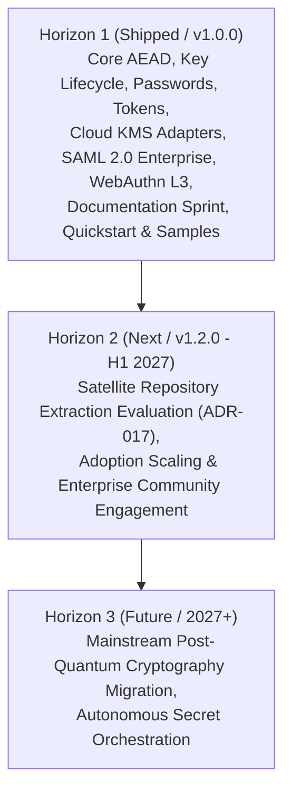

# Product Strategy — EricksonLopez.Security

> Senior Product Strategist + Competitive Intelligence Analysis  
> Date: 2026-09-01 | Version: 1.0.0 | Based on: Functional Parity Audit v1.0.0

---

## 1. Product Context

### What Problem Does It Solve?

`EricksonLopez.Security` addresses a structural vulnerability within the .NET ecosystem: **fragmented and permissive-by-default security**. Developers are forced to assemble heterogeneous, uncoordinated libraries (`DataProtection` for encryption, `ASP.NET Identity` for passwords, `OtpNet` for TOTP, `Fido2-net-lib` for passkeys, `VaultSharp` for secrets) that:

- Do not share unified error contracts (relying on scattered exceptions).
- Were not architected with Native AOT compilation as a primary constraint.
- Offload cryptographic correctness onto the integrator (CBC mode enabled, passwords exposed in log arguments, non-constant-time comparisons).
- Lack proactive memory hygiene: secrets linger in the GC heap until garbage collection.
- Neglect modern emerging threats: SSRF via DNS rebinding and Post-Quantum harvest-now-decrypt-later attacks.

**`EricksonLopez.Security` establishes a unified ecosystem where secure programming is the path of least resistance.** Insecure modes cannot be selected because the API surface does not expose them. Secrets cannot leak into logs because `Redacted<T>` and `Secret<T>` mask them. Ephemeral memory cannot be abandoned because `IDisposable` deterministically executes `CryptographicOperations.ZeroMemory`.

### Target Personas

- **Primary**: Backend .NET engineers in mid-to-large product teams building APIs and microservices handling sensitive assets (credentials, secrets, PII, financial transactions). They are not cryptographers; they require secure-by-default correctness without deciphering low-level cipher specifications.
- **Secondary**: Tech leads and enterprise architects pursuing regulatory compliance (NIST SP 800-63B, OWASP, NIST SP 800-162 Zero Trust) without maintaining thousands of lines of boilerplate.
- **Tertiary**: Teams migrating to Native AOT, containerized microservices, or Blazor WASM requiring trim-safe security components with zero dynamic reflection.

### Product Classification

A developer-facing ecosystem of 21 modular NuGet packages. **It is not an invasive framework** (it does not dictate application execution flow). It acts as a **foundational security primitives layer**: integrating cleanly into any Clean Architecture, DDD, or Hexagonal design via standard Dependency Injection.

### Direct and Indirect Competitors

| Domain | Direct Competitor | Indirect Competitor |
|---|---|---|
| Encryption / Key Management | `Microsoft.AspNetCore.DataProtection`, `NSec` | `Bouncy Castle` |
| Password Hashing | `ASP.NET Identity.PasswordHasher`, `BCrypt.Net-Next`, `Isopoh.Argon2` | — |
| Tokens / API Keys | `AspNetCore.Authentication.ApiKey` | `OpenIddict`, `Duende` |
| Cloud Secrets | `Microsoft.Extensions.Configuration` (Azure), `VaultSharp` | — |
| Multi-Factor Authentication (MFA) | `OtpNet` | — |
| WebAuthn / FIDO2 | `Fido2-net-lib` (`passwordless.dev`) | — |
| SSRF Network Defense | **None (Direct Gap in .NET OSS)** | — |
| SAML 2.0 Service Provider | `Sustainsys.Saml2`, `ITfoxtec.Saml2` | — |

### Key Adoption Dimensions

In order of practical decision weight:

1. **Correctness by Default**: Is it misuse-resistant? Does it prevent timing attacks, log leakage, and insecure cipher modes?
2. **API Ergonomics & Developer Experience (DX)**: Time to first working implementation? Are error contracts clear and typed?
3. **Native AOT & Trim Safety**: Does it compile and execute deterministically under AOT publishing?
4. **Cohesive Ecosystem**: Does it eliminate the maintenance cost of coordinating N disparate libraries?
5. **Documentation & Migration Ease**: Can teams migrate from existing legacy stacks with zero downtime?
6. **Maturity & Supply Chain Governance**: Documented ADRs, comprehensive test suites, and transparent changelogs.

---

## 2. Feature Matrix Audit

### Identified Evaluation Nuances

| Area | Detail |
|---|---|
| **Category Discrepancies** | `DataProtection` is often compared as a general "encryption engine", whereas its intended purpose is ephemeral session/cookie token protection. |
| **Cohesive Scope vs. Generic Utilities** | Comparing XML Digital Signatures against `BouncyCastle` is flawed: `BouncyCastle` is a general crypto toolbox without application-level ergonomics. |
| **SAML Profile Resolution** | Previously unverified capabilities (IdP-initiated SSO, SLO) have been verified and implemented in v1.0.0. |
| **Documentation vs. Feature Gaps** | Migration documentation and quickstart guides have a disproportionate impact on conversion compared to hyper-specialized features. |
| **Differentiator Impact** | Post-Quantum Cryptography (PQC) and socket-level SSRF defense represent substantial technical moats when mapped to enterprise compliance mandates. |

---

## 3. Feature Classification

### A. Competitive Parity (Market Baseline)

Table stakes required for enterprise consideration:

| Capability | Status | Justification |
|---|---|---|
| Authenticated Encryption (AES-256-GCM) | ✅ Implemented | Mandatory standard in all modern cryptographic stacks. |
| PBKDF2-SHA512 + Argon2id Password Hashing | ✅ Implemented | Explicit requirement of OWASP 2024 password storage guidelines. |
| TOTP / HOTP MFA (RFC 6238 / RFC 4226) | ✅ Implemented | De facto enterprise two-factor authentication baseline. |
| WebAuthn Passkeys Core Ceremonies | ✅ Implemented | Growing market expectation for passwordless authentication. |
| Cloud Key Vault Adapters (Azure / AWS / HashiCorp) | ✅ Implemented | Essential for enterprise cloud native adoption. |
| ASP.NET Core Middleware & DI Integration | ✅ Implemented | Standard requirement for modern .NET service architectures. |

### B. Critical Gaps & Resolution

Previously identified adoption blockers and their resolution status:

| Capability | Addressed Competitor | Priority | Resolution in v1.0.0 |
|---|---|---|---|
| Migration Guide (`DataProtection` $\rightarrow$ EL.Security) | Adoption barrier | 🔴 P1 | ✅ Completed (`docs/migration-from-dataprotection.md`) |
| Quickstart & 5-Minute Onboarding | DX barrier | 🔴 P1 | ✅ Completed (`docs/quickstart.md`) |
| SAML 2.0 IdP-initiated SSO | `Sustainsys`, `ITfoxtec` | 🟠 P1 | ✅ Completed (`Saml2Service.ProcessIdpInitiatedResponseAsync`) |
| SAML 2.0 Single Logout (SLO) | `Sustainsys`, `ITfoxtec` | 🟠 P1 | ✅ Completed (`CreateLogoutRequest`, `ProcessLogoutResponseAsync`) |
| WebAuthn Advanced Attestation (SafetyNet, TPM) | `Fido2-net-lib` | 🟡 P2 | ✅ Completed (`AndroidSafetyNetAttestationVerifier`, `TpmAttestationVerifier`) |
| FIDO MDS3 Metadata Service | `Fido2-net-lib` | 🟡 P2 | ✅ Completed (`EricksonLopez.Security.WebAuthn.Fido2.Mds3`) |
| Detailed Semantic Changelog | Enterprise maturity signal | 🟠 P2 | ✅ Completed (`CHANGELOG.md` in Keep a Changelog format) |
| Functional End-to-End Samples | DX barrier | 🟠 P2 | ✅ Completed (4 sample projects in `samples/`) |

### C. Core Strengths (Superior to Alternatives)

| Capability | Evidence of Superiority |
|---|---|
| **Multi-Algorithm Hasher with Transparent Rehash** | Only .NET ecosystem offering PBKDF2-SHA512 + Argon2id + MCF dispatch with zero-downtime automatic rehash. |
| **Comprehensive API Key Lifecycle** | Structured format (`{prefix}_{id}_{secret}`) + SHA-256 hashed persistence + constant-time validation in one integrated package. |
| **Multi-Version Key Lifecycle with Instant Revocation** | Explicit state machine (`Active` $\rightarrow$ `Retired` $\rightarrow$ `Revoked` $\rightarrow$ `Destroyed`) with immediate kill-switch and RAM scrubbing. |
| **Pure AEAD Design (No Unsafe Cipher Modes)** | Rejects unauthenticated ciphers (CBC, ECB) at the API level, eliminating padding oracle vectors. |
| **Native AOT Zero-Reflection Core** | 100% trim-compatible with zero reflection over open generics or unmanaged P/Invoke dependencies. |
| **Result Pattern with Discriminated Error Catalogs** | Zero-allocation error handling via `EricksonLopez.Result` without control-flow exceptions. |
| **Unified Memory Scrubbing (`ZeroMemory` + `Redacted<T>`)**| Simultaneous memory wiping upon disposal and automatic masking in logging infrastructure. |

### D. Architectural Differentiators (High Barrier to Replicate)

| Capability | Strategic Moat |
|---|---|
| **Hybrid Post-Quantum Cryptography (ML-KEM-768)** | Forward secrecy against future quantum decryption threats combining NIST FIPS 203 with AES-256-GCM. |
| **Socket-Level SSRF Prevention** | Prevents DNS rebinding, loopback exfiltration, and cloud metadata access directly within `SafeSocketsHttpHandler`. |
| **Versioned Binary Security Envelope with AAD** | Seamless multi-tenant context isolation and backwards-compatible historical decryption. |
| **Integrated NIST SP 800-162 ABAC Zero Trust Engine** | Dynamic attribute-based authorization engine embedded within the security ecosystem. |
| **Roslyn Security Analyzers (`ELS0001`–`ELS0005`)** | Compile-time detection of timing attacks, undisposed buffers, and unredacted logging. |

---

## 4. Competitive Positioning

### Target Audience & Positioning Statement

> **For** enterprise backend .NET developers and software architects building services that process sensitive assets,  
> **EricksonLopez.Security** is a unified, Native AOT-first cryptographic and identity foundation  
> **that** guarantees secure-by-default behavior across encryption, key management, passwords, passkeys, and Zero Trust,  
> **unlike** fragmented legacy alternatives (`DataProtection`, `ASP.NET Identity`, `BCrypt.Net`, `OtpNet`),  
> **because** its architecture makes insecure cipher modes impossible, eliminates memory and log leakage, provides quantum-ready forward secrecy, and ensures 100% Native AOT compatibility with zero reflection.

### Primary Value Propositions

1. **"Impossible to Use Insecurely"**: Every API is restricted to secure operation modes. Unauthenticated ciphers, non-constant-time comparisons, and unredacted log writes are structurally prevented.
2. **"One Coherent Ecosystem, Zero Fragmentation"**: Replaces 5 disparate packages with a single, harmonious ecosystem sharing unified `Result<T>` error contracts and DI models.
3. **"Engineered for Emerging Threats"**: Out-of-the-box support for Hybrid Post-Quantum Key Encapsulation (ML-KEM-768) and socket-level SSRF defense.

### Competitor Comparison Highlights

- **vs. `Microsoft.AspNetCore.DataProtection`**: `DataProtection` relies on manual CBC+HMAC composition, reflection-based XML keyrings, lacks immediate key revocation, and retains secrets in the GC heap. `EricksonLopez.Security` uses single-pass AEAD, zero reflection, instant revocation, and deterministic RAM zeroing.
- **vs. `ASP.NET Identity PasswordHasher`**: Identity defaults to PBKDF2-SHA256 (100k iterations) and requires manual password resets to upgrade algorithms. `EricksonLopez.Security` implements PBKDF2-SHA512 (210k iterations) + memory-hard Argon2id and transparently rehashes credentials upon successful login.
- **vs. `Fido2-net-lib`**: While capable in WebAuthn, `Fido2-net-lib` is an isolated package. `EricksonLopez.Security` integrates WebAuthn Level 3 with cloud key management, ABAC authorization, and structured error reporting.
- **vs. Patchwork Custom Libraries**: Eliminates the operational and security overhead of building custom constant-time comparers, binary envelope serializers, and memory scrubbers in-house.

---

## 5. Strategic Horizons (Three Horizons Model)

### Horizon 1 — Core Foundation & Adoption Friction Elimination (v1.0.0)
- Deliver all 21 packages with 100% Native AOT compatibility assessment.
- Eliminate adoption barriers via migration guides (`docs/migration-from-dataprotection.md`, `docs/migration-from-identity-passwordhasher.md`) and executable reference showcase (Levels 00–11).
- Close enterprise federation gaps with SAML 2.0 IdP-initiated SSO and Single Logout.

### Horizon 2 — Ecosystem Scale & Governance (v1.2.0 — H1 2027)
- Monitor package adoption metrics against ADR-017 extraction thresholds ($\ge$ 1,000,000 monthly downloads).
- Formally evaluate independent repositories for `EricksonLopez.Authorization` (Zero Trust ABAC) and `EricksonLopez.Privacy` (HIBP).
- Expand enterprise adoption through security audit certifications.

### Horizon 3 — Emerging Standards & Quantum Readiness (2027+)
- Transition hybrid ML-KEM-768 into primary cryptographic profiles as post-quantum compliance becomes mandatory across financial and healthcare regulations.

---

## 6. Architectural Exclusions & Permanent Rejections

To maintain domain focus and avoid feature creep, the following capabilities are explicitly rejected:

| Capability | Status | Reference | Rationale |
|---|---|---|---|
| **OAuth2 / OIDC Server** | Rejected | ADR-015 | Specialized identity provider domain; use dedicated servers (Duende, OpenIddict). |
| **JWT Token Issuance** | Rejected | ADR-015 | Outside data protection scope; token generator handles high-entropy opaque tokens. |
| **Rate Limiting & CAPTCHA** | Rejected | ADR-020 | Belongs in edge gateways (YARP, Cloudflare, ASP.NET Core RateLimiter). |
| **Full Certificate Authority (CA)** | Rejected | ADR-020 | Complex PKI domain; use HashiCorp Vault or cert-manager. |
| **Proprietary Cryptographic Algorithms** | Rejected | ADR-002, ADR-020 | Violates Kerckhoffs's principle and security-by-design tenets. |
| **Unauthenticated Ciphers (AES-CBC, ECB)**| Rejected | ADR-002 | Susceptible to padding oracle and ciphertext manipulation attacks. |

---

## 7. Success Metrics & Key Performance Indicators (KPIs)

- **Adoption**: Month-over-month download growth $\ge 20\%$ across core packages; growth in multi-package installs.
- **Developer Experience (DX)**: Time to first successful build and execution from `README.md` under 15 minutes.
- **Quality Assurance**: 100% test pass rate across .NET 8.0, 9.0, and 10.0; Stryker.NET mutation score maintained above 95% break threshold.
- **Retention**: Active community issue resolution SLA within 48 hours; zero critical unaddressed security advisories.
