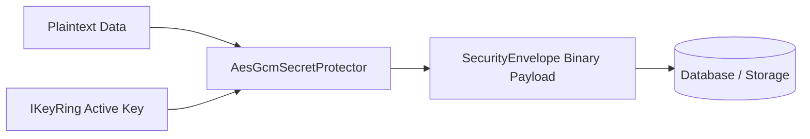

# Secrets Management & Secret Protectors

## 1. Secret Protection Overview

`EricksonLopez.Security` protects in-flight and at-rest secrets via envelope encryption and type-safe redaction:



---

## 2. Protected Secrets (`ProtectedSecret`)

`ProtectedSecret` holds an encrypted payload and its key lineage, allowing deferred decryption on demand:

```csharp
var protectedSecret = new ProtectedSecret(keyId, keyVersion, encryptedBytes);

// Safe logging
logger.LogInformation("Processing secret: {Secret}", protectedSecret); // Outputs: [REDACTED PROTECTED SECRET]

// Deferred unprotect
var result = await protectedSecret.UnprotectAsync(secretProtector);
if (result.IsSuccess)
{
    byte[] rawSecretBytes = result.Value;
}
```

---

## 3. Secret Resolution URI Schemes (`ISecretResolver`)

`CompositeSecretResolver` allows dynamic resolution of secrets using URI prefixes:

| URI Scheme | Resolution Target | Example |
|---|---|---|
| `env:VAR_NAME` | Reads from environment variable | `env:DATABASE_PASSWORD` |
| `store:SECRET_NAME` | Reads from registered `ISecretStore` | `store:StripeApiKey` |
| `raw:VALUE` | Returns inline plaintext value wrapped in `Redacted<string>` | `raw:local-dev-secret` |

```csharp
var resolvedSecret = await secretResolver.ResolveAsync("env:STRIPE_SECRET_KEY");
if (resolvedSecret.IsSuccess)
{
    Redacted<string> secret = resolvedSecret.Value;
    // secret.ToString() -> "[REDACTED]"
    // secret.UnsafeValue -> "sk_live_..."
}
```
