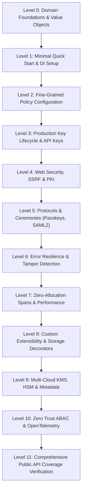

# Official Showcase Specification — EricksonLopez.Security

> **Ecosystem Version**: v1.0.0  
> **Supported Frameworks**: .NET 8.0, .NET 9.0, .NET 10.0  
> **Core Invariants**: Native AOT, Zero Allocations, Misuse Resistance, Memory Scrubbing, Zero Trust (ABAC).  
> **Reference Showcase Project**: [`samples/EricksonLopez.Security.Sample`](../samples/EricksonLopez.Security.Sample)

---

## Table of Contents

1. [Showcase Mission & Purpose](#1-showcase-mission--purpose)
2. [Repository Project Classification](#2-repository-project-classification)
3. [Complete Public API Inventory](#3-complete-public-api-inventory)
4. [Functional Map & Layer Transitions](#4-functional-map--layer-transitions)
5. [Progressive Educational Walkthrough (Levels 0 to 10)](#5-progressive-educational-walkthrough-levels-0-to-10)
6. [Architectural Diagrams (Mermaid)](#6-architectural-diagrams-mermaid)
7. [Validation Verdict](#7-validation-verdict)

---

## 1. Showcase Mission & Purpose

The **`samples/EricksonLopez.Security.Sample`** project serves as the **official reference implementation** and **executable specification** for the `EricksonLopez.Security` ecosystem.

### Core Guarantees
- **Absolute Public API Fidelity**: Every demonstration exclusively consumes classes, interfaces, records, structs, enums, and extension methods that actively exist in the shipping code.
- **Zero Mock APIs**: No fictional or simulated methods are used; all operations execute against real cryptographic and security engines.
- **Strict Continuous Compilation**: The showcase compiles cleanly across .NET 8.0, .NET 9.0, and .NET 10.0 with 0 errors and 0 warnings under `<TreatWarningsAsErrors>true</TreatWarningsAsErrors>`.
- **Progressive Pedagogical Design**: 12 modular levels organized sequentially (Levels 00 to 11) from conceptual domain primitives to comprehensive public API verification.

---

## 2. Repository Project Classification

| Project / Path | Classification | Role in Documentation |
|---|---|---|
| `src/EricksonLopez.Security.Abstractions` | **Core Library** | Source of truth for contracts, value objects, error catalogs, and domain events. |
| `src/EricksonLopez.Security` | **Core Library** | Central cryptographic engine (AEAD, KeyRing, Passwords, Tokens, Secrets). |
| `src/EricksonLopez.Security.Cryptography` | **Core Library** | Direct cryptographic primitives and constant-time execution algorithms. |
| `src/EricksonLopez.Security.Mfa` | **Core Library** | Multi-factor authentication (RFC 6238 TOTP, HOTP, Recovery Codes). |
| `src/EricksonLopez.Security.ZeroTrust` | **Core Library** | Attribute-based access control engine (NIST SP 800-162 / XACML). |
| `src/EricksonLopez.Security.WebAuthn.Fido2` | **Core Library** | WebAuthn Level 3 Passkeys registration and assertion ceremonies. |
| `src/EricksonLopez.Security.Saml2` | **Core Library** | SAML 2.0 Service Provider (SP) with anti-XSW signature defense. |
| `src/EricksonLopez.Security.AspNetCore` | **Infrastructure** | Security headers middleware, API key authentication, and scoped request context. |
| `src/EricksonLopez.Security.Network` | **Infrastructure** | SSRF prevention via `SafeSocketsHttpHandler` and CIDR range blocking. |
| `src/EricksonLopez.Security.Pki` | **Infrastructure** | X.509 certificate chain validation, custom trust anchors, and CRL/OCSP checking. |
| `src/EricksonLopez.Security.Privacy.Hibp` | **Infrastructure** | Have I Been Pwned k-anonymity breached password validation. |
| `src/EricksonLopez.Security.Cryptography.XmlDSig` | **Infrastructure** | W3C XML Digital Signatures (RFC 3275). |
| `src/EricksonLopez.Security.Cryptography.Pkcs11` | **Infrastructure** | Hardware Security Module (HSM) interop via standard PKCS#11 (Cryptoki). |
| `src/EricksonLopez.Security.WebAuthn.Fido2.Mds3` | **Infrastructure** | FIDO Alliance Metadata Service v3 authenticator metadata client. |
| `src/EricksonLopez.Security.Azure` | **Infrastructure** | Azure Key Vault KMS and Secret Store adapters. |
| `src/EricksonLopez.Security.Aws` | **Infrastructure** | AWS KMS and AWS Secrets Manager adapters. |
| `src/EricksonLopez.Security.HashiCorpVault` | **Infrastructure** | HashiCorp Vault Transit Encryption and KV v2 Secret Store adapters. |
| `src/EricksonLopez.Security.GoogleCloud` | **Infrastructure** | Google Cloud KMS and Secret Manager adapters. |
| `src/EricksonLopez.Security.OpenTelemetry` | **Infrastructure** | OpenTelemetry distributed tracing and metrics instrumentation satellite. |
| `src/EricksonLopez.Security.Testing` | **Testing Utility** | In-memory test doubles, fake stores, and cryptographic assertions. |
| `src/EricksonLopez.Security.Analyzers` | **Static Analysis** | Roslyn Diagnostic Analyzers (`ELS0001`–`ELS0005`) for compile-time safety. |
| `samples/EricksonLopez.Security.Sample` | **Showcase** | **Official Executable Reference Showcase (Levels 0 to 11).** |
| `samples/EricksonLopez.Security.ApiKeys.Sample` | **Sample** | ASP.NET Core Minimal API demonstrating API key lifecycle. |
| `samples/EricksonLopez.Security.Totp.Sample` | **Sample** | Console app demonstrating TOTP enrollment and recovery codes. |
| `samples/EricksonLopez.Security.Secrets.Sample` | **Sample** | Console app demonstrating envelope encryption and key rotation. |
| `tests/*` (23 test projects) | **Tests** | Unit, integration, architecture (NetArchTest), and Native AOT smoke tests. |
| `benchmarks/EricksonLopez.Security.Benchmarks` | **Benchmarks** | Allocation and latency benchmarks via BenchmarkDotNet. |
| `docs/*` | **Documentation** | Architectural guides, ADRs, Cookbook, and API reference. |

---

## 3. Complete Public API Inventory in Showcase

| Public Type | Namespace | Responsibility | Showcase Level |
|---|---|---|:---:|
| `KeyIdentifier` | `...Abstractions.Primitives` | Immutable strongly-typed key identifier | Level 0, 2 |
| `KeyVersion` | `...Abstractions.Primitives` | Monotonic integer key version | Level 0, 3 |
| `Redacted<T>` | `...Abstractions.Primitives` | Log-safe wrapper masking sensitive data | Level 0 |
| `Nonce` & `Salt` | `...Abstractions.Primitives` | Immutable fixed-size cryptographic byte containers | Level 0, 2 |
| `SecurityStamp` | `...Abstractions.Primitives` | Cryptographic stamp for session invalidation | Level 0 |
| `CryptographicKey` | `...Abstractions.Primitives` | Key entity with secure buffer and metadata | Level 1, 3, 8 |
| `ISecretBuffer` | `...Abstractions.Primitives` | Memory buffer zeroed on disposal (`ZeroMemory`) | Level 2, 7 |
| `ISecretProtector` | `...Abstractions.Secrets` | High-level envelope encryption facade | Level 1, 3, 6 |
| `IKeyLifecycleManager` | `...Abstractions.KeyManagement` | Key lifecycle orchestrator (`Active` $\rightarrow$ `Retired` $\rightarrow$ `Revoked`) | Level 1, 3, 6, 8 |
| `IKeyRing` | `...Abstractions.KeyManagement` | In-memory key ring for active/retired key lookup | Level 1, 3 |
| `IKeyStore` | `...Abstractions.KeyManagement` | Physical key persistence adapter | Level 8 |
| `IPasswordHasher` | `...Abstractions.Passwords` | Modular password hasher (PBKDF2/Argon2id) | Level 1 |
| `ISimplePasswordHasher` | `...Abstractions.Passwords` | String-based password hashing contract (`Hash`, `Verify`, `NeedsRehash`) | Level 2 |
| `PasswordPolicy` | `...Abstractions.Policies` | Zero-allocation span NIST SP 800-63B policy | Level 2 |
| `KeyRotationPolicy` | `...Abstractions.Policies` | Key rotation periodicity and grace periods | Level 2 |
| `IApiKeyGenerator` | `...Abstractions.Tokens` | Structured high-entropy API key issuer | Level 1, 3 |
| `IApiKeyValidator` | `...Abstractions.Tokens` | Constant-time API key validator | Level 3 |
| `ITokenGenerator` | `...Abstractions.Tokens` | Opaque token and numeric OTP generator | Level 1 |
| `IAuthenticatedEncryptionEngine`| `...Abstractions.Cryptography` | Unified AEAD cipher contract | Level 2, 7 |
| `SecurityEnvelope` | `...Abstractions.Cryptography` | Interoperable binary envelope record | Level 2 |
| `SecurityError` | `...Abstractions.Errors` | Discriminated union error catalog | Level 2, 6 |
| `SecurityEventSeverity` | `...Abstractions.Events` | Security audit event severity (Informational, Warning, High, Critical) | Level 2 |
| `AesGcmEncryptionEngine` | `...Security.Cryptography` | Hardware-accelerated AES-256-GCM engine | Level 2, 7 |
| `HkdfAesGcmEncryptionEngine` | `...Security.Cryptography` | Ephemeral subkey derivation via HKDF-SHA512 + AES-256-GCM | Level 2 |
| `ChaCha20Poly1305EncryptionEngine`| `...Security.Cryptography` | RFC 8439 ChaCha20-Poly1305 engine | Level 2 |
| `BinarySecurityEnvelopeSerializer`| `...Security.Cryptography` | Zero-allocation envelope serializer | Level 2 |
| `ConstantTimeComparer` | `...Security.Randomness` | Side-channel resistant byte/string comparer | Level 6 |
| `TimingSafeString` | `...Security.Randomness` | Constant-time string equality helper | Level 2 |
| `ITotpService` | `...Security.Mfa` | RFC 6238 TOTP generator and validator | Level 3 |
| `DelegateTotpReplayStore` | `...Security.Mfa` | Delegate-based distributed TOTP replay store | Level 3, 11 |
| `AddDistributedTotpReplayStore` | `...Security.Mfa` | DI extensions for distributed replay prevention | Level 11 |
| `IRecoveryCodeGenerator` | `...Security.Mfa` | Contract for emergency recovery code generation and verification | Level 3 |
| `RecoveryCodeGenerator` | `...Security.Mfa` | Single-use emergency recovery codes with constant-time verification | Level 3 |
| `IKeyRevocationNotifier` | `...Abstractions.KeyManagement` | Real-time key revocation broadcasting contract | Level 6, 11 |
| `InProcessKeyRevocationNotifier` | `...Security.KeyManagement` | In-process thread-safe revocation notifier | Level 6, 11 |
| `IKeyRing.Invalidate*` | `...Abstractions.KeyManagement` | Immediate ZeroMemory cache eviction methods | Level 6, 11 |
| `SecurityHeadersMiddleware` | `...AspNetCore.Headers` | Hardened HTTP response headers (CSP, HSTS) | Level 4 |
| `RequestSecurityContext` | `...AspNetCore.Context` | Scoped request security and actor traceability | Level 4 |
| `SafeSocketsHttpHandler` | `...Security.Network` | Socket-level SSRF and DNS rebinding defense | Level 4 |
| `SafeHttpClientFactory` | `...Security.Network` | Factory producing hardened HttpClient with SSRF protection | Level 4 |
| `CertificateChainValidator` | `...Security.Pki` | X.509 chain and custom trust anchor validator | Level 4 |
| `IWebAuthnCeremonyService` | `...WebAuthn.Fido2` | WebAuthn Level 3 Passkeys ceremony orchestrator | Level 5 |
| `ISaml2Service` | `...Security.Saml2` | SAML 2.0 SP with anti-XSW signature validation | Level 5 |
| `IXmlDigitalSignatureVerifier` | `...Cryptography.XmlDSig` | W3C XML Digital Signature verifier with anti-XSW extraction | Level 5 |
| `XmlDigitalSignatureService` | `...Cryptography.XmlDSig` | W3C XML Digital Signatures (RFC 3275) | Level 5 |
| `LegacyPbkdf2PasswordHasher` | `...Security.Passwords` | Legacy PBKDF2 hasher signaling automatic rehash | Level 8 |
| `IAbacPolicyEngine` | `...Security.ZeroTrust` | NIST SP 800-162 dynamic ABAC policy engine | Level 8, 10 |
| `AzureKeyVaultOptions` | `...Security.Azure` | Azure Key Vault KMS and secret store configuration | Level 9 |
| `AwsSecurityOptions` | `...Security.Aws` | AWS KMS and Secrets Manager configuration | Level 9 |
| `HashiCorpVaultOptions` | `...Security.HashiCorpVault` | HashiCorp Vault Transit and KV v2 configuration | Level 9 |
| `GoogleCloudSecurityOptions` | `...Security.GoogleCloud` | Google Cloud KMS and Secret Manager configuration | Level 9 |
| `SecurityActivitySource` | `...Security.Diagnostics` | ActivitySource for OpenTelemetry traces | Level 7, 10 |
| `SecurityMeter` | `...Security.Diagnostics` | Meter for cryptographic and authentication metrics | Level 7, 10 |
| `FakePasswordHasher` | `...Security.Testing.Fakes` | Deterministic zero-cost `IPasswordHasher` test double with `SimulateNeedsRehash` | Level 8 |
| `FakeSecretProtector` | `...Security.Testing.Fakes` | XOR-masking in-memory `ISecretProtector` test double with `InjectedError` | Level 8 |
| `FakeKeyStore` | `...Security.Testing.Fakes` | In-memory `IKeyStore` test double with `InjectedError` simulation | Level 8 |
| `DeterministicRandomNumberGenerator` | `...Security.Testing.Fakes` | Seeded `ICryptographicRandomNumberGenerator` for reproducible tests | Level 8 |
| `TestHttpMessageHandler` | `...Security.Testing.Http` | Configurable `HttpMessageHandler` test double (`responseContent`, `LastRequest`, `RequestCount`) | Level 8 |
| `FakeLogger<T>` | `...Security.Testing.Logging` | Structured log capture test double (`Entries`, `Count`, `Messages`, `HasMessage()`) | Level 8 |
| `FakeLogRecord` | `...Security.Testing.Logging` | Positional record for structured log assertion (`LogLevel`, `EventId`, `Message`) | Level 8 |

---

## 4. Progressive Educational Walkthrough (Levels 0 to 11)



### Level 0 — Conceptual Foundations
- Invariants: immutability, type safety, memory hygiene.
- Primitives: `KeyIdentifier`, `KeyVersion`, `Redacted<T>`, `Nonce`, `Salt`, `SecurityStamp`.
- Demonstration: `ToString()` unconditionally redacting secrets; safe parsing with `TryCreate`.

### Level 1 — Quick Start
- Dependency injection via `AddEricksonLopezSecurity()`.
- Minimal setup: key generation, secret protection with `ISecretProtector`, password hashing, token generation.

### Level 2 — Full Configuration
- Fine-tuning policies: `PasswordPolicy` (NIST SP 800-63B), `KeyRotationPolicy`, `ApiKeyPolicy`, `TokenPolicy`.
- Enumerations: `KeyPurpose` (all 6 values including Encryption, Signing, Hashing, TokenProtection, SecretProtection, KeyWrapping), `KeyStatus`, `PasswordHashAlgorithm`, `AeadAlgorithm` — security domain vocabulary.
- **NEW** `SecurityEventSeverity` enum — all values (Informational, Warning, High, Critical) for audit event severity taxonomy.
- **NEW** `ISimplePasswordHasher` — string-based password hashing contract (`Hash()`, `Verify()`, `NeedsRehash()`) via `CompositePasswordHasher` dual implementation.
- **NEW** `OpaqueTokenGenerator.Shared` — static singleton access (no DI required) demonstrating all 4 overloads: `GenerateToken()`, `GenerateUrlSafeToken()`, `GenerateHexToken()`, `GenerateNumericCode()`.
- Cryptographic value objects: `Nonce`, `Salt`, `SecurityStamp`, `PasswordHash` — strongly-typed primitives.
- `KeyIdentifier.Prefixed()`, `TryCreate()` — semantic prefixed IDs and defensive parsing.
- Direct AEAD engines: AES-256-GCM, ChaCha20-Poly1305, `HkdfAesGcmEncryptionEngine` (`AeadAlgorithm.HkdfAes256Gcm` per-message key derivation), Hybrid ML-KEM-768 Post-Quantum engine.
- Envelope serialization via `BinarySecurityEnvelopeSerializer` — including `TrySerialize(Span<byte>)` zero-allocation overload.
- `ISecurityPolicy<T>` — base contract demonstrating polymorphic policy reference.
- `SecurityError` complete factory catalog — including `InvalidKey`, `EncryptionFailed`, `DecryptionFailed`, `InvalidPassword`, `InvalidNonce`, `BufferTooSmall`.
- **NEW** `ISecretProtector` with associated data (AAD) — `ProtectAsync()` and `UnprotectAsync()` with `associatedData` parameter (async and sync overloads).
- **NEW** `IKeyLifecycleManager.GenerateAndActivateKeyAsync()` with explicit `algorithmId` and `validityPeriod` overloads.
- **NEW** `IKeyLifecycleManager.RotateKeyAsync()` with explicit `validityPeriod` overload.
- Dual-PBKDF2 architecture note: `EricksonLopez.Security.Cryptography` (tier-1, PBKDF2.V1$ format) vs `EricksonLopez.Security` (tier-2, MCF format).

### Level 3 — Real-World Production Use Cases
- Multi-version key rotation (`KeyLifecycleManager`): active keys encrypt; retired keys seamlessly decrypt historical data.
- Structured API key lifecycle: generation, SHA-256 hashed persistence, constant-time validation.
- RFC 6238 TOTP MFA: `ITotpService.GenerateSecretKey()`, `TotpSetupInfo.FormattedSecretKey`, `TotpOptions` (all properties), `TotpHashAlgorithm` enum (Sha1/Sha256/Sha512), re-enrollment with existing key, custom 8-digit SHA-256 codes.
- Multi-node distributed TOTP replay prevention (`DelegateTotpReplayStore`): cross-node replay mitigation validating that a consumed token on Node A fails closed if replayed on Node B.
- Single-use emergency recovery codes: `IRecoveryCodeGenerator` interface, `RecoveryCodeGenerator.GenerateCodes()`, `RecoveryCodeGenerator.HashCode()`, and constant-time `RecoveryCodeGenerator.VerifyCode()`.

### Level 4 — Advanced Integration & Perimeter Defense
- ASP.NET Core setup: `AddSecurityAspNetCore()` DI registration, `UseSecurityHeaders()` and `UseApiKeyAuthentication()` middleware pipeline.
- `ApiKeyAuthenticationOptions` — all 4 properties (`HeaderName`, `QueryParameterName`, `RequireApiKey`, `AuthenticationScheme`).
- `SecurityHeadersOptions` — all response header properties (CSP, HSTS, X-Frame-Options, Permissions-Policy, Referrer-Policy).
- `IRequestSecurityContext` — full contract including `.ApiKey` and `.Principal` properties.
- SSRF prevention via `SafeSocketsHttpHandler` and `SafeHttpClientFactory` blocking loopback, link-local, and RFC 1918 addresses.
- X.509 certificate chain validation with custom trust anchors (`CertificateChainValidator`).
- `IKeyRing.GetActiveKeyAsync()` and `GetKeyAsync()` — async overloads.
- `IEncryptionKeyProvider.GetActiveEncryptionKeyAsync()`, `GetDecryptionKeyAsync()` — encryption key resolution layer.
- `KeyMetadata` — direct property inspection (KeyId, Version, Purpose, Status, AlgorithmId, CreatedAtUtc, ExpiresAtUtc).

### Level 5 — Security Protocols & Ceremonies
- FIDO2 / WebAuthn Level 3 Passkeys ceremonies: registration, attestation validation (Packed, SafetyNet, TPM, FIDO-U2F), and assertion verification.
- SAML 2.0 SP engine: SP-initiated SSO, IdP-initiated SSO, Single Logout (SLO), and anti-XSW signature verification.
- W3C XML Digital Signatures (`XmlDigitalSignatureService`) and anti-XSW verification (`IXmlDigitalSignatureVerifier`, `XmlVerificationOptions`, `XmlVerificationResult`).

### Level 6 — Error Handling & Resilience
- Functional error handling via `EricksonLopez.Result` and `SecurityError` catalog (all factory methods).
- Tamper detection: invalid ciphertext, altered authentication tags, mismatched AAD tenant context.
- Key revocation & real-time cache eviction: immediate kill-switch with `IKeyRevocationNotifier` and `InProcessKeyRevocationNotifier` broadcasting revocation signals and immediately executing `KeyRing.InvalidateKey()`, `InvalidateActiveKey()`, and `InvalidateAll()`.
- HIBP k-Anonymity: `AddHaveIBeenPwned()`, `IHaveIBeenPwnedClient.CheckPasswordAsync()`, `IHaveIBeenPwnedClient.GetRangeAsync()`, `IPasswordPwnedValidator.ValidateNotPwnedAsync()`, `PwnedPasswordCheckResult` (all properties).

### Level 7 — Scalability, Zero-Allocation Performance & Observability
- Span-based in-place encryption (`ReadOnlySpan<byte>`, `stackalloc`, `ArrayPool<byte>`).
- 10,000 operations micro-benchmark demonstrating 0 B heap allocations on core crypto hotpaths.
- Native AOT trim safety and deterministic runtime performance.
- `SecurityActivitySource` — BCL-native distributed tracing spans and tag constants.
- `SecurityMeter` — BCL-native OpenTelemetry-compatible metric counters and histograms.
- `HmacSha256TokenHasher` — SHA-256/HMAC-SHA256 token hashing for database-safe storage.

### Level 8 — Customization, Extensibility & Testing Utilities
- Custom `IKeyStore` implementation with an audit-logging decorator pattern.
- Custom domain-specific ABAC rules and custom secret resolvers.
- `CompositePasswordHasher` — transparent multi-algorithm migration (PBKDF2 → Argon2id) and rehash signaling.
- `Argon2idPasswordHasher` — custom cost parameters (memorySizeKb, iterations, parallelism).
- `LegacyPbkdf2PasswordHasher` — verifying legacy `$legacy-pbkdf2$` hashes and signaling `SuccessRehashNeeded`.
- `Pbkdf2PasswordHasher.Default` — explicit static instance access, `.Algorithm`, `.HashPassword()`, `.NeedsRehash()`.
- `EnvironmentSecretStore` — environment variable-backed `ISecretStore` with prefix normalization.
- `CompositeSecretResolver` — multi-scheme URI secret resolution (raw:, env:, store:).
- `InMemoryApiKeyStore` — thread-safe API key CRUD store with revocation lifecycle.
- `ApiKey` entity — full lifecycle (create, store, retrieve, revoke, IsActive, HasScope).
- `IAbacPolicyEngine` — programming against the abstract interface (vs concrete `AbacPolicyEngine`).
- `AbacDecisionStatus` enum — all XACML outcomes (Permit, Deny, NotApplicable, Indeterminate).
- `AbacEffect` enum — Permit, Deny.
- `IdentityPasswordHasherBridge<TUser>` — direct instantiation and ASP.NET Core Identity bridging.
- `AddEricksonLopezIdentityPasswordHasher<TUser>()` — DI replacement of Identity's `IPasswordHasher<TUser>`.
- **NEW** `FakePasswordHasher` — deterministic zero-cost `IPasswordHasher` test double (`HashPassword()`, `VerifyPassword()`, `NeedsRehash()`, `SimulateNeedsRehash` flag).
- **NEW** `FakeSecretProtector` — XOR-masking in-memory `ISecretProtector` test double with `InjectedError` failure simulation.
- **NEW** `FakeKeyStore` — in-memory `IKeyStore` test double (`SaveKeyAsync`, `GetKeyAsync`, `ListMetadataAsync`, `UpdateStatusAsync`) with `InjectedError` simulation.
- **NEW** `DeterministicRandomNumberGenerator` — seeded `ICryptographicRandomNumberGenerator` for reproducible cryptographic tests (`Fill()`, `GetInt32()`, same-seed reproducibility).
- **NEW** `TestHttpMessageHandler` — configurable `HttpMessageHandler` test double (`responseContent` string constructor, `LastRequest`, `RequestCount`, `Requests` collection).
- **NEW** `FakeLogger<T>` — structured log capture test double (`Entries`, `Count`, `Messages`, `HasMessage()`).
- **NEW** `FakeLogRecord` — positional record (`LogLevel`, `EventId`, `State`, `Exception`, `Message`) for structured log assertion.

### Level 9 — Cloud KMS, HSM & Satellite Extensions
- Azure Key Vault (`EricksonLopez.Security.Azure`).
- AWS KMS / Secrets Manager (`EricksonLopez.Security.Aws`).
- HashiCorp Vault Transit Engine (`EricksonLopez.Security.HashiCorpVault`).
- Google Cloud KMS & Secret Manager (`EricksonLopez.Security.GoogleCloud`).
- Hardware Security Module (HSM) via PKCS#11 (`EricksonLopez.Security.Cryptography.Pkcs11`).
- FIDO Alliance MDS3 metadata caching (`EricksonLopez.Security.WebAuthn.Fido2.Mds3`).
- Have I Been Pwned password breach checking (`EricksonLopez.Security.Privacy.Hibp`).

### Level 10 — Enterprise Zero Trust & Observability
- Dynamic Attribute-Based Access Control engine (NIST SP 800-162 / XACML) with Deny-Overrides.
- `IAbacPolicyEngine` interface, `AbacDecisionStatus` (all XACML values with semantic descriptions).
- OpenTelemetry instrumentation: `SecurityActivitySource`, `SecurityMeter`.
- `SecurityOpenTelemetryExtensions.AddEricksonLopezSecurityInstrumentation(TracerProviderBuilder)` — OTel tracing integration.
- `SecurityOpenTelemetryExtensions.AddEricksonLopezSecurityInstrumentation(MeterProviderBuilder)` — OTel metrics integration.

### Level 11 — Comprehensive Public API Coverage Verification
- **100% Public API Surface Gate**: Exhaustive live execution and assertion of all public APIs across all 21 ecosystem packages.
- Systematic runtime verification of memory scrubbing (`SecretBuffer`), cloud storage adapters, identity protocols (WebAuthn Level 3, SAML 2.0 with anti-XSW, W3C XmlDSig), ASP.NET Core security headers, and OpenTelemetry instrumentation.

---

## 5. Execution Instructions

Execute the complete reference showcase locally:

```bash
dotnet run --project samples/EricksonLopez.Security.Sample
```

All 12 levels execute sequentially, outputting formatted verification results for every cryptographic and security operation.
