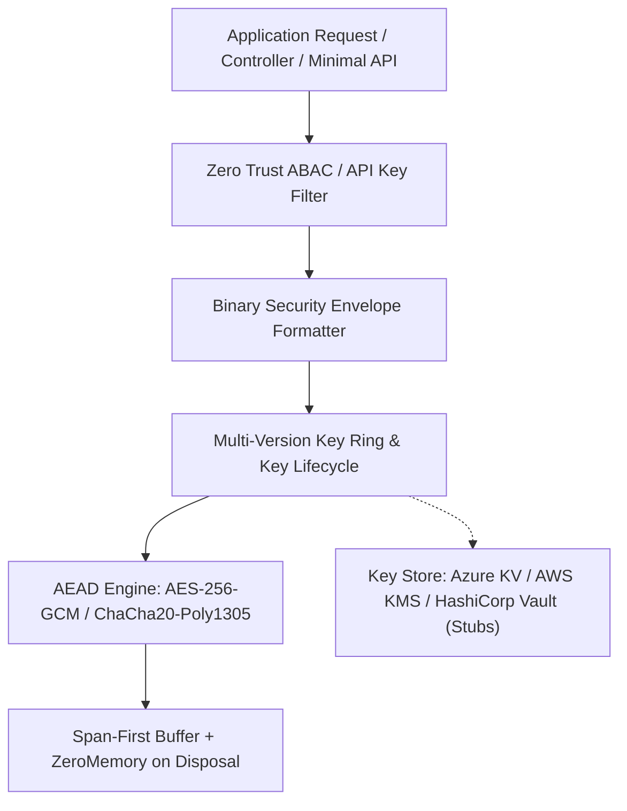

# Level 00: Architectural Introduction & Security Mental Model

## 1. Overview & Problem Statement

Building enterprise cryptographic systems requires uncompromising defense-in-depth. Common vulnerabilities in modern .NET security architectures stem from:
- **Insecure Cipher Modes**: Legacy use of CBC mode without authentication tag validation, vulnerable to padding oracle attacks.
- **Timing Side-Channels**: String or array comparisons using standard `==` or `SequenceEqual`, enabling remote byte-by-byte timing attacks.
- **RAM Credential Exfiltration**: Secrets left in managed heap memory indefinitely until garbage collection, vulnerable to core dumps and process memory scraping.
- **Key Stagnation & Hardcoded Secrets**: Lack of multi-version key rotation and automated key lifecycle state machines.

`EricksonLopez.Security` eliminates these vulnerabilities through architectural constraints:
- **AEAD By Design**: Exclusively uses authenticated encryption with associated data (**AES-256-GCM** and **ChaCha20-Poly1305**).
- **Constant-Time Execution**: All comparisons of hashes, MACs, signatures, and tokens use `CryptographicOperations.FixedTimeEquals`.
- **Automatic Memory Scrubbing**: Sensitive types implement `IDisposable` and immediately wipe key buffers via `CryptographicOperations.ZeroMemory`.
- **Native AOT Compatible**: Strict trimming annotations with zero reflection in core paths.

---

## 2. Layered Architecture Flow

---

## 3. Architecture Comparison Matrix

| Capability | Standard .NET Data Protection | Third-Party Crypto Libs | EricksonLopez.Security |
| :--- | :--- | :--- | :--- |
| **Cipher Policy** | Configurable (defaults to AES-CBC+HMAC) | Often exposes insecure modes | **Strict AEAD Only (AES-GCM / ChaCha20)** |
| **Key Lifecycle** | XML key repository auto-rotation | Manual key management | **State Machine (Active -> Retired -> Revoked -> Destroyed)** |
| **Memory Scrubbing** | Relies on GC | Variable | **Deterministic `CryptographicOperations.ZeroMemory`** |
| **Native AOT Trimming** | Partial | Often reflection heavy | **100% Verified with Native AOT Smoke Tests** |
| **Error Handling** | Throws `CryptographicException` | Throws exceptions | **Functional `Result<T>` with Structured Taxonomy** |
