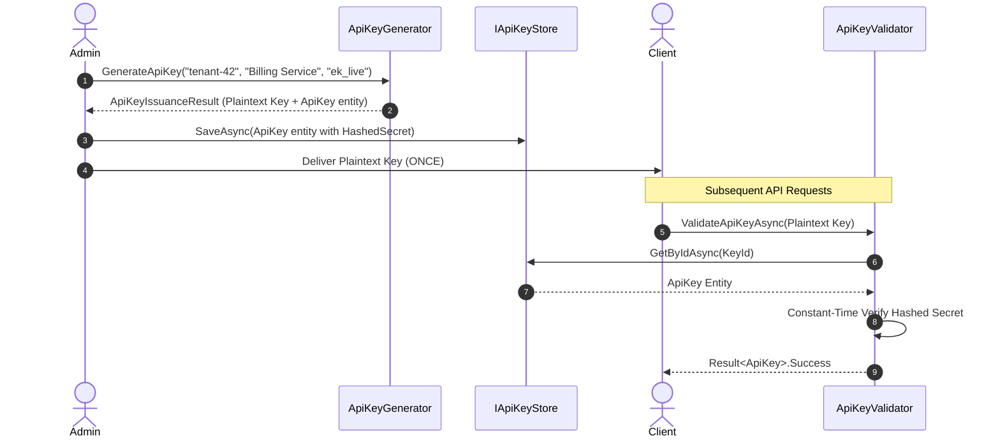

# Token Security & High-Entropy API Keys

## 1. Opaque Token Generation

`ITokenGenerator` generates cryptographically secure, high-entropy tokens:

```csharp
var generator = OpaqueTokenGenerator.Shared;

// 1. 256-bit Opaque Token (Redacts value in ToString())
OpaqueToken sessionToken = generator.GenerateToken(32);

// 2. URL-Safe Base64Url Token (e.g. for email verification links)
string urlToken = generator.GenerateUrlSafeToken(32);

// 3. High-entropy Hex Token (e.g. for CSRF tokens)
string hexToken = generator.GenerateHexToken(16);

// 4. Numeric OTP code (e.g. 6-digit 2FA SMS/Email code)
string otpCode = generator.GenerateNumericCode(6);
```

---

## 2. Structured API Key Issuance Pattern

API keys follow a structured, misuse-resistant format:
`{prefix}_{idHex16}_{secret24}`
Example: `ek_live_4fecdac2ba87e980_9GNGyhS8CU94p2V3KfjevKVoju6gsGW6`



### Safety Features
1. **Single-Use Plaintext**: The raw key is returned only once to the issuer.
2. **Hashed Persistence**: Databases only store the SHA-256 / HMAC-SHA256 digest of the secret.
3. **Prefix Indexing**: Fast database index lookups via `DisplayPrefix` and `ApiKeyId`.
4. **Scope Authorization**: Typed scopes (e.g. `orders:read`, `payments:write`) checked via `apiKey.HasScope("orders:read")`.
