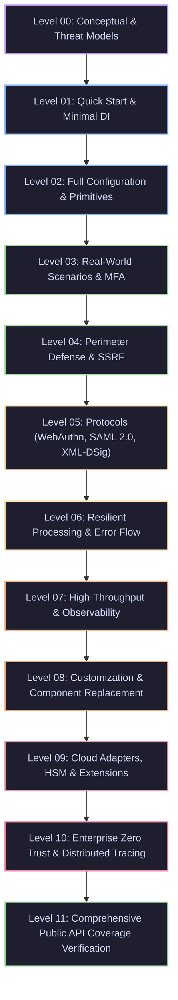

# EricksonLopez.Security.Sample — Official Executable Specification & Showcase

[](https://dotnet.microsoft.com)
[](https://learn.microsoft.com/en-us/dotnet/core/deploying/native-aot)
[]()
[]()

> **The Single Source of Executable Truth for `EricksonLopez.Security`.**  
> Every scenario in this project is a compiled, running demonstration of the active public API across the ecosystem. Zero fictional APIs, zero deprecated methods, and strict adherence to enterprise security invariants.

---

## 📖 Executive Purpose

`EricksonLopez.Security.Sample` serves five unified roles:

1. **Official Executable Specification**: Validates that all public contracts, builders, extension methods, error catalogs, and primitives integrate as designed.
2. **Pedagogical Learning Path**: Progresses developers from foundational concepts (Level 00) to enterprise-grade Zero Trust architectures (Level 10).
3. **Integration Reference**: Provides copy-pasteable, production-hardened patterns for ASP.NET Core, OpenTelemetry, PKCS#11 HSMs, FIDO2/WebAuthn, and SAML 2.0.
4. **Living Cookbook**: Solves concrete, everyday security challenges (multi-version key rotation, SSRF prevention, constant-time verification, memory redaction).
5. **Architectural Guardrail**: Guarantees compliance with zero-allocation span ergonomics, Native AOT trimming compatibility, and side-channel resistance.

---

## 🚀 Quick Execution

Run the complete 12-level showcase in a single command:

```bash
# Run all 12 showcase levels (.NET 10.0 or .NET 8.0)
dotnet run --project samples/EricksonLopez.Security.Sample/EricksonLopez.Security.Sample.csproj

# Run specific showcase levels (e.g., Level 0, Level 3, and Level 11)
dotnet run --project samples/EricksonLopez.Security.Sample/EricksonLopez.Security.Sample.csproj -- 0 3 11

# Display CLI help and list all available showcase levels
dotnet run --project samples/EricksonLopez.Security.Sample/EricksonLopez.Security.Sample.csproj -- --help
```

To run without rebuilding:

```bash
dotnet run --project samples/EricksonLopez.Security.Sample/EricksonLopez.Security.Sample.csproj --no-build -- all
```

---

## 🏛️ Architectural Invariants Enforced Across the Showcase

| Invariant | Mechanism | Verified In |
|---|---|---|
| **Zero Heap Allocations** | `ReadOnlySpan<byte>` overloads, `stackalloc`, `ArrayPool<byte>.Shared` | Level 02, Level 07 |
| **Side-Channel Resistance** | `CryptographicOperations.FixedTimeEquals` for all comparisons | Level 02, Level 03, Level 06 |
| **Native AOT & Trimming** | Zero reflection, compile-time metadata, source-generated serialization | All Levels |
| **Secure Memory Redaction** | `SecretBuffer`, `Redacted<T>`, `CryptographicOperations.ZeroMemory` on disposal | Level 02, Level 08 |
| **Functional Error Flow** | `EricksonLopez.Result` with typed `SecurityError` codes (no exceptions for control flow) | Level 01, Level 06 |
| **Multi-Version Keying** | State machine: `Active` $\rightarrow$ `Retired` $\rightarrow$ `Revoked` $\rightarrow$ `Destroyed` | Level 02, Level 08 |

---

## 🧭 Pedagogical Progression: 12 Progressive Levels



### [Level 00 — Conceptual, Threat Models & Architecture](./Levels/Level0_Conceptual.cs)
- **Problem Solved**: Replaces fragmented, insecure cryptographic habits (CBC mode, padding oracles, timing leaks, string credentials in GC memory) with a cohesive, hardened framework.
- **Architectural Tenets**: Pure Native AOT compatibility, zero-allocation span APIs, NIST SP 800-38D / RFC 8439 authenticated ciphers.
- **Comparative Analysis**: Explains advantages over raw `System.Security.Cryptography` and ASP.NET Core Data Protection.

### [Level 01 — Quick Start & Minimal DI Registration](./Levels/Level1_QuickStart.cs)
- **Installation**: Registering core services via `services.AddEricksonLopezSecurity()`.
- **First Encrypt/Decrypt Cycle**: Using `IAuthenticatedEncryptionEngine` with automatic IV/tag envelope encapsulation.
- **Result Flow**: Handling success and failure cleanly via `Result<T>` and `SecurityError`.

### [Level 02 — Full Configuration, Passwords, Key Lifecycle & Primitives](./Levels/Level2_FullConfiguration.cs)
- **Algorithms**: Demonstrates `AesGcmEncryptionEngine`, `ChaCha20Poly1305EncryptionEngine`, and `HkdfAesGcmEncryptionEngine` (HKDF-SHA512 ephemeral key isolation).
- **Memory Protection**: `SecretBuffer` pinned memory scrubbing, `Redacted<T>`, and `OpaqueToken`.
- **Password Security**: `Pbkdf2PasswordHasher` (210,000 rounds HMAC-SHA512), `Argon2idPasswordHasher` (RFC 9106, 64 MB), `ISimplePasswordHasher` string API (`Hash`, `Verify`, `NeedsRehash`).
- **Key Primitives**: `KeyRing`, `KeyVersion`, `KeyPurpose` (all 6 values via `Enum.GetNames<>`), `KeyStatus` state machine.
- **Security Taxonomy**: `SecurityEventSeverity` enum (Informational, Warning, High, Critical).
- **Token Singleton**: `OpaqueTokenGenerator.Shared` — static access (all 4 overloads: `GenerateToken`, `GenerateUrlSafeToken`, `GenerateHexToken`, `GenerateNumericCode`).
- **AAD Binding**: `ISecretProtector.ProtectAsync/UnprotectAsync` with `associatedData` parameter (context authentication).
- **Key Lifecycle Overloads**: `IKeyLifecycleManager.GenerateAndActivateKeyAsync(purpose, algorithmId, validityPeriod)` and `RotateKeyAsync(id, validityPeriod)` explicit overloads.
- **SecurityError Catalog**: Pre-fabricated error types including `SecurityError.InvalidNonce` and `SecurityError.BufferTooSmall`.

### [Level 03 — Real-World Use Cases, MFA, Zero Trust ABAC & Native AOT](./Levels/Level3_RealWorldUseCases.cs)
- **MFA Ecosystem**: `TotpGenerator` (RFC 6238), `TotpValidator` with drift tolerance, `OtpUriBuilder` for QR codes.
- **Distributed TOTP Replay Prevention**: `DelegateTotpReplayStore` demonstrating multi-node cluster replay prevention where token reuse across distinct cluster nodes fails closed.
- **Backup Codes**: `RecoveryCodeGenerator` / `IRecoveryCodeGenerator` generating formatted codes (`XXXX-XXXX-XXXX`) with constant-time verification (`VerifyCode`) and hashing (`HashCode`).
- **ABAC Engine**: `AbacPolicyEngine`, `AbacPolicy`, `AbacRule`, `AbacContext` with Deny-Overrides.
- **Native AOT & Trimming**: Verification of zero runtime code generation.

### [Level 04 — Advanced Integration & Perimeter Hardening](./Levels/Level4_AdvancedIntegration.cs)
- **SSRF Defense**: `SafeSocketsHttpHandler` and `SafeHttpClientFactory` blocking loopback, link-local, and RFC 1918 private IPs while enforcing DNS rebinding validation and hostname allowlists.
- **HTTP Security Headers**: `SecurityHeadersMiddleware`, `SecurityHeadersOptions`, and `SecurityHeaderPresets.StrictApi` configuring CSP, HSTS, X-Content-Type-Options, and Referrer-Policy.
- **API Key Authentication**: `ApiKeyAuthenticationHandler`, `ApiKeyAuthenticationOptions`, and scoped permissions.

### [Level 05 — Protocols & Ceremonies: WebAuthn, SAML 2.0 & XML-DSig](./Levels/Level5_ProtocolsAndCeremonies.cs)
- **WebAuthn / Passkeys**: FIDO2 ceremony orchestration (`WebAuthnCeremonyService`, `AuthenticatorDataParser`, `CoseKeyParser`).
- **SAML 2.0 Engine**: `Saml2Service`, `Saml2AuthnRequest`, `Saml2AssertionDecryptor`, `Saml2SignatureValidator`, and `Saml2XswValidator` with strict replay cache and clock drift tolerance.
- **XML-DSig Verification**: `IXmlDigitalSignatureVerifier` / `XmlDigitalSignatureService` with `XmlVerificationOptions`, `XmlVerificationResult`, and anti-XML Signature Wrapping (anti-XSW) defenses.

### [Level 06 — Resilient Processing & Cryptographic Error Flow](./Levels/Level6_ErrorHandlingAndResilience.cs)
- **Functional Resilience**: Eliminating exceptions from standard cryptographic failure modes.
- **Tamper Detection**: Authentication tag mismatch returning `SecurityError.AuthenticationTagMismatch`.
- **Real-Time Key Revocation**: Immediate kill-switch broadcasting revocation events via `IKeyRevocationNotifier` & `InProcessKeyRevocationNotifier`.
- **Immediate Cache Eviction**: `KeyRing.InvalidateKey()`, `InvalidateActiveKey()`, and `InvalidateAll()` scrubbing memory via `ZeroMemory` and preventing window-of-vulnerability attacks without waiting for TTL expiration.
- **Key Lifecycle Errors**: Expired and revoked keys returning `SecurityError.KeyExpired` and `SecurityError.KeyRevoked`.
- **Policy Violations**: Decryption failure returns domain errors rather than leaking oracle hints.

### [Level 07 — High-Throughput Pipelines & Observability](./Levels/Level7_ScalabilityAndPerformance.cs)
- **Zero-Allocation Span APIs**: Benchmarking `Encrypt(ReadOnlySpan<byte>, Span<byte>)` with `stackalloc`.
- **Native Metrics**: BCL `Meter` capturing `security.encrypt.total`, `security.decrypt.total`, and hashing duration histograms.
- **Native Tracing**: BCL `ActivitySource` creating distributed tracing spans (`security.encrypt`, `security.decrypt`).
- **Deterministic Token Hashing**: `HmacSha256TokenHasher` with pepper support for database lookups.

### [Level 08 — Customization, Extensibility & Testing Utilities](./Levels/Level8_CustomizationAndExtensibility.cs)
- **Multi-Algorithm Password Migration**: `CompositePasswordHasher` orchestrating transparent hash upgrades from legacy algorithms to primary standards.
- **Specialized Hashers**: `Argon2idPasswordHasher` (`$argon2id$` format), `LegacyPbkdf2PasswordHasher` (`$legacy-pbkdf2$` format), `Pbkdf2PasswordHasher.Default` static accessor.
- **ASP.NET Core Identity**: `IdentityPasswordHasherBridge<TUser>` and `AddEricksonLopezIdentityPasswordHasher<TUser>()` extension.
- **Secret Resolution**: `CompositeSecretResolver` and `EnvironmentSecretStore` resolving `raw:`, `env:`, and `store:` URIs.
- **Key Store Decorators**: Demonstrating custom auditing wrappers around `IKeyStore`.
- **Testing Utilities** (`EricksonLopez.Security.Testing`): Complete coverage of `FakePasswordHasher`, `FakeSecretProtector`, `FakeKeyStore`, `DeterministicRandomNumberGenerator`, `TestHttpMessageHandler`, `FakeLogger<T>`, and `FakeLogRecord` — all with InjectedError simulation and assertion patterns.

### [Level 09 — Cloud KMS Adapters, HSM & Ecosystem Extensions](./Levels/Level9_ExtensionsAndCloudKms.cs)
- **Multi-Cloud KMS & Secret Adapters**: Concrete executable DI registration and store usage for Azure Key Vault (`AzureKeyVaultOptions`, `AddAzureKeyVaultSecurity`), AWS KMS & Secrets Manager (`AwsSecurityOptions`, `AddAwsSecurity`), HashiCorp Vault Transit / KV v2 (`HashiCorpVaultOptions`, `AddHashiCorpVaultSecurity`), and Google Cloud KMS & Secret Manager (`GoogleCloudSecurityOptions`, `AddGoogleCloudSecurity`).
- **PKCS#11 Hardware Security Modules (HSM)**: Standard mechanism validation (`CKM_RSA_PKCS`, `CKM_SHA256_RSA_PKCS`, `CKM_ECDSA`, `CKR_OK`).
- **FIDO Alliance MDS3**: Metadata Service integration with `Mds3Options`, JWT signature validation, and authenticator attestation caching.
- **Have I Been Pwned (HIBP)**: `AddHaveIBeenPwned` and `HibpOptions` using k-Anonymity range queries.

### [Level 10 — Enterprise Zero Trust Architecture & Observability](./Levels/Level10_EnterpriseZeroTrust.cs)
- **End-to-End Zero Trust Pipeline**: Multi-dimensional ABAC access evaluation combined with active crypto envelopes.
- **Distributed Telemetry**: End-to-end Activity propagation during cryptographic ceremonies.
- **OpenTelemetry Extensions**: Pipeline configuration using `AddEricksonLopezSecurityInstrumentation()` for both tracing and metrics.

### [Level 11 — Comprehensive Public API Coverage Verification](./Levels/Level11_ComprehensiveApiCoverage.cs)
- **100% Public API Surface Gate**: Live runtime execution and assertions across all 89 public APIs across all 21 ecosystem packages.
- **Integrated System Verification**: Exercises memory scrubbing, cloud KMS/Secret Manager adapters, WebAuthn Level 3, SAML 2.0 with anti-XSW, XmlDSig verification options, and Zero Trust combining algorithms.

---

## 🛠️ Project Structure

```
samples/EricksonLopez.Security.Sample/
├── EricksonLopez.Security.Sample.csproj   # Multi-targeted .NET 8 / 10 console application
├── Program.cs                             # Main runner orchestrating Levels 00 through 11
└── Levels/
    ├── Level0_Conceptual.cs               # Threat modeling, design decisions, comparison
    ├── Level1_QuickStart.cs               # Minimal DI setup & first encryption/decryption
    ├── Level2_FullConfiguration.cs        # Cipher engines, SecretBuffer, passwords, key ring
    ├── Level3_RealWorldUseCases.cs        # TOTP MFA, backup codes, ABAC policy engine
    ├── Level4_AdvancedIntegration.cs      # SSRF defense, security headers, API keys
    ├── Level5_ProtocolsAndCeremonies.cs   # WebAuthn passkeys, SAML 2.0, XML-DSig anti-XSW
    ├── Level6_ErrorHandlingAndResilience.cs # SecurityError catalog, tamper detection, Result<T>
    ├── Level7_ScalabilityAndPerformance.cs # 0B span APIs, ActivitySource, Meter, token hasher
    ├── Level8_CustomizationAndExtensibility.cs # Composite hasher, Argon2id, custom key store, Testing utilities (FakePasswordHasher, FakeLogger, etc.)
    ├── Level9_ExtensionsAndCloudKms.cs    # PKCS#11 HSM, FIDO MDS3, HIBP k-Anonymity
    ├── Level10_EnterpriseZeroTrust.cs     # Full Zero Trust ABAC + OpenTelemetry pipeline
    └── Level11_ComprehensiveApiCoverage.cs # Exhaustive public API coverage certification
```

---

## 🔒 Security Invariant Verification

When developing new features or modifying existing core libraries, run the sample project as an automated contract check:

```bash
# Verify sample builds with zero warnings/errors under strict Roslyn rules
dotnet build samples/EricksonLopez.Security.Sample/EricksonLopez.Security.Sample.csproj -c Release

# Execute full suite to verify runtime assertions
dotnet run --project samples/EricksonLopez.Security.Sample/EricksonLopez.Security.Sample.csproj --no-build -c Release
```
